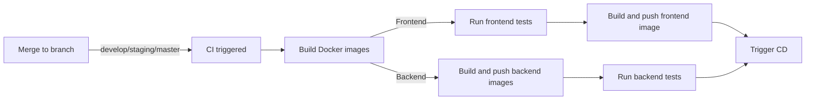
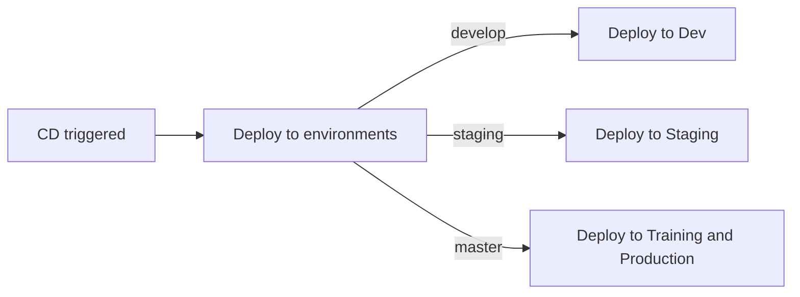

# CI/CD Process Documentation

This document describes the Continuous Integration and Continuous Deployment (CI/CD) process for our project. The CI/CD pipeline is designed to automate the testing and deployment of our software, ensuring reliability and efficiency in our development workflow.

## Continuous Integration (CI)

## Continuous Deployment (CD)

### Description of the Process

1. **CI trigger**: The CI process starts when changes are merged/pushed into either the develop, staging, or master branch.
2. **Docker image building**:
   - **Frontend**: Tests are run first using Yarn. After successful testing, the frontend image is built with necessary build-time environment variables, particularly for Sentry, based on the branch.
   - **Backend**: Backend images for deployment and testing (with debug options and packages) are built. For the master branch, a training (`trn`) image is also built and pushed to a separate Docker registry.
3. **Backend Testing**: After building the backend images, unit tests are run.
4. **Continuous Deployment**: If all tests pass, the continuous deployment (CD) process is triggered.

### Continuous Deployment Details

- The CD process involves deploying the built images to the appropriate servers based on the branch, providing such services as a relational database (postgres), cache (redis), broker (celery), elasticserach, and the backend and frontend services built in the CI process.
- Develop branch deployments go to the development server, staging to the staging server, and master to the training and production servers.
- As the project is evolving, "ephemeral" environments may be created for testing purposes. These environments are created by creating a new branch from the develop branch, and deploying the branch to the new server. The branch is then deleted after testing is complete and the deployment is removed.

## Example

When a developer merges a branch into the develop branch, the CI process is triggered. Pipeline workers begin running jobs to build the frontend and backend images, and run tests. Each job can be run in parallel but the dependent jobs must wait for the previous job to finish before starting. In this case, in order to run a job `Trigger CD`, both `Build and push frontend image` and `Run backend tests` must finish first.

## Environment Variables

When running a backend image, the following environment variables must be set:
- Azure:
    - AZURE_CLIENT_ID
    - AZURE_CLIENT_SECRET
    - AZURE_TENANT_KEY
    - STORAGE_AZURE_ACCOUNT_KEY
- Sentry:
    - SENTRY_DSN
    - SENTRY_ENVIRONMENT
- Exchange Rates API:
    - EXCHANGE_RATSE_API_KEY
- Kobo:
    - KOBO_APP_API_TOKEN
- Other
    - ROOT_ACCESS_TOKEN
    - SECRET_KEY