# Beneficiary Group

The **Beneficiary Group** model controls the dynamic labeling used across the frontend UI. Each `Program` is linked to a `BeneficiaryGroup`, and the group's fields determine what labels users see on various pages.

## Model Fields → Labels

| Model Field            | Example value    | Responsible for                                                                                                                                                            |
|------------------------|------------------|----------------------------------------------------------------------------------------------------------------------------------------------------------------------------|
| `name`                 | "Household"      | Shown in the Program form dropdown when selecting a beneficiary group.                                                                                                     |
| `group_label`          | "Household"      | Singular group name — detail page titles, lookup dialogs, filter labels.                                                                                                   |
| `group_label_plural`   | "Households"     | Plural group name — list page headers, tab labels, count labels.                                                                                                           |
| `member_label`         | "Individual"     | Singular member name — detail page titles, lookup dialogs, filter labels.                                                                                                  |
| `member_label_plural`  | "Individuals"    | Plural member name — list page headers, table headers, count labels.                                                                                                       |
| `master_detail`        | `True` / `False` | If `True` → group-member hierarchy (e.g. Household → Individuals). If `False` → only members are shown (e.g. Social Workers). Controls which sections/columns are visible. |

## Admin Configuration

Beneficiary Groups are managed in Django Admin under **Programme › Beneficiary Groups**.
Changing a label value will immediately affect the frontend for all programs using that group.

> ⚠️ **Warning:** Renaming labels on an existing beneficiary group changes the UI for **all** programs linked to it.

## Example: How Labels Are Used in the UI

Below are some concrete examples of where each field appears:

- **Population list page header** → `group_label_plural` (e.g. "Households")
- **Population detail page title** → `group_label` + entity ID (e.g. "Household: HH-001")
- **Members table header** → `member_label_plural` (e.g. "Individuals")
- **Grievance / Feedback lookup dialog** → `group_label` / `member_label` (e.g. "Household/Individual Look up")
- **RDI details tab** → `group_label_plural` (e.g. tab labeled "Households")
- **Program Cycle totals** → `group_label_plural` (e.g. "Total Households Count")
- **Search page filter labels** → `group_label` (e.g. "Household (ID)")

## Example Usage: `Household` vs `Education Workers` Beneficiary Groups

### Admin definition

| Household | Education Workers |
|-----------|-------------------|
| 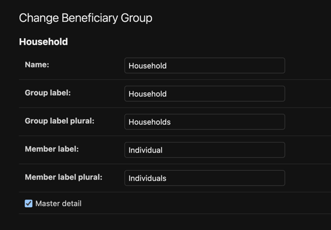 | 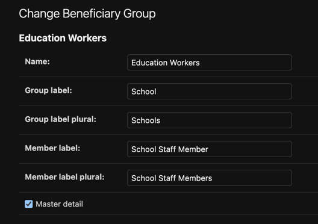 |

### Sidebar menu
`group_label` as the menu item, expanding into `group_label_plural` and `member_label_plural` sub-items:

| Household | Education Workers |
|-----------|-------------------|
| 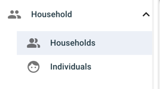 | 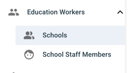 |

### Group list
Page title uses `group_label_plural`; table headers use `group_label`:

| Household | Education Workers |
|-----------|-------------------|
| 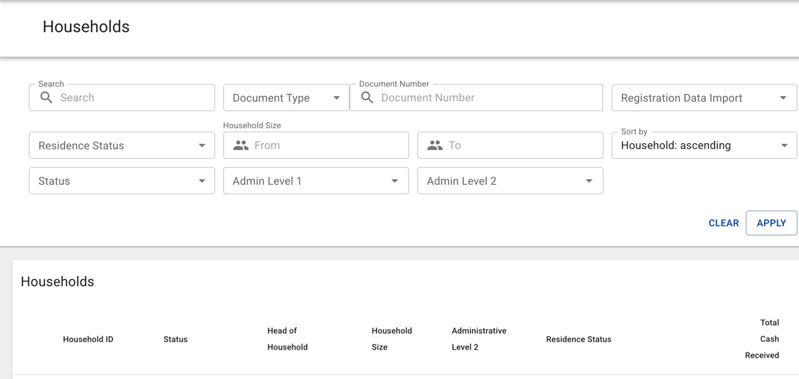 | 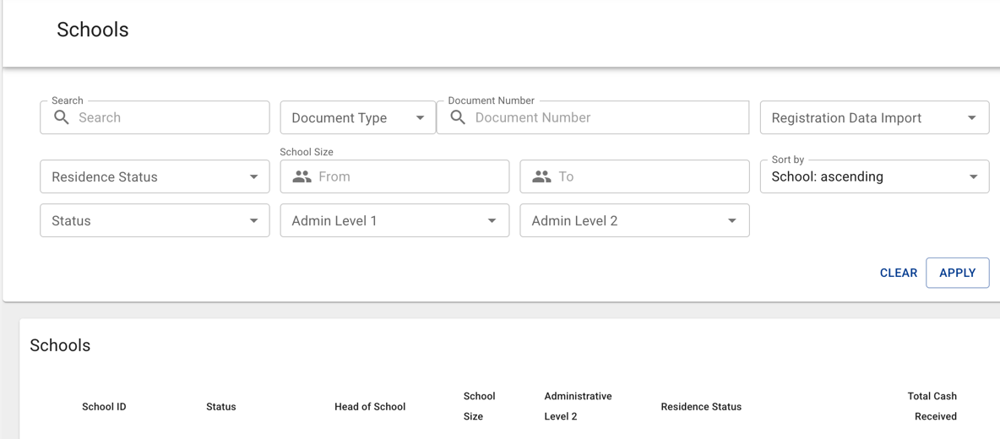 |

### Group detail
Title uses `group_label` + ID:

| Household | Education Workers |
|-----------|-------------------|
| 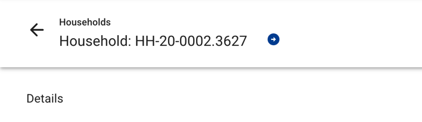 | 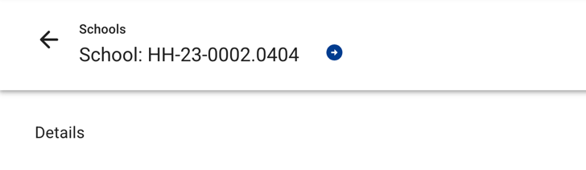 |

### Member list
Page title uses `member_label_plural`; table headers use `member_label` and `group_label`:

| Household | Education Workers |
|-----------|-------------------|
| 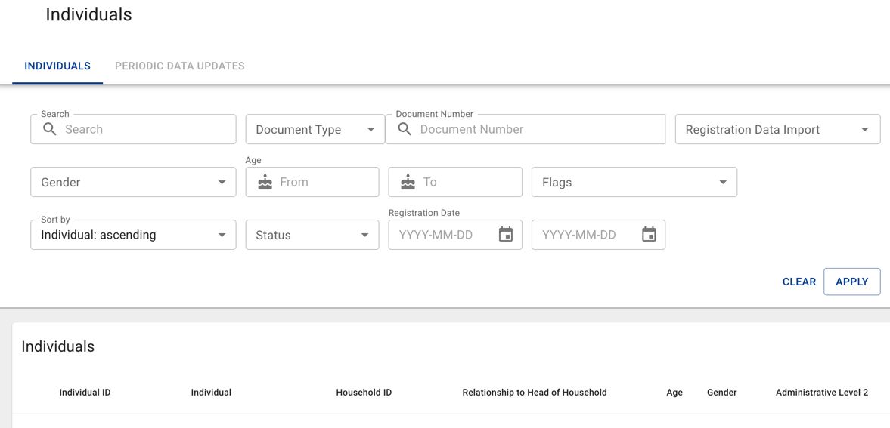 | 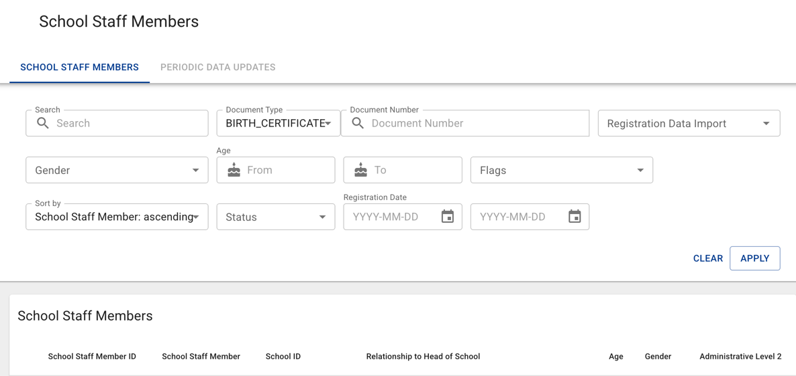 |

### Member detail
Title uses `member_label` + ID:

| Household | Education Workers |
|-----------|-------------------|
| 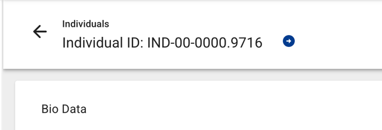 | 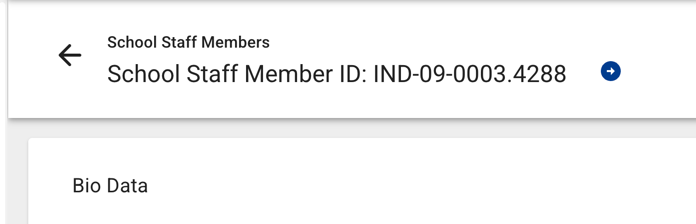 |

### Grievance ticket creation
Categories use `group_label` and `member_label` (e.g. "Household Data Update" vs "School Data Update"):

| Household | Education Workers |
|-----------|-------------------|
| 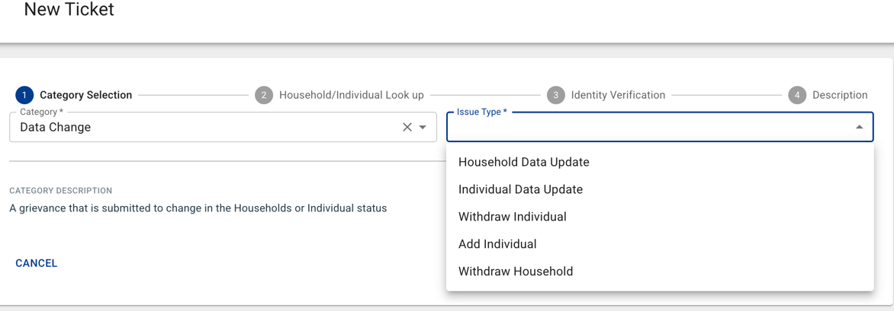 | 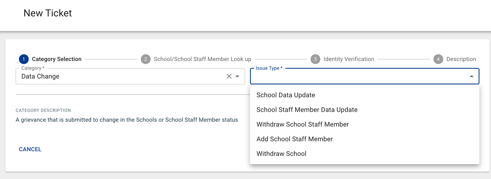 |

> The same pattern applies throughout the application — wherever groups or members are referenced (e.g. targeting, RDI, program cycles, feedback, country search), the labels are driven by the same Beneficiary Group fields.
