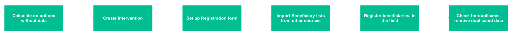
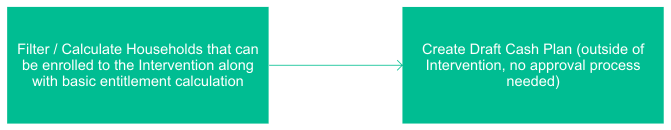
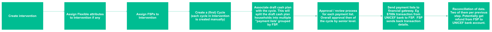
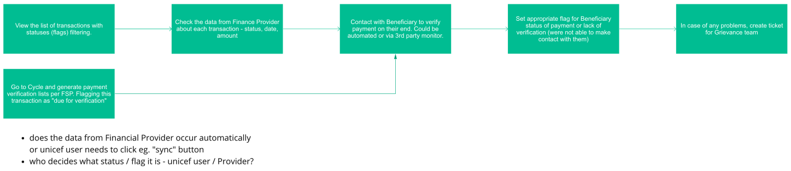
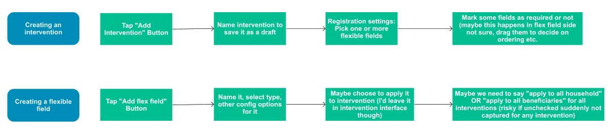

# User Flows

## Summary

To view the latest flow diagrams for the HCT-MIS system, please view the following [**Link**](https://www.lucidchart.com/invitations/accept/cddd9508-7562-4cd5-adc5-f16a0d695752).

## Registration / Start the Flow:

## Targeting

## Intervention Management

## Payment Verification

## Grievance / Feedback

## Grievance / Change of Personal Information

## Flexible Fields

