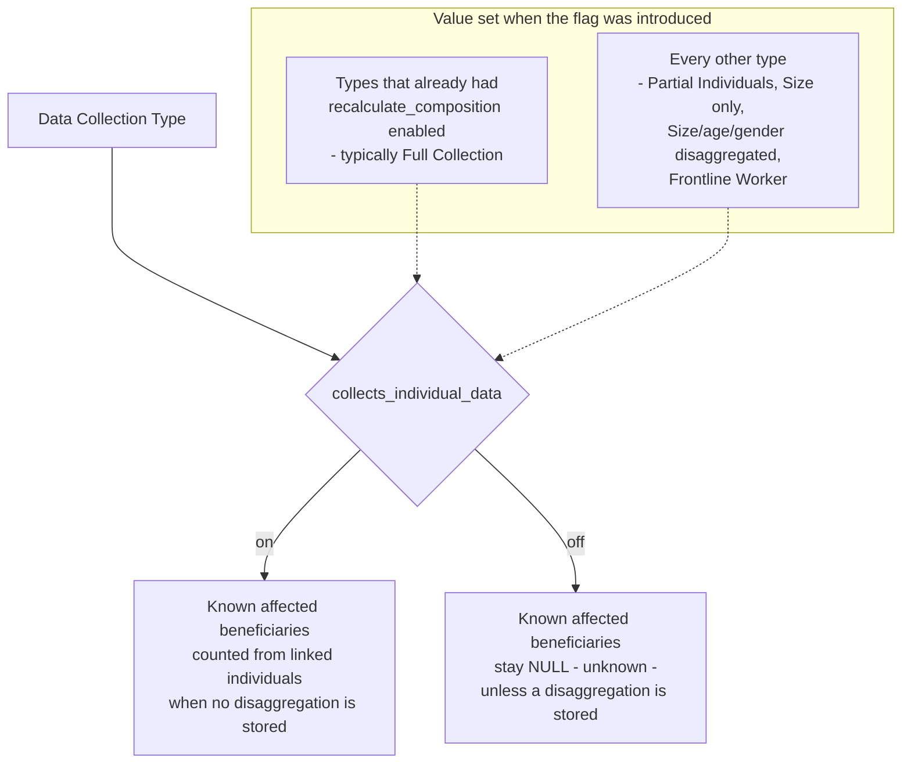

The Data Collection Type parameter defines the structure of beneficiary data used in the Programme.

1. __Full Collection__: Full individual data is collected. This type indicates that data has been collected for all of the household members. (Individuals with details collected = size of household).
1. __Partial Individuals__: Partial individual data collected. This type indicates that data has been collected for the Head of Household, collector, and at least one other individual. However, data collection has not covered every member of the household. (Individuals with details collected are less than the size of household).
1. __Size only__: Size only collected This type is assigned when only the size of the household (count of individuals) has been collected without collecting specific details about the household members.
1. __Size/age/gender disaggregated__: No individual data available. This data collection type is assigned when no data has been collected for any individual other than the head of the household.
1. __Frontline Worker__: This type is used for population where only individual information is collected to pay incentives for workers, and it can be named by the section implementing the programme.

## Collects individual data

Each Data Collection Type carries a `collects_individual_data` flag, declaring whether programmes
using that type register individual household members at all. It is the flag that decides whether
[known affected beneficiaries](../../guide-user/known-affected-beneficiaries.md) may be counted
from the linked individuals when a household has no stored age and gender disaggregation.

It is independent of `recalculate_composition`, which controls whether the declared household
composition is maintained. A type can register members without having its composition recalculated.

!!! warning "Partial types need a manual decision"
    A type such as __Partial Individuals__ does register some members, so enabling the flag for it
    is usually correct - but it is a configuration decision that has to be taken per deployment and
    applied by hand in the admin. Changing the flag does not recalculate anything on its own;
    `backfill_kab` has to be re-run afterwards.

The flag was introduced by
[AB#326718: Calculate Gender and Age disaggregated group ALSO for Partial Data collecting Type](https://dev.azure.com/unicef/ICTD-HCT-MIS/_workitems/edit/326718).
