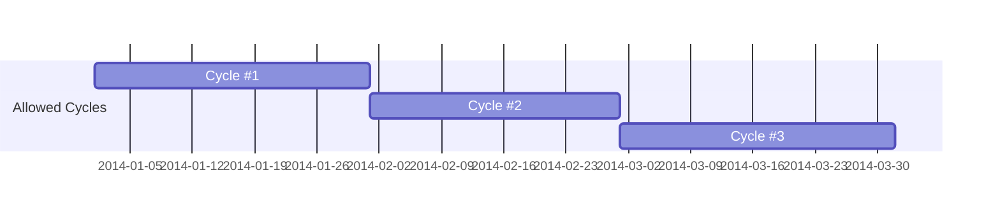
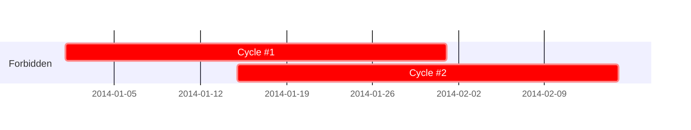
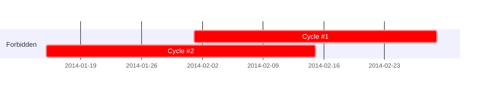

## Program

The campaign targeting a certain set of beneficiaries around a particular
        reason or on the ground issues. Eg &quot;Cash for nutrition&quot; ( also `Intervention` )

## Cycle

A cycle is a named time span (es. Jan, Feb… or First-Quarter, Second-Quarter…) to manage recurring payments 
(paying SAME HH/IND multiple times)

The Cycle must respect the following rules:

1. It is possible to have multiple Payment Plans within the same Cycle
1. It is NOT possible to pay the SAME HH within the same Cycle (even in different TP/PP) (Failed payment makes an exception)
1. Programme cannot have overlapping Cycles
1. It is possible to create a new Cycle ONLY with "start_date" AFTER the most recent “Cycle.end_date” (you can insert a new cycle between two existing cycles or before the last recent one)
1. Any Program has at least one Cycle (Default Cycle)
1. It is possible to add PP to a Cycle EVEN AFTER its “end_date” if the cycle is still active
1. It is possible to create an “Open Cycle” (cycle with only a start date), but you cannot create new cycles.
1. When you create a <glossary:TP>, you must set the cycle. This will automatically exclude HH in the same Cycle

## Programme Population

Households or Individuals who fit the first set of targeting criteria and
        are potential targets of a given programme. They may or may not be further
        trimmed down with additional criteria or filter in the Target Population.

## Programme Partner

A group of users involved in the operations of a specific programme, 
often granted a defined set of permissions within programme (i.e., Grievance Redressal)

## Programme Time Series Fields

Individual's details that can be collected and updated more than once during the programme (i.e., Monthly Attendance)

## Round

An attribute to Programme Time Series fields that indicates how many times can a specific field be collected within the programme.

