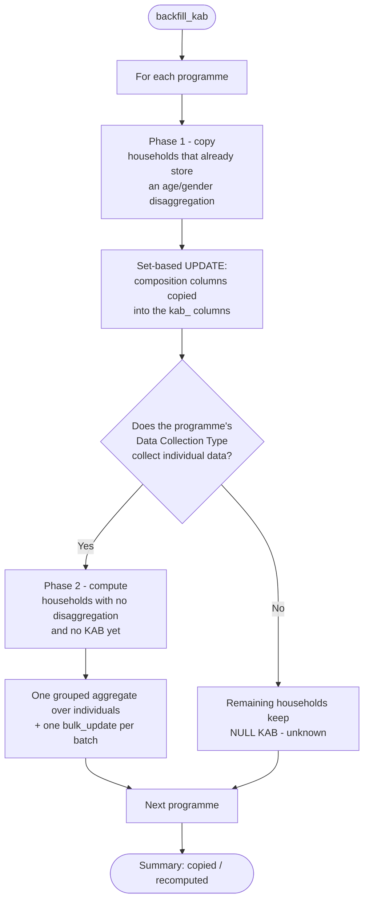

# Maintenance

Tasks an administrator runs against a deployed environment, outside the normal request cycle.
Everything here is executed with Django's management command runner:

```bash
python manage.py <command>
```

In a containerised deployment the same command is run inside the backend container, for example:

```bash
docker compose run --rm backend python manage.py <command>
```

## Backfill KAB

`backfill_kab` populates the [known affected beneficiaries](../guide-user/known-affected-beneficiaries.md)
counters on households that already exist in the database.

!!! danger "Required once after the release that introduces KAB"
    Migrations only add the empty columns. Until `backfill_kab` has been run on an environment,
    every existing household reports unknown KAB. Newly registered households are not affected -
    they get their counters from the normal recalculation.

```bash
python manage.py backfill_kab
```

### What it does

The command walks the database programme by programme, so every query stays bounded by an indexed
programme id instead of scanning the whole household table, and only lists of primary keys are ever
held in memory. Within a programme, households are processed in batches (5000 by default) using
keyset pagination.



Both phases report progress per batch, and the run ends with a summary of how many households had
their composition copied and how many were recomputed from individuals.

### Options

| Option | Default | Meaning |
|---|---|---|
| `--batch-size` | `5000` | Households per batch. Lower it to reduce lock and memory pressure on a busy environment, raise it for a faster run on a quiet one. |

### Safety

- **Idempotent.** Re-running the command never produces a different result for a household whose
  input data has not changed.
- **Restartable.** The compute phase skips households that already have a KAB size, so a run
  interrupted halfway resumes roughly where it stopped instead of starting over.
- **Safe during normal operation.** No household is locked for the duration of the run; any
  concurrent write to a household triggers its own recalculation anyway, which wins over the
  backfill value.

### Re-run it after changing a Data Collecting Type

Enabling `collects_individual_data` on a data collecting type in the admin does **not** recalculate
anything. Households belonging to programmes of that type keep their existing - usually unknown -
KAB until something else touches them.

After changing the flag by hand, run `backfill_kab` again. The copy phase re-copies stored
compositions, and the compute phase now picks up the households that were skipped before, since
they still have no KAB stored.

The `backfill_kab` command was introduced by
[AB#326718: Calculate Gender and Age disaggregated group ALSO for Partial Data collecting Type](https://dev.azure.com/unicef/ICTD-HCT-MIS/_workitems/edit/326718).

## Celery locks

Long-running Celery tasks hold a Redis lock while they run (see
[Celery Task Locks](../guide-dev/celery-locks.md)). Locks expire on their own within about five
minutes of a worker dying, so after an OOM kill or a deploy nothing has to be cleaned up: the
redelivered job waits for the lock and continues.

Two admin tools exist for the remaining cases, both restricted to root users (superuser with the
`IS_ROOT` flag enabled):

| Tool | Where | Removes |
|------|-------|---------|
| Celery locks page | `/admin/celery-locks/` – listed under *Quick links* on the admin index when `QUICK_LINKS` contains `Celery Locks,celery-locks/` | one chosen lock, grouped by task |
| *Remove task locks* button | change page of an RDI, Payment Plan, Payment Plan Group, Programme, Western Union report, PDU online edit, Universal update or Aurora registration | every lock whose key contains that object's id |

Both ask you to type `I confirm` before anything is deleted.

!!! danger "Removing a lock does not stop the task"
    A lock that is still being renewed belongs to a task that is still running. Removing it lets
    a second copy of the task start on the same object – duplicate payments records, an RDI merged
    twice, corrupted counters. Only remove a lock when Flower shows no running task for it, or the
    worker that held it is known to be gone.

A task whose lock was removed keeps running; when it finishes it logs a warning about the missing
lock and still reports its normal result. Restarting a job from the admin (for example *restart
preparing payment plan*) does not release the lock of the killed job either - the new job simply
waits for it to expire, so "Task is already running" can show for up to five minutes afterwards.

Every removal is written to the admin log (*Recent actions*, and the *Log entries* admin) with the
user, the lock key and, for the button, the object it was removed for.

!!! info "Quick link on existing environments"
    `Celery Locks,celery-locks/` is part of the default `QUICK_LINKS` value only. Environments that
    already store their own value in Constance keep it; add the line there to get the link.

[AB#340074: Harden Celery task locks against worker loss (OOM / deploy)](https://dev.azure.com/unicef/ICTD-HCT-MIS/_workitems/edit/340074).
