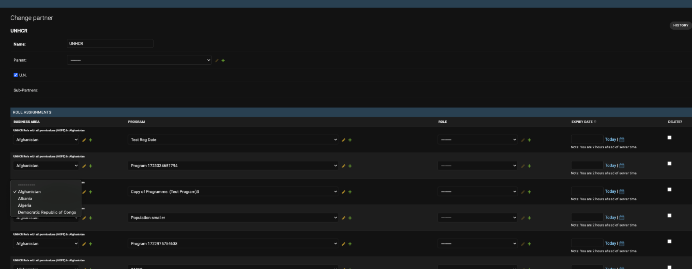

# Changes in Permissions - Current Requirements

Big part of the refactor was just technical, with wrapping the logic for checking permissions in a custom functionality, structured in one place, with caching the roles per user.

**Requested functionality changes covered the following:**

## 1. UserRole changes

**Before:** A User could hold only a role in a BA and then they had to get the program access from its Partner. Without program access on a Partner, the roles on the user didn't grant any permissions themselves, besides the non-program area.

**Right now:** User roles are not per Business Area but already per Program. So, a User will have a role – e.g. Planner/Releaser assigned already to a specific Program. You can also not assign any Program (empty program) - that will mean that the User has this role in the whole BA - so in all programs in this BA.

So the **UserRole** as we knew it, which was User + Role + Business Area (and expiry date) is now renamed to **Role Assignment** and it has an additional field: **Program**.

### Admin Changes
Instead of UserRole, we have this RoleAssignment. And on the User page, when updating their roles (Role Assignments), there is also an additional field Program.

### BEFORE:


> (just granting a role in a BA; without access to any Program – the role would work in Programs that the user's Partner had access in)

### NOW:


> (additional field Program - we grant role in a specific Program already; or empty Program = role in all Programs in the BA)


---
**Note:** The user roles can be also changed on the Role assignments page. There are no "User roles" anymore. There is a **RoleAssignment** which acts as an old UserRole for a specific Program(s) OR a Partner role for a Program(s) – Partner and User share now the same structure for granting roles – see below.

## 2. Partner role changes

**Before:** We had roles on a Partner in the BA and separately we were assigning program accesses. So the roles came from one place and access to Program from another. Similar to user, there could have been a role for Partner in Afghanistan, but we also needed access to specific Programs – and only then this Role was applied for the Programs.

**Right now:** It's also the same new structure as for a user: **RoleAssignment**, where you also assign a role already to a Program, not to a Business Area.

### Key Changes:
- There is **no "access to program"** anymore, there is now role already in a Program
- Just like for the User, you can leave Program empty in this RoleAssignment and it will mean that the Role is for **All Programs** in the Business Area
- In the admin, it is now in the same place as for the User. Before, it was under button **Permissions**, now it is in the inline, added just like for the user. And it also can have expiry date

### Allowed Business Areas Logic Reversal
Also on the Partner, there were **Allowed Business Areas**. Now this logic is **reversed**. It is in the Business Area where you specify which Partners are allowed for the BA.

### BEFORE:


```
• Allowed BAs specified for the Partner
• Button PERMISSIONS → page for specifying roles in a BA 
```


```
• Program detail page - button PARTNERS → place to assign access to Program
• If a Partner was on the list for the Program, only then the Roles specified for them in the BA were applied for the Program
```

### NOW:


```
• BA page - button PARTNERS → for specifying Partners allowed in the BA (reversed to what was before - allowed BAs on Partner page)
```



```
• Roles for Partner have now the same structure as for the User -
  RoleAssignment with Program - we grant role in a specific Program; or empty Program = role in all Programs in the BA
```

> ⚠️ **Important:** You can only create a role in a BA that the Partner is allowed in. (Which is specified on the BA page – as shown above) That's why there are only few BAs in the dropdown – Partner is allowed only in these BAs.

> ⚠️ There is also **no Partners access** on a Program page, as there is nothing like access now without a role. It's a role for a program

### Admin Area limits are still defined on the Program page


```
- If Partner is not here, it means it doesn't have any Area Limits for this Program
- You can select from Partners that have a Role in this Program - either a Role assigned to a Program or a Role with empty Program in this BA - which means all Programs
```

## 3. UNICEF Partner structure & logic

**Main change** is that there are **multiple UNICEF Partners** now: UNICEF HQ and a UNICEF Partner per every country office.

### Structure Overview:
- These **UNICEF Sub-partners** are children of the UNICEF Partner
- **New concept:** **Parent Partner** – if the Partner is a Parent Partner, it cannot hold any roles, its function is grouping the children Partners below

### UNICEF sub-partners:
- UNICEF sub-partners in specific BAs are granted the **"Role for UNICEF Partners"** in this one business area (always for Program empty - so all programs)
- We also have **UNICEF HQ Partner**, that grants the **"Role with All Permissions"** in all the business areas (Program empty = all programs)
- They all have **no admin area restrictions**


So **UNICEF Partner** is now a Parent for UNICEF HQ and all UNICEF Partners in country offices and it cannot hold any roles on itself. It just groups the other Partners. (It is planned for example to be able to deactivate all the Partners below, deactivating the Parent Partner.)


## 4. Role changes

Also there are **new flags** for a Role:


### `is_available_for_partner`
- If set to `False`, it cannot be assigned to Partner; only for the User
- Right now, only **"Role with All Permissions"** has this flag = `False` - so "Role with All permissions" can be assigned only to Users
- **Exception:** UNICEF Partners still have **"Role with All Permissions"**, even though it has this flag `False`

### `is_visible_on_ui`
- Will be applied when Roles are selectable on UI (not implemented right now)

## 5. Migration of the existing Roles

All the existing roles also had to be **migrated** to the new structure. So all roles on User (UserRoles) and the previous structure of roles on Partner and program access on Partner.

### User Roles Migration:
For example, if a user had a **Planner Role** in Afghanistan and a **Releaser role** in Afghanistan, then it was checked on its Partner, which Programs they had access to. So now they got their Role for every Program that their Partner had access to. So usually this means **a lot of roles on a user now**, as it is per Program.

### Partner Roles Migration:
It was similar to User Role migration - the role in business area and their access in program was also connected and they got this role that they had in a BA per all the programs they had access to.

### UNICEF Partner Migration:
UNICEF sub-partners were created for all the country offices and the UNICEF HQ. And Users that were under UNICEF Partner before, were migrated to the matching Partner now:

- **Single BA users:** If a User under UNICEF had only Roles for one BA (so they had e.g. Planner, Releaser only in Afghanistan), they were assigned UNICEF Partner for Afghanistan

- **Multi-BA users:** If a User under UNICEF had Roles in multiple business areas, they were assigned the UNICEF HQ Partner
