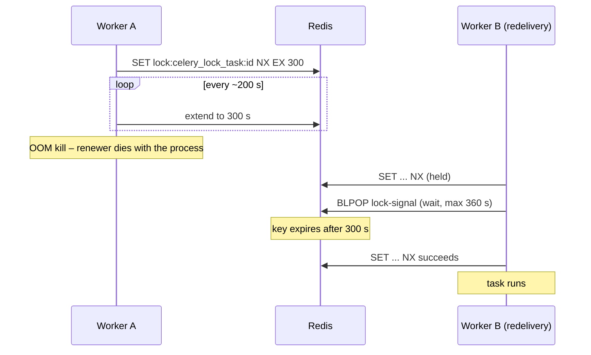

# Celery Task Locks

Some Celery tasks must never run twice for the same object at the same time: rebuilding a
payment plan, importing or merging an RDI, merging a PDU online edit, running a universal
update. Each of them takes a Redis lock for the duration of the task.

Locks are the one piece of task state that outlives the worker. A worker killed by the OOM
killer or replaced during a deploy cannot release its lock, so the lock has to expire on its
own, and quickly. This page describes the contract every locked task follows.

- Removing a stale lock by hand: [Maintenance](../guide-adm/maintenance.md#celery-locks)

## The contract

`hope.apps.core.celery_lock.celery_lock` is the only way a task takes a lock.

```python
from hope.apps.core.celery_lock import celery_lock


def payment_plan_full_rebuild_async_task_action(job: AsyncRetryJob) -> None:
    payment_plan_id = job.config["payment_plan_id"]
    with celery_lock("payment_plan_full_rebuild", payment_plan_id):
        ...
```

| Rule | Value |
|------|-------|
| Backend | [python-redis-lock](https://python-redis-lock.readthedocs.io/) through the `default` cache (`hope.apps.core.cache.RedisCache`) |
| Key | `celery_lock_<task>:<param>[:<param>...]` – `<task>` is the action name without `_async_task_action`, parameters are usually the object id |
| TTL | 5 minutes (`LOCK_EXPIRE`), renewed by a heartbeat thread every ~200 s while the task runs |
| Waiting | up to 6 minutes (`LOCK_WAIT`) for a held lock, then give up |
| Held lock | `AlreadyRunningError` – the job fails and is **not** retried |
| Release | always, including when the task raises |

!!! danger "A held lock is a failure, never a skip"
    `AlreadyRunningError` is a `NonRetriableTaskError`. `async_retry_job_task` stores the message
    (`Lock celery_lock_... is held by another task`) in `job.errors` and re-raises without retrying.
    Do not catch it in a task to return early: a job that "succeeds" without doing its work is the
    bug this design removes. Let it propagate; the RDI tasks do exactly that ahead of their generic
    `except Exception` handlers so the RDI is not marked as failed by a duplicate job.

!!! warning "Only Celery locks use the prefix"
    `celery_lock_` marks locks the admin page may list and remove. A lock taken inside a request
    (for example the RapidPro activation guard in `VerificationPlanStatusChangeServices`) uses
    `cache.lock` directly and stays out of that namespace.

## Why a heartbeat instead of a long TTL

The old locks had a fixed TTL matching the longest plausible run (2 hours, 24 hours for RDI
imports). A worker that died mid-task left the lock behind for the whole TTL; the job redelivered
by `reject_on_worker_lost` hit the stale lock, exhausted its retries and needed someone with Redis
access to fix it.

With auto-renewal the TTL only has to survive a pause of the renewing thread, so it can be short.
A dead worker's lock is gone after at most `LOCK_EXPIRE`; the redelivered job waits it out.



If the lock is still held when the wait runs out, the holder is alive and really running; the
second job fails with `AlreadyRunningError` instead of starting a duplicate.

## What triggers each lock

| Lock key | Taken by |
|----------|----------|
| `celery_lock_payment_plan_full_rebuild:<payment plan>` | `payment_plan_full_rebuild_async_task_action` |
| `celery_lock_payment_plan_rebuild_stats:<payment plan>` | `payment_plan_rebuild_stats_async_task_action` |
| `celery_lock_export_payment_plan_group_delivery_xlsx:<payment plan group>` | delivery XLSX export |
| `celery_lock_payment_plan_generate_token_and_order_numbers:<programme>` | nested inside the export above |
| `celery_lock_send_payment_plan_reconciliation_overdue_email:<payment plan>` | reconciliation overdue e-mail |
| `celery_lock_send_western_union_report_email_notifications:<report>` | Western Union report e-mails |
| `celery_lock_merge_pdu_online_edit` | PDU online edit merge (global, one merge at a time) |
| `celery_lock_run_universal_individual_update:<universal update>` | universal update run |
| `celery_lock_generate_universal_individual_update_template:<universal update>` | universal update template |
| `celery_lock_registration_xlsx_import:<rdi>` | RDI XLSX import |
| `celery_lock_registration_kobo_import:<rdi>` | RDI Kobo import |
| `celery_lock_registration_program_population_import:<rdi>` | RDI import from another programme |
| `celery_lock_merge_registration_data_import:<rdi>` | RDI merge |
| `celery_lock_deduplicate_documents` | document deduplication inside the merge (global) |
| `celery_lock_classify_findings_and_schedule_merge:<rdi>` | Country Workspace arrival hook |
| `celery_lock_automate_rdi_creation:<aurora registration>` | Aurora automatic RDI creation |
| `celery_lock_process_generic_import:<rdi>` | generic XLSX import |

## Adding a lock to a task

1. Pick the task name: the action function name without `_async_task_action`.
2. Pass the identifiers that define "the same work" as parameters. Omit them only when the lock is
   deliberately global.
3. Wrap the body in `with celery_lock(...)`. Do not catch `AlreadyRunningError`.
4. If the object has an admin page, add `CeleryLocksAdminMixin` (`hope.admin.utils`) so the lock
   can be removed from there. The button matches locks by the object's primary key in the key.

## Tests

Unit and e2e tests run with `CACHE_ENABLED=false`, which selects `hope.apps.core.memcache.LocMemCache`.
Its `lock()` returns `LocMemLock`, an in-process object with the same `acquire` / `release` /
`extend` / `locked` API and no renewal thread. Locks are therefore private to each pytest-xdist
worker and cleared with the cache between tests.

To test the held-lock path, hold the lock yourself and shorten the wait:

```python
@pytest.fixture
def hold_lock(monkeypatch: pytest.MonkeyPatch) -> Callable[..., None]:
    monkeypatch.setattr("hope.apps.core.celery_lock.LOCK_WAIT", 0)

    def _hold(task: str, *parts: object) -> None:
        cache.lock(lock_key(task, *parts)).acquire()

    return _hold
```

---

[AB#340074: Harden Celery task locks against worker loss (OOM / deploy)](https://dev.azure.com/unicef/ICTD-HCT-MIS/_workitems/edit/340074).
