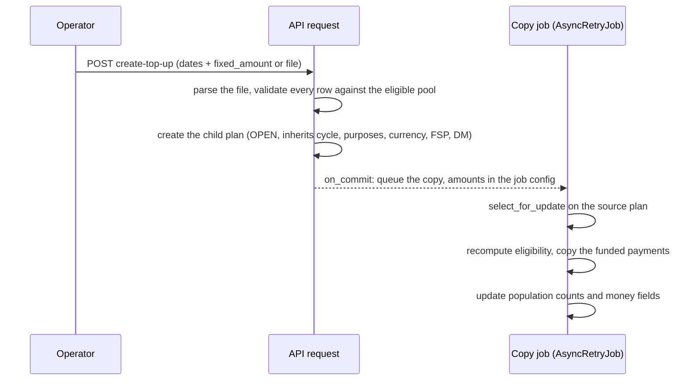

# Child Payment Plans

A child Payment Plan is spawned from an existing plan: a **Follow-Up** retries failed payments, a **Top-Up** pays beneficiaries of a Standard plan again, and a **Top-Up Amendment** adjusts the amounts of a Top-Up. All three share one creation path in `PaymentPlanService`; this page describes that path and the invariants it relies on. The user-facing behaviour is documented in the [user manual](../guide-user/payment-groups-and-purposes.md).

## Entry points

All actions live on `PaymentPlanViewSet` and require `PM_CREATE`.

| Endpoint | Plan type | Request body |
|---|---|---|
| `POST .../create-follow-up/` | `FOLLOW_UP` | dispersion dates |
| `POST .../create-top-up/` | `TOP_UP` | multipart: dates + exactly one of `fixed_amount` / `file` |
| `POST .../create-top-up-amendment/` | `TOP_UP_AMENDMENT` | same as Top-Up |
| `GET .../top-up-amount-template/` | — | blank per-beneficiary amount template for the child this plan can spawn |

The template endpoint, the file parser and the copy job all select their row pool through `PaymentPlan.eligible_payments_for_child_plan()`, which dispatches on the source plan's type (Standard → Top-Up pool, Top-Up → Amendment pool). Because every stage goes through the same method, the template, the validation and the copy cannot drift apart.

## Pipeline

The request only creates the empty child plan; the payments are copied asynchronously. The amounts resolved at request time (a fixed value, or the parsed file) travel to the job in `AsyncRetryJob.config` as strings — JSON has no decimal type, and a float would round the money. That is roughly 40 B of jsonb per beneficiary, so there is no practical size limit.

## Concurrency and idempotency

- **Copy jobs for the same source plan are serialized** by `select_for_update` on the source row. A beneficiary can therefore never end up in two Top-Ups (or two Amendments) of one source: the second job recomputes eligibility after the first has committed and skips anyone already claimed.
- **A skipped beneficiary is logged, never silent.** When the amount file listed someone who lost eligibility between request validation and the copy, the job emits a warning with the missing payment ids.
- **Redelivery is safe.** The job runs with `acks_late`; if it is redelivered after a successful commit, the copy detects existing payments and returns instead of violating the one-payment-per-household constraint.

## Eligibility

`eligible_payments_for_top_up()` and `eligible_payments_for_top_up_amendment()` mirror each other: payment status does not gate either flow, withdrawn households are excluded, and **membership alone blocks** — a payment excluded from a child plan does not return its beneficiary to the pool.

Creation-time funding of Top-Ups and Top-Up Amendments was introduced by [Change Request 332492: Improve the Top-Up Payment Plan workflow](https://dev.azure.com/unicef/ICTD-HCT-MIS/_workitems/edit/332492).
