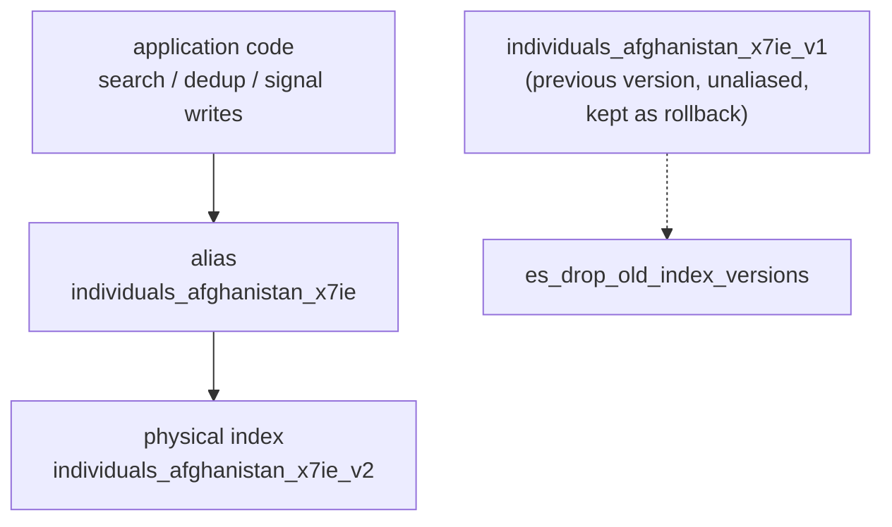
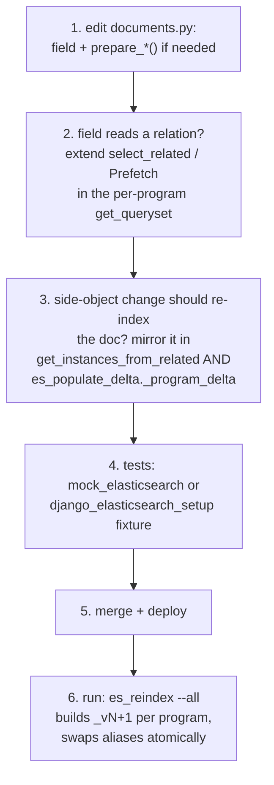

# Elasticsearch

How HOPE's per-program Elasticsearch indexes work after the blue-green migration, and the
rules to follow when building a feature that reads from or writes to them.

## The index model

Every ACTIVE program owns a **pair** of indexes: one for individuals, one for households.
The name the application addresses — `individuals_<ba-slug>_<program-code>` — is **not a
physical index**: it is an **alias** pointing at a versioned physical index (`..._v1`,
`..._v2`, ...). Mapping changes are rolled out blue-green: a new version is built dark next
to the live one, then both aliases of the pair are swapped in one atomic call.



Because the app only ever sees the alias, a reindex is invisible to it — searches and
writes keep working before, during and after the swap.

## Golden rules

| Rule | Why |
|---|---|
| Address indexes only through `get_individual_doc(program_id)` / `get_household_doc(program_id)` (`hope.apps.household.documents`) | They resolve the per-program alias name and carry the queryset, mapping and `prepare()` logic |
| Never hardcode an index name, never append `_vN` | The physical name changes on every reindex; the alias does not |
| Never create or delete indexes ad hoc | Index lifecycle belongs to `index_management.py` and the management commands; a bare index squatting on an alias name breaks the next reindex |
| Delete documents via `remove_elasticsearch_documents_by_matching_ids()` | It resolves the alias and ignores missing documents |
| Gate any new ES write path on `config.IS_ELASTICSEARCH_ENABLED` | The whole sync machinery is switchable per environment (constance) |

## Reading

```python
from hope.apps.household.documents import get_individual_doc

doc = get_individual_doc(str(program_id))
results = doc.search().query("match", full_name=value).execute()
```

The search goes through the alias, so it always hits the live version.

## Writing — you probably don't need to

Documents are kept in sync automatically by signals in `hope/apps/household/signals.py`
(plain Django signals — the `django-elasticsearch-dsl` registry/autosync machinery is
deliberately unused in HOPE):

| Trigger | Effect |
|---|---|
| `Individual` / `Household` saved (program ACTIVE, not removed) | document upserted |
| `Individual` / `Household` soft-removed or deleted | document deleted |
| `Program` transitions to ACTIVE | `ensure_program_indexes()` — creates `_v1` + alias if missing, upsert-populates |

All of it is a no-op while `IS_ELASTICSEARCH_ENABLED` is off. If your feature mutates
individuals/households through `save()`, ES is already taken care of. Bulk paths that
bypass `save()` (raw `bulk_create`/`update`) do **not** fire these signals — either send
the documents yourself through the doc class or rely on an explicit populate afterwards.

## Changing the mapping (adding a field)

This is the flow that did not exist before blue-green: mappings are immutable in ES, so a
mapping change means a new index version and an alias swap — which `es_reindex` does for
you.



Step 2 matters for performance: `prepare()` runs once per row during a full populate, and
an un-prefetched relation is one extra query per row — on production volumes that is the
difference between minutes and hours. Keep the prefetch querysets filtered exactly like
the related managers (`Document.objects` / `IndividualIdentity.objects`, i.e. MERGED and
not removed), otherwise the prefetch cache changes which rows get indexed.

`es_reindex --all` is safe to re-run at any point: programs whose live index already
carries the current code-mapping stamp are skipped, a crashed run's dark leftover is
resumed, and nothing touches an alias before a count verification passes.

!!! warning "Analyzer or settings changes are invisible to the skip"
    The reindex skip/resume logic stamps each index with a hash of its **mappings** only.
    A change to analyzers or index settings (`es_analyzers.py`, `index_settings`) leaves
    the mapping identical, so `es_reindex --all` would happily skip everything. After such
    a deploy, reindex with `es_reindex --all --force` (or per program with
    `--sweep-wrecks`).

## New programs

Nothing to do: when a program becomes ACTIVE, the signal creates the pair as `_v1` with
the alias attached in the same call. There is never a bare physical index on an alias
name.

## What never to run

!!! danger
    - The admin **Rebuild Index** button deletes the LIVE index first — search and
      deduplication run against an empty index until the populate finishes. It is a
      recovery tool, not a routine one (it now requires an extra confirmation).
    - `search_index --rebuild` (from django-elasticsearch-dsl) is a **silent no-op** in
      HOPE — the DED registry is empty. Do not "fix" that by registering documents in it;
      the whole sync path is HOPE's own.
    - Writing to a physical `_vN` name or attaching your own aliases corrupts the version
      bookkeeping that `es_reindex` and `es_drop_old_index_versions` rely on.

## Testing

- ES is disabled by default in unit tests (`IS_ELASTICSEARCH_ENABLED` off,
  `ELASTICSEARCH_DSL_AUTOSYNC = False`). Use the `mock_elasticsearch` fixture when code
  under test merely touches ES, and `django_elasticsearch_setup` when the test genuinely
  needs a live index.
- Command-level tests that exercise the sync paths need
  `@override_config(IS_ELASTICSEARCH_ENABLED=True)`.

Introduced with the blue-green reindex tooling:
[PR #6293](https://github.com/unicef/hope/pull/6293).
