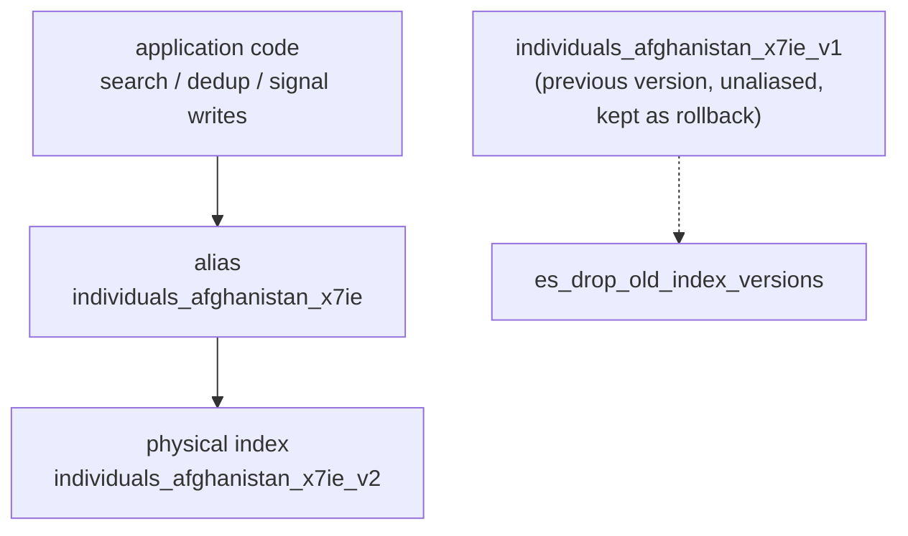

# Elasticsearch

How HOPE's per-program Elasticsearch indexes work, and the rules to follow when building a
feature that reads from or writes to them. To run a reindex on an environment, see
[Elasticsearch reindex](elasticsearch-reindex.md).

## The index model

Every ACTIVE program owns a **pair** of indexes: one for individuals, one for households.
The name the application uses, `individuals_<ba-slug>_<program-code>`, is **not a physical
index**. It is an **alias** pointing at a versioned physical index (`..._v1`, `..._v2`,
...). Mapping changes are rolled out blue-green: a new version is built dark next to the
live one, then both aliases of the pair are swapped in one atomic call.


```mermaid
flowchart TD
    APP["application code<br/>search / dedup / signal writes"] --> ALIAS["alias<br/>individuals_afghanistan_x7ie"]
    ALIAS --> V2["physical index<br/>individuals_afghanistan_x7ie_v2"]
    V1["individuals_afghanistan_x7ie_v1<br/>(previous version, unaliased,<br/>kept as rollback)"] -.-> DROP["es_drop_old_index_versions"]
```

Because the app only ever sees the alias, a reindex is invisible to it: searches and writes
keep working before, during and after the swap.

New programs need nothing: when a program becomes ACTIVE, a signal creates the pair as
`_v1` with the alias attached in the same call.

## Golden rules

| Rule | Why |
|---|---|
| Address indexes only through `get_individual_doc(program_id)` / `get_household_doc(program_id)` (`hope.apps.household.documents`) | They resolve the per-program alias and carry the queryset, mapping and `prepare()` logic |
| Never hardcode an index name, never append `_vN`, never attach your own aliases | The physical name changes on every reindex, and stray names break the version bookkeeping of `es_reindex` / `es_drop_old_index_versions` |
| Never create or delete indexes ad hoc | Index lifecycle belongs to `index_management.py` and the management commands; a bare index squatting on an alias name breaks the next reindex |
| Delete documents via `remove_elasticsearch_documents_by_matching_ids()` | It resolves the alias and ignores missing documents |
| Gate any new ES write path on `config.IS_ELASTICSEARCH_ENABLED` | The whole sync machinery is switchable per environment (constance) |

## Reading

```python
from hope.apps.household.documents import get_individual_doc

doc = get_individual_doc(str(program_id))
results = doc.search().query("match", full_name=value).execute()
```

## Writing — you probably don't need to

Documents are kept in sync by plain Django signals in `hope/apps/household/signals.py`
(the `django-elasticsearch-dsl` registry/autosync machinery is deliberately unused):

| Trigger | Effect |
|---|---|
| `Individual` / `Household` saved (program ACTIVE, not removed) | document upserted |
| `Individual` / `Household` soft-removed or deleted | document deleted |
| `Program` transitions to ACTIVE | `ensure_program_indexes()` creates `_v1` + alias if missing and populates it |

All of it is a no-op while `IS_ELASTICSEARCH_ENABLED` is off. Bulk paths that bypass
`save()` (`bulk_create`, `update`) do **not** fire the signals: send the documents yourself
through the doc class, or rely on an explicit populate afterwards.

## Changing the mapping

ES mappings are immutable, so a mapping change means a new index version and an alias swap.
It ships in **two independent steps**, the code deploy and the fleet reindex, with a window
in between where the aliases still point at indexes built from the old mapping. During that
window:

- signal writes push the full document into the old index, so a brand-new field gets
  created there by ES **dynamic mapping with a guessed type**;
- any query that depends on the new field must therefore sit behind a **feature flag**
  (default OFF), so the old query path keeps serving until every program is reindexed.

### Add fields, never change them

- **Adding a field** is the supported flow below.
- **Changing an existing field** (type, analyzer, similarity, `index_prefixes`, ...) is a
  *breaking* change: until a program is reindexed, its live index still serves the old
  definition, and queries relying on the new one return wrong results or errors.
- **Renaming** a field is an add plus a later removal: the old field stays (and keeps being
  written) until every consumer is migrated and a reindex drops it.

### Step by step

1. **Define the flag** in `src/hope/config/fragments/constance.py` (`CONSTANCE_CONFIG`),
   prefixed `ES_USE_`, default `False`. Constance needs no migration and can be flipped at
   runtime from the admin panel.

    ```python
    "ES_USE_FULL_NAME_NGRAMS": (
        False,
        "Search/dedup queries use the new full_name ngram field (requires a fleet reindex)",
        bool,
    ),
    ```

2. **Extend the mapping**: add the field in `documents.py`, with a `prepare_*()` method
   where the value is derived.
3. **Feed the populate**: if the field reads a relation, extend `select_related` /
   `Prefetch` in the per-program `get_queryset`. `prepare()` runs once per row, so an
   un-prefetched relation is one extra query per row: minutes vs. hours on production
   volumes. Filter the prefetch querysets exactly like the related managers
   (`Document.objects` / `IndividualIdentity.objects`, i.e. MERGED and not removed), or
   the prefetch cache changes which rows get indexed.
4. **Feed the delta**: if a change to a related object must re-index the document, mirror
   it in `get_instances_from_related` **and** `es_populate_delta._program_delta`.
5. **Write the query path** behind the flag, leaving the old path byte-for-byte intact:

    ```python
    from constance import config

    if config.ES_USE_FULL_NAME_NGRAMS:
        search = search.query("match", full_name__ngram=value)
    else:
        search = search.query("match", full_name=value)
    ```

6. **Test** (see [Testing](#testing)).
7. **Merge and deploy**: the flag is OFF, so nothing observable changes yet.
8. **Reindex, flip the flag, clean up**: follow
   [Elasticsearch reindex](elasticsearch-reindex.md). Afterwards, delete the flag together
   with the old query path.

!!! danger "Never flip the flag before the fleet reindex finishes"
    A flag flipped early produces silently wrong search and deduplication results for
    every not-yet-reindexed program. Nothing errors, which makes it the worst failure mode.

!!! warning "Analyzer or settings changes are invisible to the reindex skip"
    `es_reindex` skips programs whose index carries a hash of the current **mappings**. A
    change to analyzers or index settings (`es_analyzers.py`, `index_settings`) leaves the
    mapping identical, so everything would be skipped. Reindex such a deploy with
    `es_reindex --all --force`.

## What never to run

!!! danger
    - The admin **Rebuild Index** button deletes the LIVE index first: search and
      deduplication run against an empty index until the populate finishes. It is a
      recovery tool, not a routine one.
    - `search_index --rebuild` (from django-elasticsearch-dsl) is a **silent no-op** in
      HOPE, because the registry is empty. Do not "fix" that by registering documents in it.

## Testing

- ES is disabled by default in unit tests (`IS_ELASTICSEARCH_ENABLED` off,
  `ELASTICSEARCH_DSL_AUTOSYNC = False`). Use the `mock_elasticsearch` fixture when the code
  under test merely touches ES, and `django_elasticsearch_setup` when the test needs a live
  index.
- Tests that exercise the sync paths need `@override_config(IS_ELASTICSEARCH_ENABLED=True)`.

Introduced with the blue-green reindex tooling:
[PR #6293](https://github.com/unicef/hope/pull/6293).
