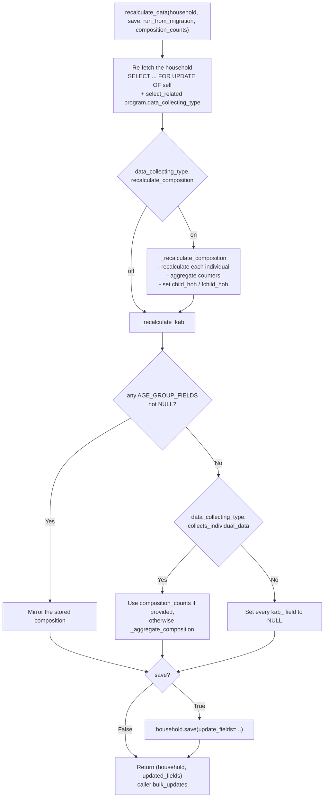
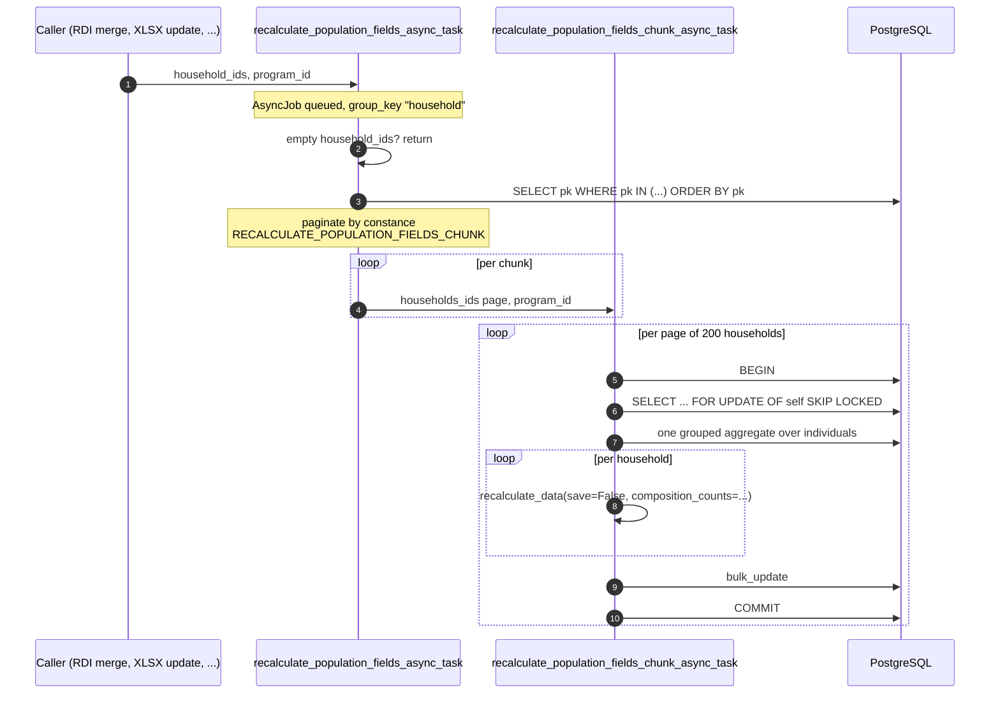

# Population Recalculation

Households carry denormalised counters describing their members: the **composition**
(`female_age_group_0_5_count` and friends) and the **known affected beneficiaries**
(`kab_*`). Neither is computed on read - both are stored on the household row and refreshed
whenever something changes the household's membership.

This page describes how that refresh works, from a single household up to a bulk run over
millions of rows.

- User-facing meaning of the counters: [Known Affected Beneficiaries](../guide-user/known-affected-beneficiaries.md)
- Backfilling existing data: [Maintenance](../guide-adm/maintenance.md#backfill-kab)

## The single household path

`hope.apps.household.services.household_recalculate_data.recalculate_data` is the only place that
decides what a household's counters should be.

Points worth knowing:

- The function is wrapped in `transaction.atomic` and always **re-fetches** the household with
  `select_for_update`, so callers may pass a stale instance.
- **The household is locked before any individual.** Every other flow that locks both rows must use
  the same order - `services/locking.py` exists for exactly this - otherwise concurrent grievance
  edits and recalculations deadlock.
- Composition is gated by `recalculate_composition`; **KAB always runs**, so the function always
  returns a non-empty `updated_fields` list.
- `composition_counts` is the batch escape hatch: a caller that already counted many households in
  one query passes this household's row instead of making `recalculate_data` count again. It is
  consumed only on the counted branch, which is the branch where re-counting would be wasted.

### One definition of the counters

Both the per-household path and the batch path build their filters from
`_composition_count_filters(cutoff)`. The only difference is how the age boundary is expressed:

| | Per household | Batch |
|---|---|---|
| Entry point | `_aggregate_composition(household)` | `aggregate_composition_by_household_id(ids)` |
| Query shape | one `aggregate()` over the household's individuals | one grouped `values("household_id").annotate(...)` |
| Age cutoff | Python, `last_registration_date - relativedelta(years=n)` | SQL, `household.last_registration_date - interval 'n years'` |

Postgres calendar interval arithmetic matches `relativedelta` subtraction, including the 29 February
clamp, so the two paths cannot disagree on who falls into which band. Any change to the counting
rules is made once, in the shared filter builder.

`aggregate_composition_by_household_id` guarantees an entry for **every** requested id: a household
with no individuals gets all-zero counters rather than being missing from the result, so callers can
index into the mapping without a fallback.

## The bulk path

Bulk recalculation runs through `AsyncJob`, in two levels: a scheduler job that slices the work, and
chunk jobs that do it.

Design notes:

- **The scheduler never filters by programme.** `program_id` is only carried through so the chunk job
  can attach the right programme to each household instance and so the `AsyncJob` row is attributed
  correctly. Selection is by primary key alone.
- **Empty `household_ids` is a no-op, guarded once** in the scheduler action. Without the guard the
  `pk__in` filter would degenerate into "every household in the database". Callers also avoid
  queueing a job at all when they have nothing to recalculate, but the guard is what makes it safe.
- **No gate on `recalculate_composition`.** Households of non-recalculating types are no longer
  skipped, because their KAB still has to be refreshed; `recalculate_data` decides per household what
  to compute.
- **`skip_locked`** means a household already locked by another writer is left out of this pass rather
  than blocking the chunk. Whatever holds the lock is itself performing a write that schedules a
  recalculation.
- **One grouped aggregate per page of 200**, not one per household - this is what keeps a chunk job
  linear in pages instead of linear in households.
- `disable_concurrency` is applied to `Household` and `Individual` for the duration of the chunk, so
  optimistic concurrency versioning does not reject the bulk writes.

## What triggers a recalculation

| Trigger | Entry point | Scope |
|---|---|---|
| RDI merge | `rdi_merge.py`, scheduled `on_commit` | all merged households of the import |
| Grievance: add individual | `add_individual_service.py` | one household, synchronous |
| Grievance: delete individual | `individual_delete_service.py` | one household, synchronous |
| Grievance: individual data update | `individual_data_update_service.py` | one household, synchronous |
| Grievance: household data update | `household_data_update_service.py` | one household, synchronous |
| XLSX individual update | `individual_xlsx_update.py`, `update_individuals` | households of the updated individuals |
| Universal individual update | `universal_individual_update_service.py`, `schedule_population_recalculation` | households of every individual in the file |
| Nightly birthday job | `interval_recalculate_population_fields_async_task` | households with an individual whose birthday is today |
| Backfill | `backfill_kab` management command | all households, programme by programme |

### Bulk update services

Both bulk update services decide whether to schedule anything by intersecting the columns they wrote
with `RECALCULATION_INDIVIDUAL_FIELDS` (`relationship`, `withdrawn`, `duplicate`, `sex`,
`disability`, `birth_date`, `pregnant`). A file that only changes names or addresses schedules
nothing.

The universal individual update schedules **once, after the whole update loop**, not per batch:
the number of jobs is then independent of the batch size, and a household whose members span two
batches is recalculated once rather than twice.

### Nightly job

`interval_recalculate_population_fields_async_task` runs at midnight and collects households whose
members have a birthday that day, so individuals crossing an age band boundary are moved. It filters
on `household_id__isnull=False` - individuals without a household, such as external collectors, would
otherwise inject the string `"None"` into the downstream `pk__in` filter.

## Configuration

| Setting | Default | Effect |
|---|---|---|
| `RECALCULATE_POPULATION_FIELDS_CHUNK` (constance) | `50000` | Households per chunk job. Lower it to spread a large recalculation over more workers, raise it to queue fewer jobs. |

Note that a chunk job is processed by a single worker, serially, page by page. The constance value is
therefore also the unit of parallelism: one scheduler job over 50 000 households produces exactly one
chunk job and one busy worker.

The KAB half of this pipeline was introduced by
[AB#326718: Calculate Gender and Age disaggregated group ALSO for Partial Data collecting Type](https://dev.azure.com/unicef/ICTD-HCT-MIS/_workitems/edit/326718).
