The Accountability Module in HOPE is designed to enhance two-way communication and feedback between UNICEF and programme beneficiaries.
This module is particularly useful for programmes that include a Cash Plus component, as it enables the delivery of targeted messages to beneficiaries. These messages can provide information on best practices, referrals, and additional services available under Cash Plus interventions.
The Accountability Module includes the following features:
• One-Way Communication (Informative):
Allows users with the Accountability Manager role to create and send key messages to beneficiaries with valid phone numbers.
• Surveys (Two-Way Feedback):
Enables users to collect structured feedback from beneficiaries. Surveys can be distributed through RapidPro, SMS, or uploaded manually using XLSX files.

 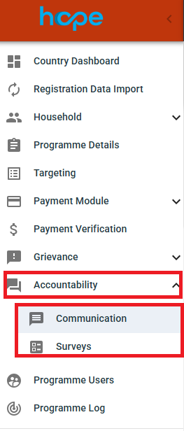

## Communication

Purpose
The Communication page is used to send key information or announcements to specific groups of beneficiaries. This is an outbound-only feature, meaning replies from beneficiaries are not expected.
Main Features
• Compose and send messages
• Select target groups
• View and manage message history
Steps to Use
Compose a Message
1.	Click New Message.
 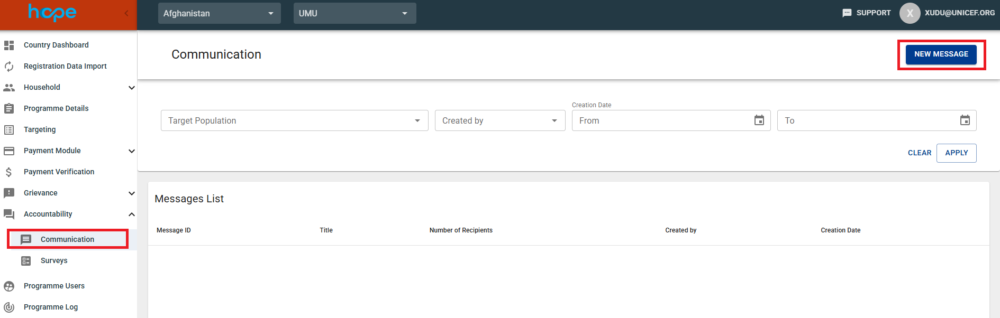

2.	Specify the recipients by selecting Households, Target Population, or RDI.
 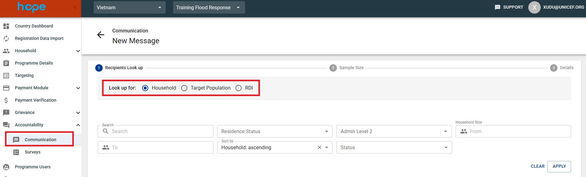

3.	Define the Sample Size. Confirm whether you want to send the communication to the entire list or to a random sample of beneficiaries.
 
 
4.	Enter the following details:
• Title: Provide a short, clear subject line.
• Message Body: Write a concise and easy-to-understand message for beneficiaries. 
 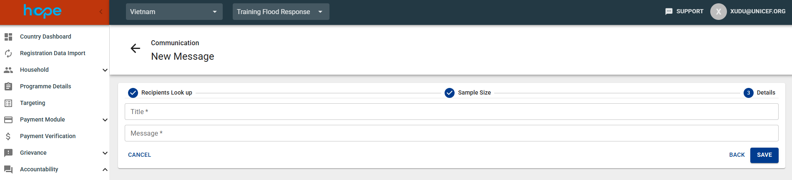
 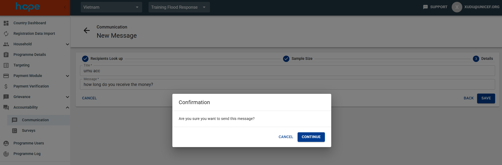
 
After the message is created, HOPE automatically generates a unique Message ID (MSG ID). You can then view the message details and the list of recipients.
 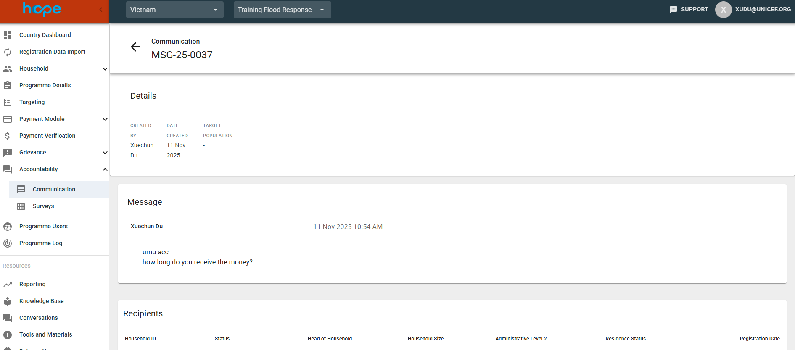

## Surveys

Purpose
The Surveys page is used to collect structured feedback or conduct assessments by distributing surveys to beneficiaries.
Main Features
• Create and design surveys
• Select target or distribution lists
• Monitor responses in real time

Steps to Use
Create a New Survey
1.	Click New Survey.
2.	Select the communication channel: RapidPro, SMS, or Manual.
 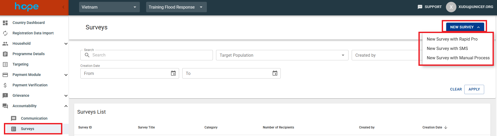

3.	Look up for Programme or Target Population.
 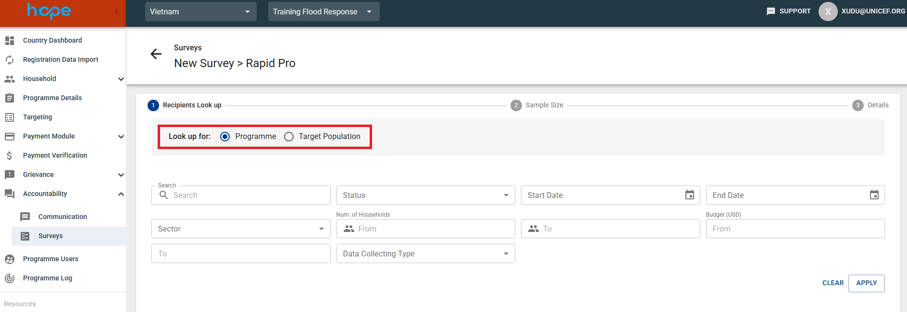

4.	Define the recipient sample size. Confirm whether you want to send the survey to the entire list or to a random sample of beneficiaries. You can also filter out administrative level areas.
 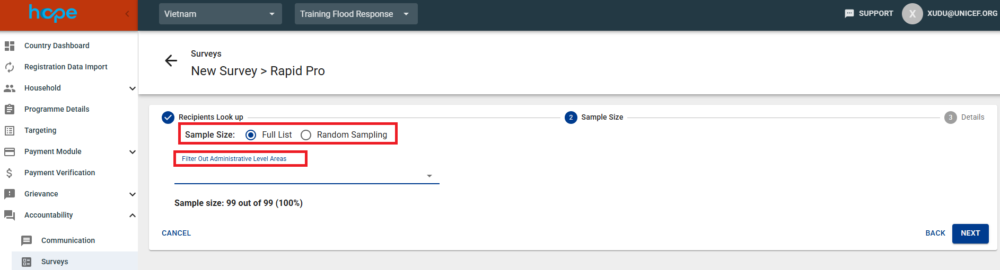

5.	 Enter or select the Survey Title from the list of existing surveys.
 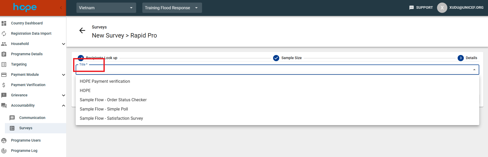
 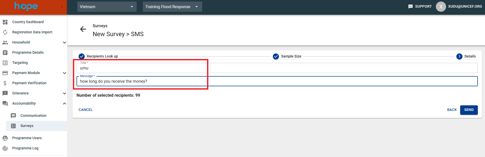
 

6.	 Review the information and click Confirm Survey to proceed.
 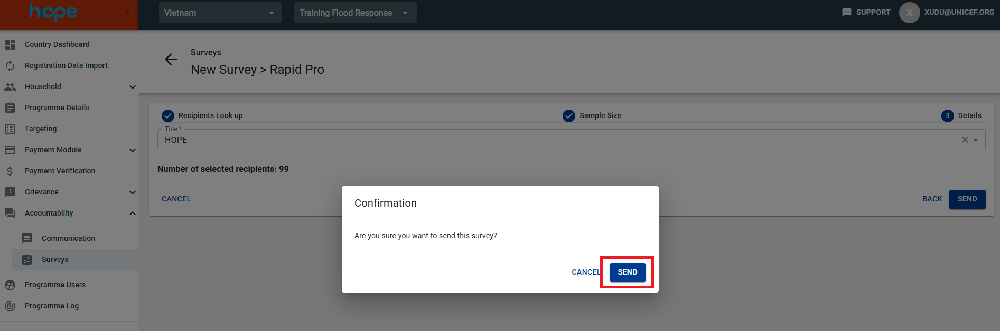

 
## Monitor and Analyze RapidPro Survey Responses
• Go to the Surveys page.
• Select the relevant survey.
• Click Check Answers to view collected responses.

## Best Practices and Recommendations
• Language and Clarity: Use local languages or dialects when appropriate, and ensure all messages are culturally sensitive and easy to understand.
• Consent and Privacy: Ensure that all data collection and feedback activities comply with UNICEF’s data protection and privacy policies.

