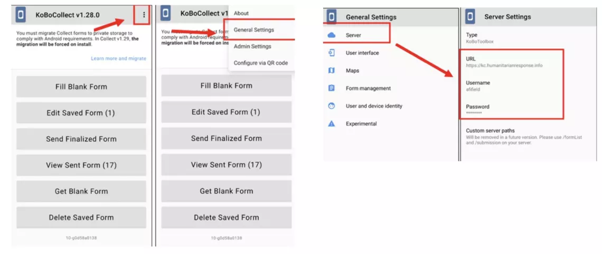
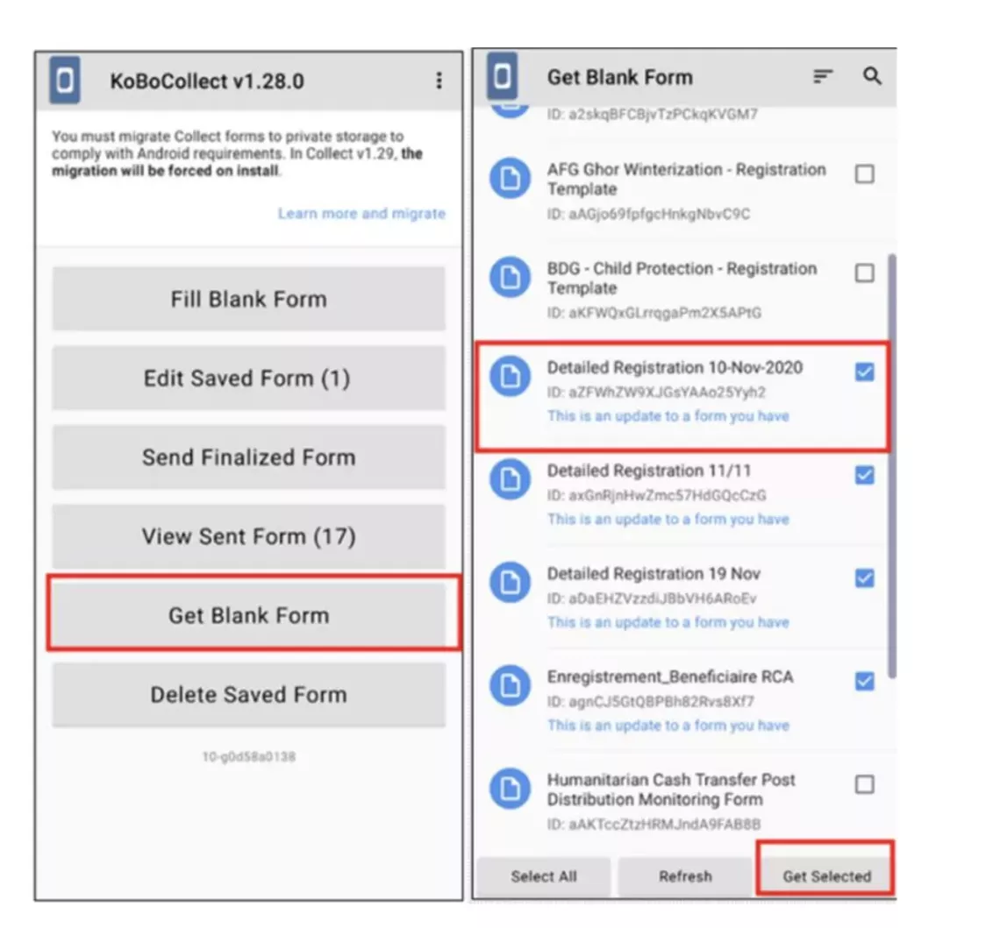
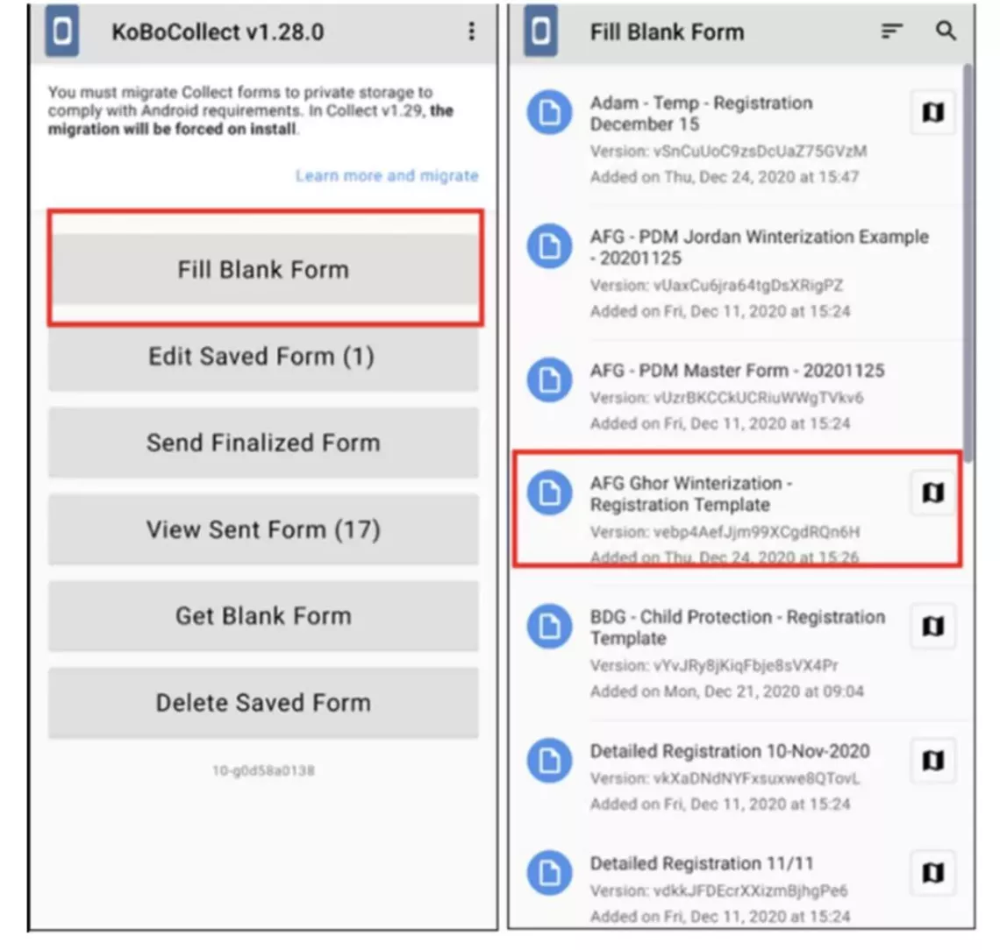
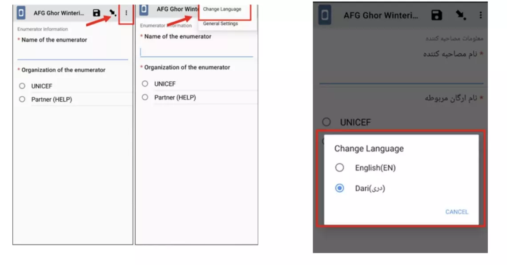
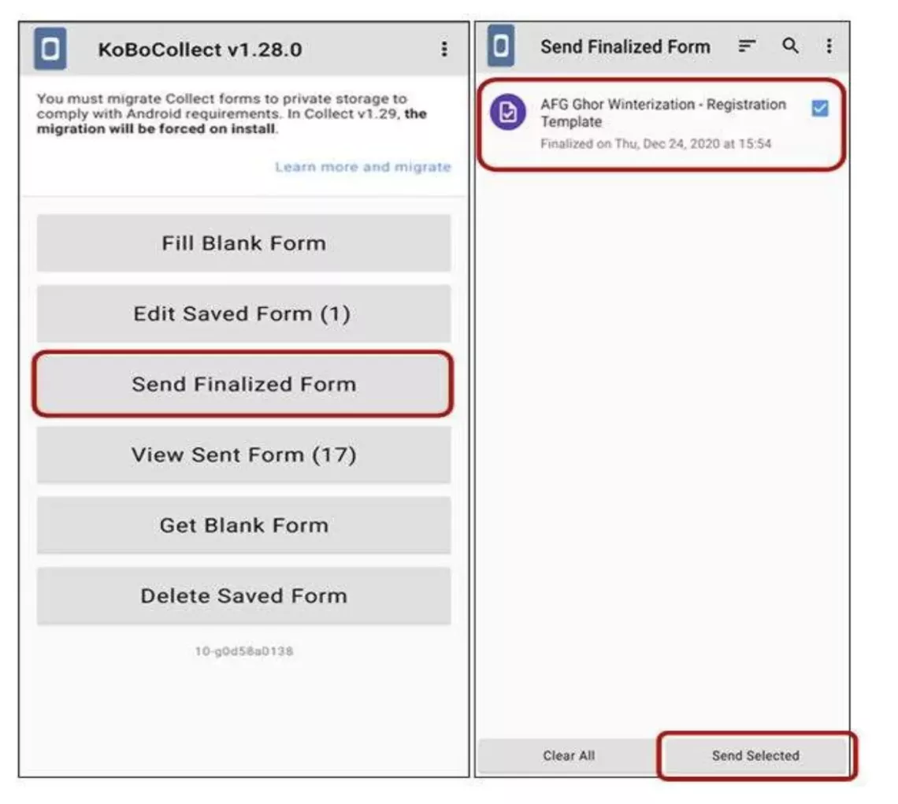
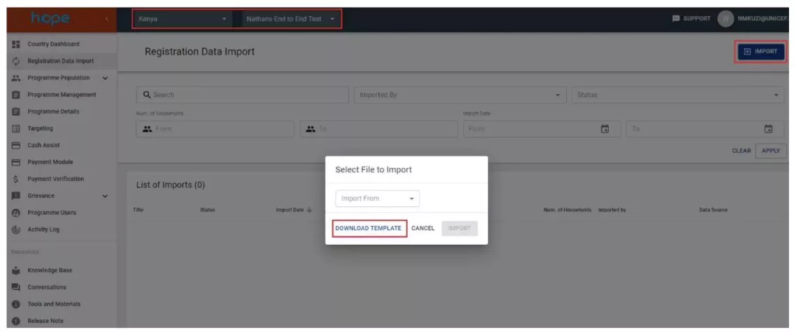

This section covers the tools for uploading beneficiary data and the Registration Data Import module in HOPE. There are two methods supported by HOPE for registering beneficiary data and two methods to
import such data:Registration

   a) Beneficiary registration using KOBO Toolbox on UNICEF cloud instance – Available in online and offline settings

   b) Aurora available in online settings Import

   a) Import data directly from Kobo and Aurora

   b) Import data from an excel sheet

   c) Import data through API

#### Beneficiary Registration with KOBO

KoBo is a digital data collection tool that allows creation of customization of registration forms and easy collation of data for reporting and programmatic use. It consists of two components:

1. KoBo Toolbox which is a web application
1. KoBo Collect which is mobile application (for Android)

!!! note "Why use KOBO?"

    a) Digital Data Collection: Cleaner, more reliable data; all collection lists automatically collated.
    
    b) Wide Adoption: KoBo is already used across the humanitarian sector, including by many of UNICEF’s partners.
    
    c) Pathway to HOPE MIS: Using standardized data collection forms in KoBo will make data usable later for UNICEF HOPE.

#### Getting Started with KoBo Toolbox and Sync with KoBo Server

The following steps will explain how to create a KoBo account:

1. Request for a Kobo Account 
      1. Ask your HOPE focal point for external users to be added to the UNICEF active directory
      2. Have your HOPE focal point create the KoBo user accounts in Django.
      3. Activate your account by clicking the link in the e-mail account that you reported.
      4. Once you have created your account, communicate your username to the relevant UNICEF project manager or focal point to be granted access to the Kobo forms.

1. Setting up KoBo Collect on Your Android Phone or Tablet
      1. Go to the Google Play Appstore and download the KoBo Collect application
      1. Launch the application
      1. Once inside the application, click on the three dots on the upper right-hand side of the screen. This will
      open your settings menu. From the settings menu, select “General Settings”
      1. In “General Settings,” tap on the button titled “Server”
      1. In the “Server” settings, type in:

      

1. Downloading Surveys to Your Device
      1. Tap on “Get Blank Form”.
      1. A list of forms will appear. You may only have one form in your list. Make sure the checkbox to the right of the form title is checked, then tap the “Get Selected” button on the bottom right. You will get a message confirming that the download of the form was successful.

   

1. Filling out Surveys
a) On the home screen of the application, tap “Fill Blank Form”
b) Your list of forms will appear. Tap on a form’s title to enter the form and begin filling it out.

   

1. Changing Languages in a Form

      While inside a form, you can select a different language by:

      1. Selecting the three dots on the upper right-hand side of the screen.
      1.  Tapping “Change Language”.

      

1. Uploading Finalized Forms

      1. To submit finalized forms, tap on “Send Finalized Form” on the home screen.
      1. A list of the survey submissions which you have made will appear on the screen. 

      

#### Overview of the Registration Data Import (RDI) Module

The Registration Data Import (RDI) module allows import of beneficiary data collected by KoBoToolbox or shared by partners. Currently one can import data sourced from Excel or directly from KoBo registration forms. Moreover, you can download a template from RDI section within HOPE in the event you have receive data from an external source which requires formatting and adjustment prior to import into HOPE

#### Why is RDI Important?

RDI is the first step that a project team needs to perform in HOPE to ensure adequate, accurate and up-todate beneficiary data. Additionally, it allows for importing data from external data sources in a secure manner. For example, in the RDI module you can import individual and household data provided by an implementing partner (such as an NGO) or received as an export from another entity’s system such as a national registry or sister UN agency’s MIS.

#### What do I need to do before importing data?

Ensure the following when selecting file to import: 

- User has a excel file or Kobo file to upload. 
- Download the import template from the RDI module in the event the data is not already in the correct format.

#### How Do I Download a Template?

1. Select the respective Programme and go to the Registration Data Import module and click import on the top right, a window will appear to select file to import
1. Click to download a template in the event you have data from a third party.

    

This is the template provided when you select download.
