This section covers the tools for uploading beneficiary data and the Registration Data Import module in HOPE. There are two methods supported by HOPE for registering beneficiary data and two methods to
import such data:Registration

   a) Beneficiary registration using KOBO Toolbox on UNICEF cloud instance – Available in online and offline settings

   b) Aurora is available in online settings Import

   c) Import data directly from Kobo and Aurora

   d) Import data from an excel sheet

   e) Import data through API

#### Beneficiary Registration with KOBO

KoBo is a digital data collection tool that allows creation of customization of registration forms and easy collation of data for reporting and programmatic use. It consists of two components:

1. KoBo Toolbox which is a web application
1. KoBo Collect which is mobile application (for Android)

!!! note "Why use KOBO?"

    a) Digital Data Collection: Cleaner, more reliable data; all collection lists automatically collated.

    b) Wide Adoption: KoBo is already used across the humanitarian sector, including by many of UNICEF’s partners.

    c) Pathway to HOPE MIS: Using standardized data collection forms in KoBo will make data usable later for UNICEF HOPE.

#### Getting Started with KoBo Toolbox and Sync with KoBo Server

The following steps will explain how to create a KoBo account:

1. Request for a Kobo Account
      1. Ask your HOPE focal point for external users to be added to the UNICEF active directory
      2. Have your HOPE focal point create the KoBo user accounts in Django.
      3. Activate your account by clicking the link in the e-mail account that you reported.
      4. Once you have created your account, communicate your username to the relevant UNICEF project manager or focal point to be granted access to the Kobo forms.

1. Setting up KoBo Collect on Your Android Phone or Tablet
      1. Go to the Google Play Appstore and download the KoBo Collect application
      1. Launch the application
      1. Once inside the application, click on the three dots on the upper right-hand side of the screen. This will
      open your settings menu. From the settings menu, select “General Settings”
      1. In “General Settings,” tap on the button titled “Server”
      1. In the “Server” settings, type in:

      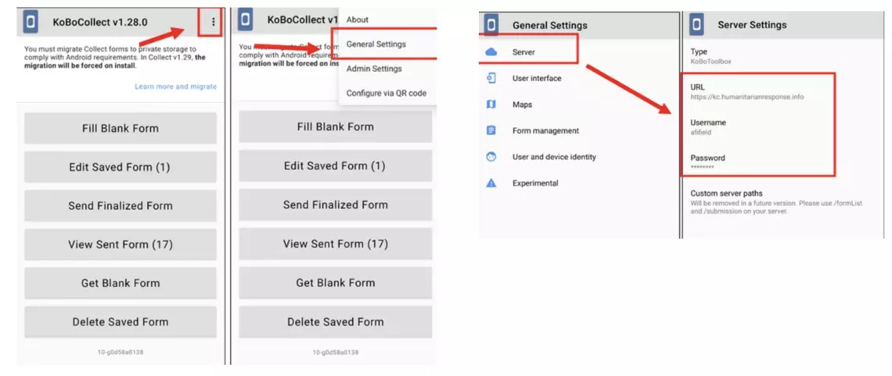

1. Downloading Surveys to Your Device
      1. Tap on “Get Blank Form”.
      1. A list of forms will appear. You may only have one form in your list. Make sure the checkbox to the right of the form title is checked, then tap the “Get Selected” button on the bottom right. You will get a message confirming that the download of the form was successful.

   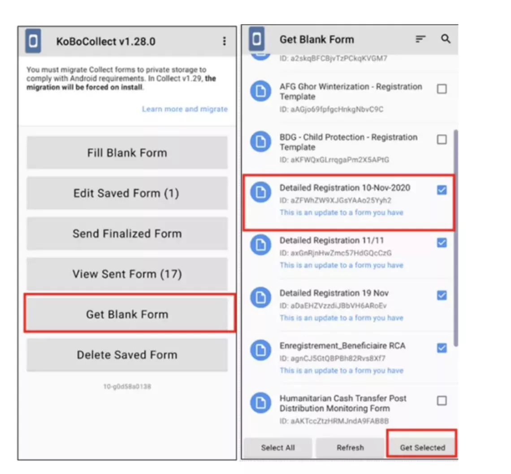

1. Filling out Surveys
a) On the home screen of the application, tap “Fill Blank Form”
b) Your list of forms will appear. Tap on a form’s title to enter the form and begin filling it out.

   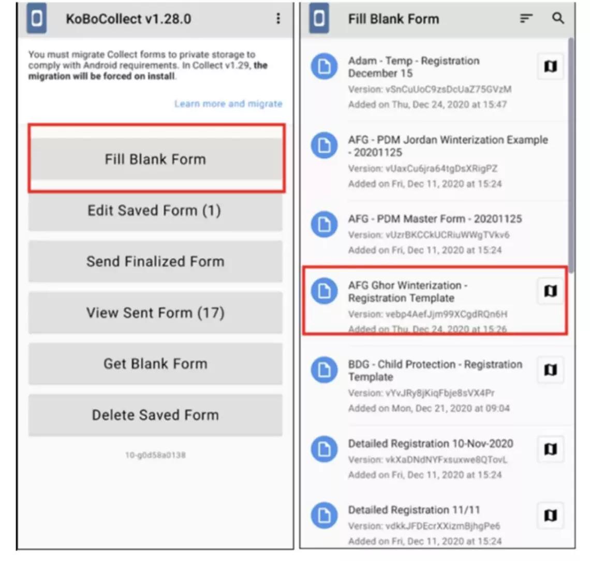

1. Changing Languages in a Form

      While inside a form, you can select a different language by:

      1. Selecting the three dots on the upper right-hand side of the screen.
      1.  Tapping “Change Language”.

      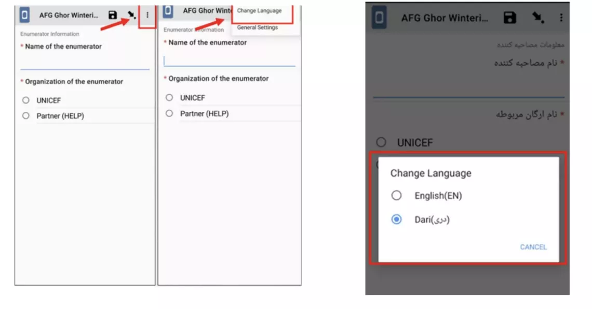

1. Uploading Finalized Forms

      1. To submit finalized forms, tap on “Send Finalized Form” on the home screen.
      1. A list of the survey submissions which you have made will appear on the screen.

      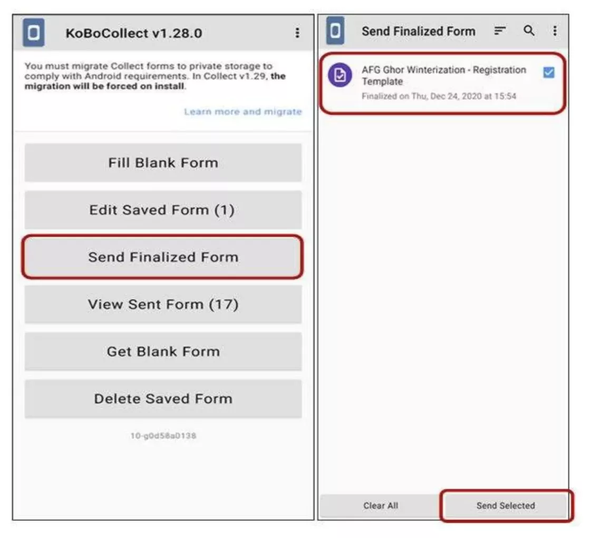

#### Overview of the Registration Data Import (RDI) Module

The Registration Data Import (RDI) module allows import of beneficiary data collected by KoBoToolbox or shared by partners. Currently one can import data sourced from Excel or directly from KoBo registration forms. Moreover, you can download a template from RDI section within HOPE in the event you have receive data from an external source which requires formatting and adjustment prior to import into HOPE

#### Why is RDI Important?

RDI is the first step that a project team needs to perform in HOPE to ensure adequate, accurate and up-todate beneficiary data. Additionally, it allows for importing data from external data sources in a secure manner. For example, in the RDI module you can import individual and household data provided by an implementing partner (such as an NGO) or received as an export from another entity’s system such as a national registry or sister UN agency’s MIS.

#### What do I need to do before importing data?

Ensure the following when selecting file to import:

- User has a excel file or Kobo file to upload.
- Download the import template from the RDI module in the event the data is not already in the correct format.

#### How Do I Download a Template?

1. Select the respective Programme and go to the Registration Data Import module and click import on the top right, a window will appear to select file to import
1. Click to download a template in the event you have data from a third party.

    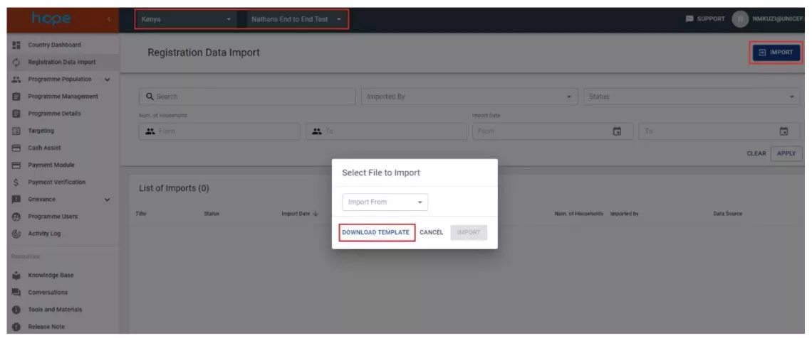

This is the template provided when you select download.

#### How to import data

1. Select the respective Programme and go to the Registration Data Import module and click import on the top right, a window will appear to select file to import
2. Select file to import data from Excel, Kobo, or Program Population.

 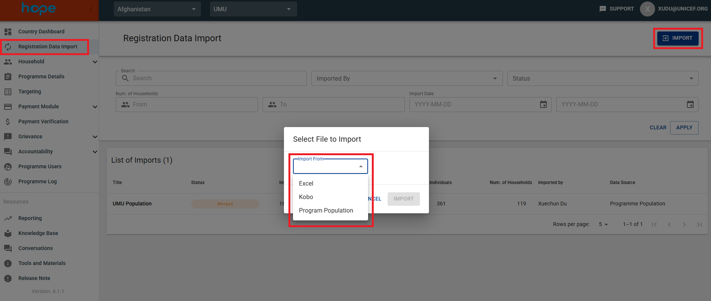

Import data from Excel: upload file and name the title, then click IMPORT.

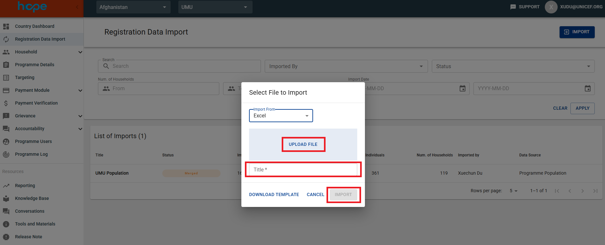

Import data from Kobo: choose the option(s) of “only approved submissions” and/or “Pull pictures”, then select project and name the title. Click IMPORT.

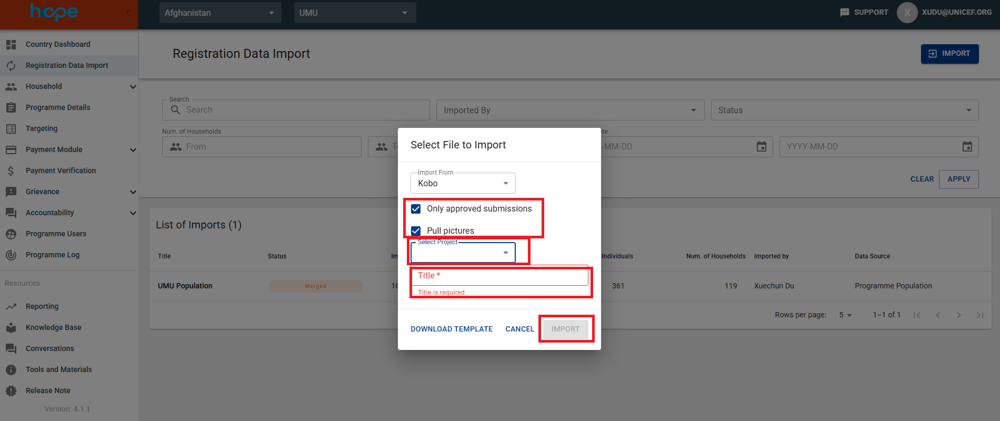

Import data from Program Population: name the title, choose the Program Name, and choose the program data requirement needed. Click IMPORT.

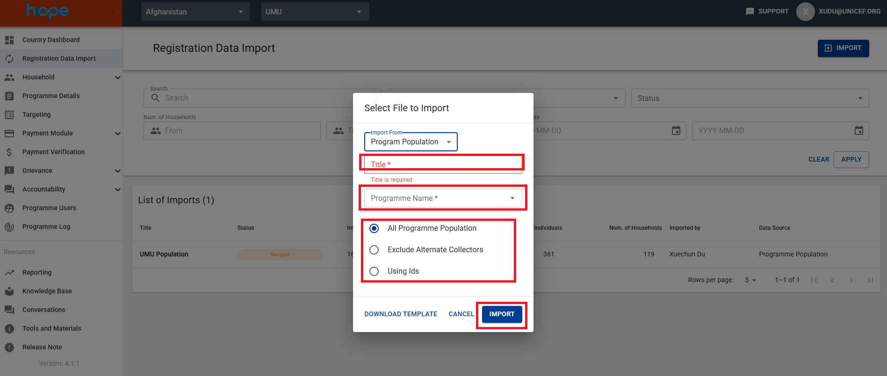

#### How to manage Periodic Data Update (PDU) values online?

#### How to deal with duplication (Deduplication)?

Deduplication is the process that identifies copies (duplicates) of individual beneficiary data. HOPE conducts 2 different kinds of deduplication: 
1. Within batch: checking for duplicates within the registration batch that is being uploaded in registration data import. The deduplication within batch does not identify individuals that need adjudication in order to determine if they are unique or a duplicate. 
2. Against the golden record: checking for duplicates against the golden record of beneficiaries already in HOPE. The deduplication against the golden record identifies individuals that need adjudication in order to determine if they are unique or a duplicate. 

Adjudication is the manual process that allows for the resolution of potential duplicates who are flagged and forwarded to relevant staff members for manual review via a ticket in the Grievances and Feedback module in HOPE.

Once the data is imported you can see the relevant tickets created by clicking on the VIEW TICKET button.
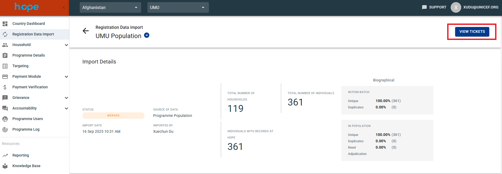

Then it will direct to the system-generated tickets under the Grievance Module. There are two types of tickets, user-generated (see in Grievance), and system-generated. "Needs adjudication” falls under the system generated tickets. Further narrow down and filter by category “Needs Adjudication”, and see the grievance tickets list below.
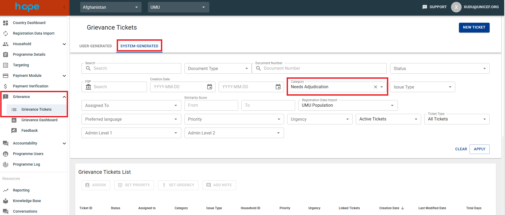

Review each Needs Adjudication tickets and check:
1. If individual is a duplicate
2. If it’s a full HH duplication and create a linked ticket and withdraw one HH
3. If individuals have same ID and it is not possible could be an error, verify and confirm with the beneficiary, create a data change linked ticket and edit the document to provide the correct document

Find more details of how to Assign, Set to in progress, Send for approval, Approve and Close ticket in the Grievance Manual.

Scenario 1: Both Individuals are Unique, (different id, name, date of birth, etc.)
1. Assign to me
2. Set in Progress
3. Write comments in notes on the issue
4. Send for approval
5. Mark both and click on Mark as distinct and close ticket
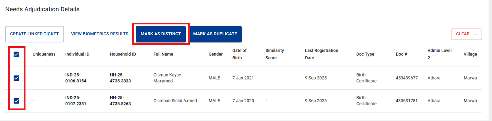

Scenario 2: Only individuals are duplicates and not the full household
1. Assign to me
2. Set in Progress
3. Write comments in notes on the issue
4. Send for approval
5. Mark one as distinct and one as duplicate and close the ticket
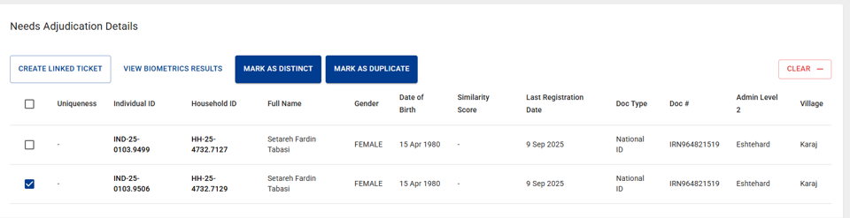

Scenario 3: Individuals are duplicates and all the members of the household (Full household is a duplicate)
1. Assign to me
2. Identify which household to withdraw
3. Click on Create linked ticket
4. Category > data change
5. Issue type > Withdraw Household
6. Click on next
7. Search for household to withdraw and click on it then click on next
8. Click on received consent and click on next
9. Write withdrawal reason and Save
10. Click on Assign to me
11. Click on Set in progress and send for approval
12. Select reason for withdrawal as Household duplicate and insert HH duplicate and click confirm
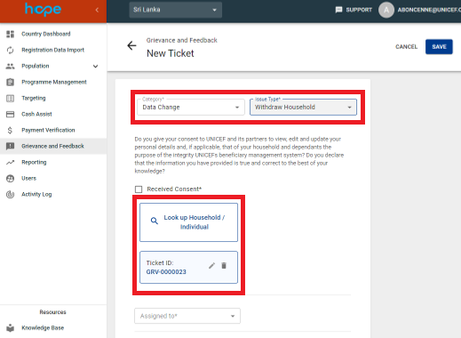
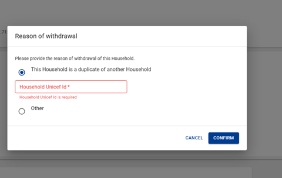

Apart from importing XLS template, users can utilize the online editing feature directly from the user interface, after defining the PDU fields following the regular process.
Access to Online PDU feature:
1. Find Household module and choose “Individuals” where users can find Periodic Data Updates.
2. Navigate to “Online Edits” tab.
3. Click 'NEW ONLINE EDIT'.
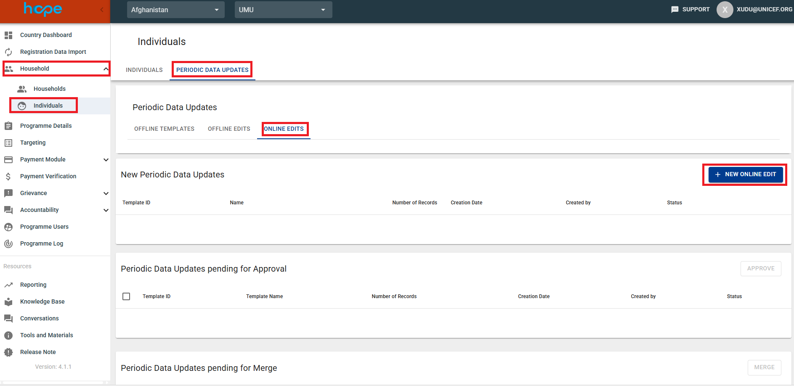

4. Filter the individuals of update.
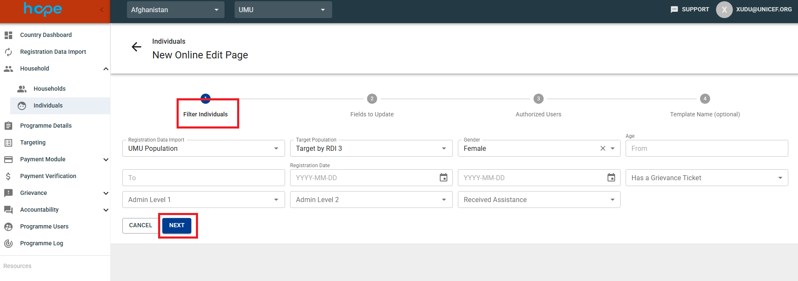

5. Specify the field(s) and the round(s).
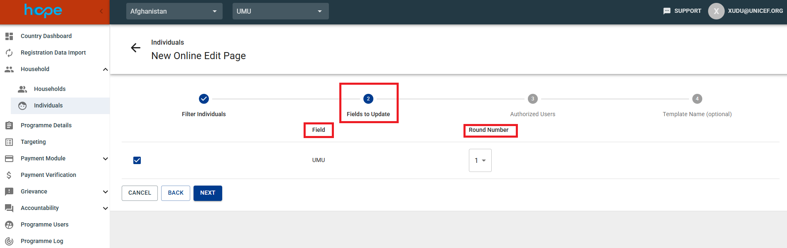

6. Authorize users to access the template; specify who can edit, approve and merge.
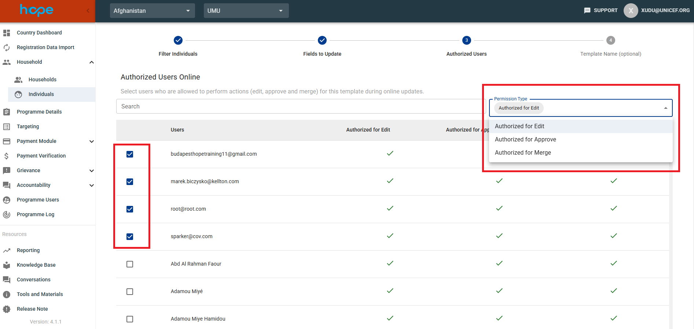

7. Specify template name (optionally).
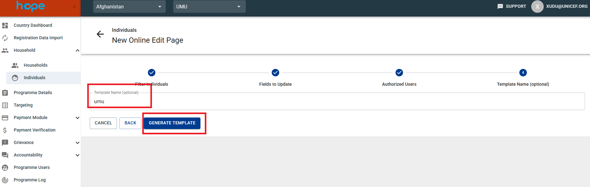

The online edits will be added, segregated by status. Users will be able to contribute based on their authorized access and user permissions. Automatic email notifications will be sent to relevant users on key status changes.
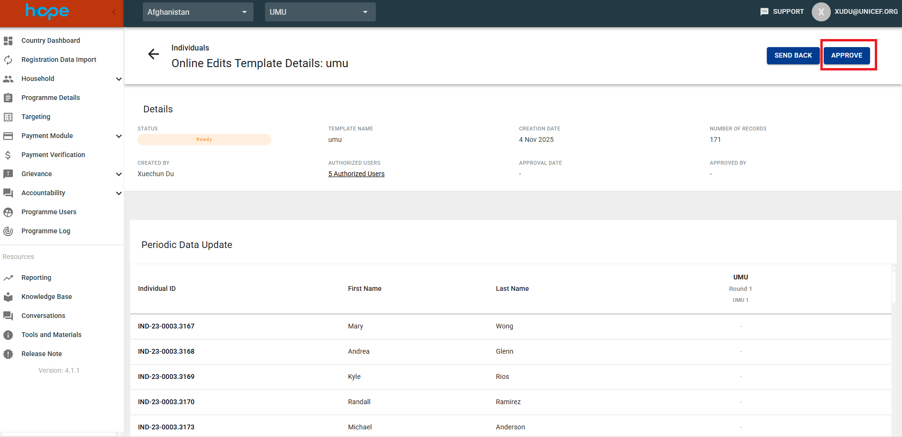
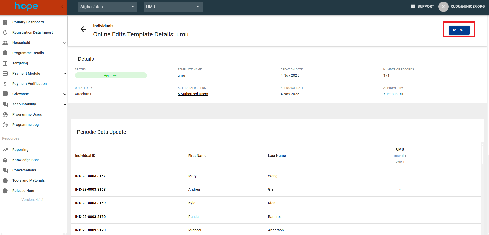
