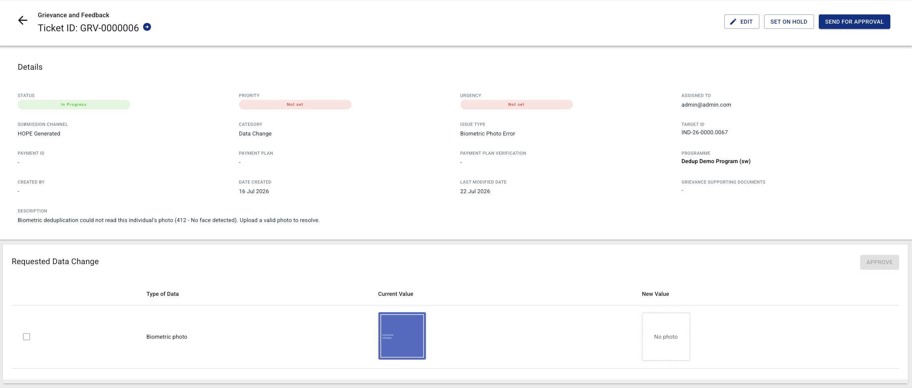
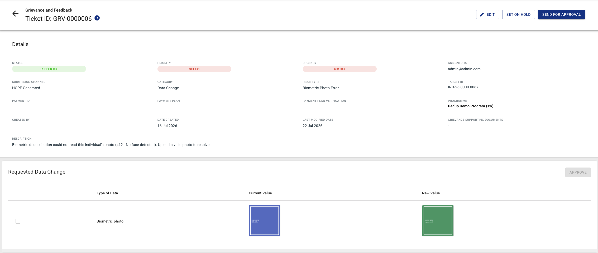
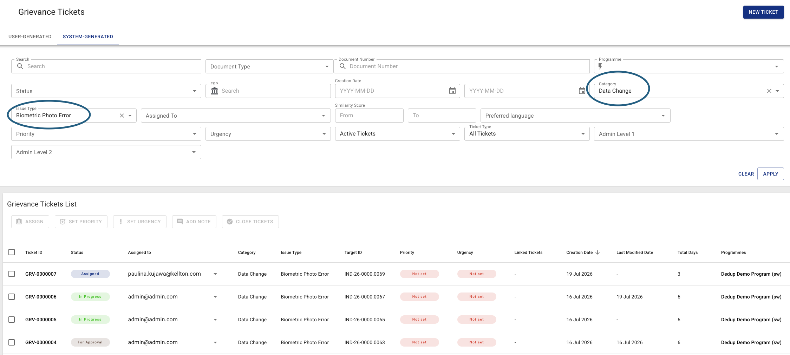
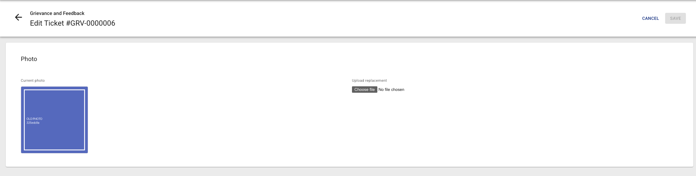
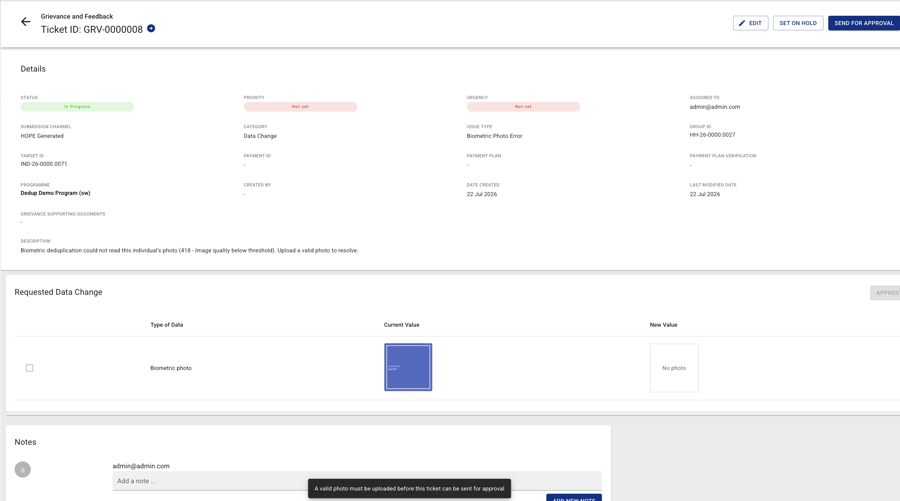

# Biometric Photo Error Tickets

When biometric deduplication runs on a Registration Data Import, the deduplication engine cannot always read a beneficiary's photo — the image may contain no face, more than one face, or be too poor in quality to compare. Previously these findings landed among the **Needs Adjudication** tickets, where they were confusing: there is no duplicate to adjudicate, only a photo that has to be replaced.

These findings are now routed to their own **Data Change** ticket type — **Biometric Photo Error** — whose sole purpose is to have an operator upload a valid photo for that individual.

---

## How the tickets are created

Photo Error tickets are **created automatically by the system** during the biometric deduplication step of an RDI. They cannot be raised manually — the issue type is deliberately hidden from the *New Ticket* form.

After deduplication finishes, the engine's findings are split in two:

- Findings that represent a genuine biometric match go to **Needs Adjudication** tickets, as before.
- Findings that represent an unreadable photo go to **Biometric Photo Error** tickets.

### Which errors produce a ticket

The deduplication engine reports a status code with every finding. Four of them mean "the photo could not be used" and produce a Photo Error ticket:

| Code | Meaning |
|---|---|
| 412 | No face detected |
| 416 | Face below confidence |
| 418 | Image quality below threshold |
| 429 | Multiple faces detected |

The specific code is recorded in the **ticket description**, so the operator can see *why* the photo was rejected before opening it — for example:

> Biometric deduplication could not read this individual's photo (412 - No face detected). Upload a valid photo to resolve.

---

## What the ticket looks like

A Biometric Photo Error ticket carries the following properties:

| Field | Value |
|---|---|
| **Category** | Data Change |
| **Issue Type** | Biometric Photo Error |
| **Type** | System-Generated |
| **Submission channel** | HOPE Generated |

Note the unique combination: the ticket sits in the **Data Change** category — because closing it changes beneficiary data — but it is classified as **System-Generated**, because no operator raised it.

Until a replacement is uploaded, the **Requested Data Change** section shows the individual's current (rejected) photo and an empty new value.

Once a photo has been uploaded, both values are shown side by side — the rejected photo as the current value, the replacement as the new value.

### Finding them in the list

Photo Error tickets are listed under the **SYSTEM-GENERATED** tab of the Grievance list. To narrow the list down to them, set **Category** to *Data Change* and then **Issue Type** to *Biometric Photo Error*.

---

## Resolving a ticket

Photo Error tickets follow the standard Data Change approval flow, with two differences at the start.

**Editing opens a dedicated photo upload page** rather than the general grievance edit form, since there is only one field to change. The page shows the individual's current (rejected) photo next to an upload field, and **Save** stays disabled until a new file is chosen.

**The ticket cannot be sent for approval until a photo has actually been uploaded.** Attempting it is blocked with the message *"A valid photo must be uploaded before this ticket can be sent for approval"*, and the ticket stays In Progress.

From **For Approval** onward the ticket behaves like any other Individual Data Update: the reviewer approves the change in the **Requested Data Change** section, and closing the ticket applies the new photo to the individual's record.

---
