The Grievances Module generates reports based on feedback from beneficiaries and other stakeholders to improve the
design of UNICEF programmes. The information stored in the Grievance Module can support the investigation function of
the Office of Internal Audit and Investigations (OIAI) by consolidating and reporting problems like suspected fraud,
corruption, and misconduct such as sexual harassment, exploitation, and abuse, as well as protect and recover project or
beneficiary funds (in the event of a confirmed fraud). Through the Grievances Module in HOPE, UNICEF is better placed to
detect, mitigate risks of unfair selection and treatment, and the exclusion of vulnerable groups.

UNICEF staff, implementing partners, and vendors participating in the Grievances and Feedback Module In HOPE must follow
the procedures outlined in
the [Grievance and Feedback SOP](https://unicef.sharepoint.com/:w:/r/teams/EMOPS-HCT-MIS/_layouts/15/Doc.aspx?sourcedoc=%7B597B4057-0219-49E8-88F7-0962C0AAF40E%7D&file=HOPE%20-%20Grievances%20&%20Feedback%20SOP.docx=&action=default&mobileredirect=true&DefaultItemOpen=1).

This module enables UNICEF to aggregate grievances and feedback received from a variety of sources, to systematically
categorise, address and refer beneficiaries and non-beneficiaries’ complaints in a timely and traceable manner. This
function supports in detecting and mitigating risks of unfair selection, treatment, and exclusion of vulnerable groups
and was designed to improve the protection from and prevention of sexual exploitation and abuse (PSEA) by enabling
people, regardless of their beneficiary status, to submit confidential sensitive grievances, as well as, for UNICEF to
handle these types of grievances in an effective and confidential manner. This module represents a major tool in
UNICEF’s efforts to advance its commitment to Accountability to Affected Populations.

## How to create Grievance tickets

1. Select Grievance on the main menu and then select Grievance Tickets. Click on NEW TICKET to create a new grievance
   ticket.
   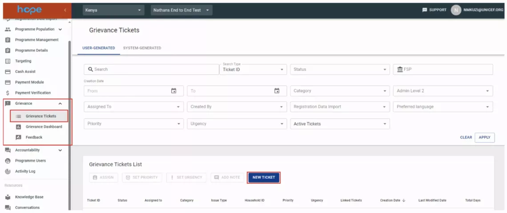

1. Select the grievance category and issue type then click next.
   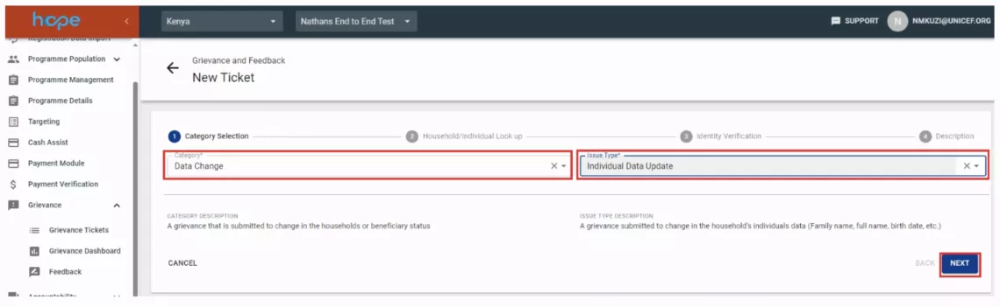

1. Select the individual that you will be making changes on and click next.
   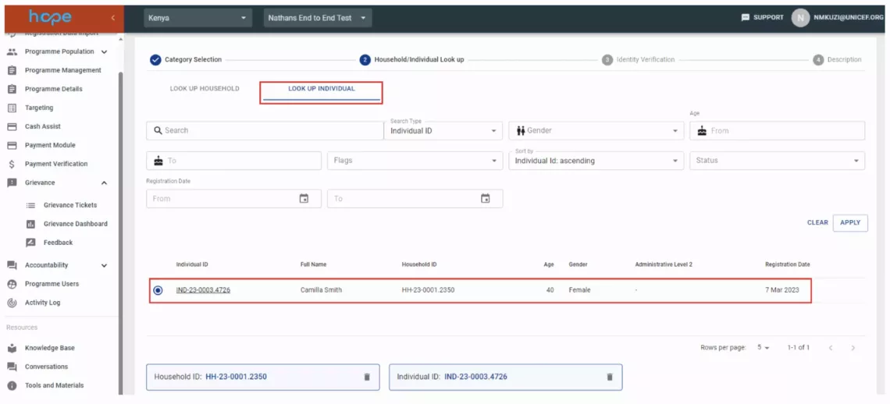

1. On the identity verification page, you have option of selecting screening questions at household level (Household
   Questionnaire) and individual level (Individual Questionnaire) fields. You can also have option to select if consent
   has been given (Received Consent). Select the received consent check box and click next.
   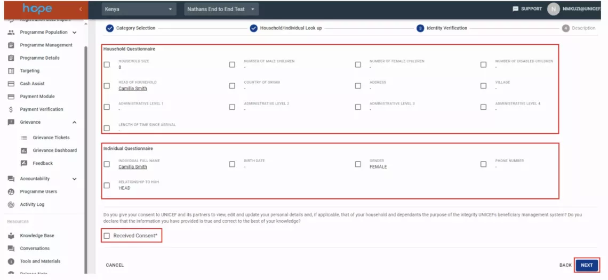

1. In the description page enter the details of the changes that you will making. In this example we will be adding the
   mobile number.
   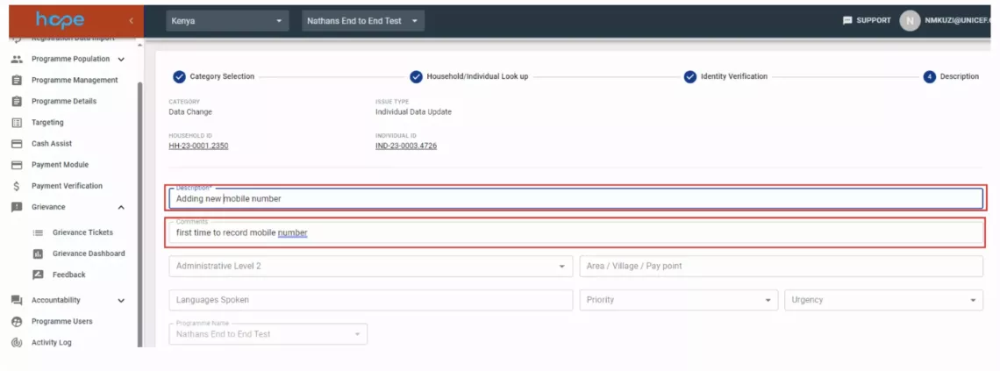

1. In the bio data section, select the Mobile Money Number field and enter the mobile number then click save.
   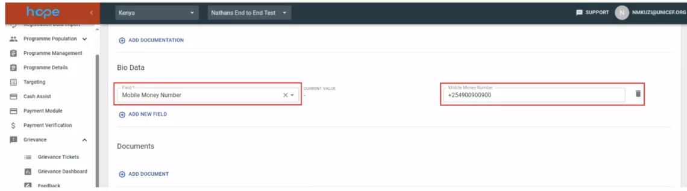

1. After you click save, a new grievance ticket will be created. The next step is to assign the ticket to someone who
   will work on the ticket.
   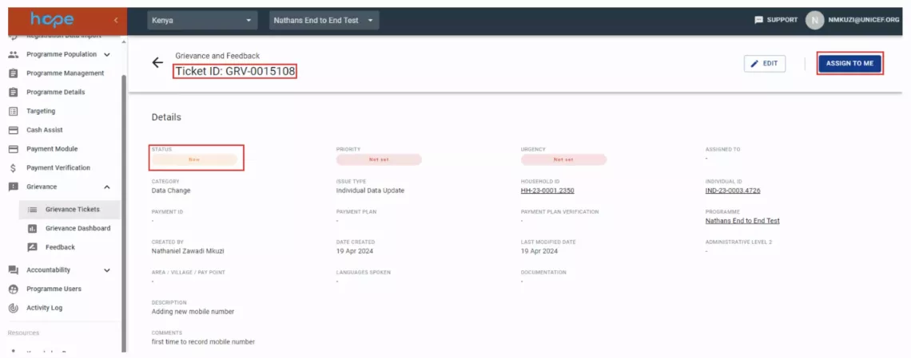

1. Once the ticket is assigned the status of the ticket will change from new to assigned. The next step is to click on
   SET TO IN PROGRESS so that you take action on the ticket.
   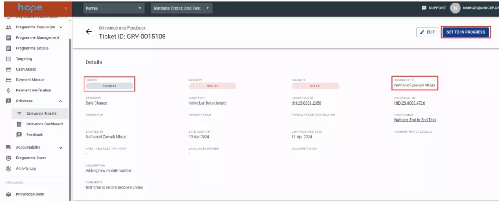

1. Once the ticket is in progress the status of the ticket will change from assigned to in progress. At this stage the
   information collected is verified then the ticket is sent for approval. Click on SEND FOR APPROVAL.
   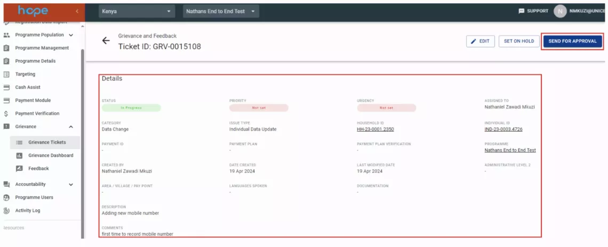

1. Once the ticket is sent for approval the status of the ticket will change from in progress to for approval. Select
    the checkbox under Requested Data Change field and click APPROVE to approve the grievance ticket.
    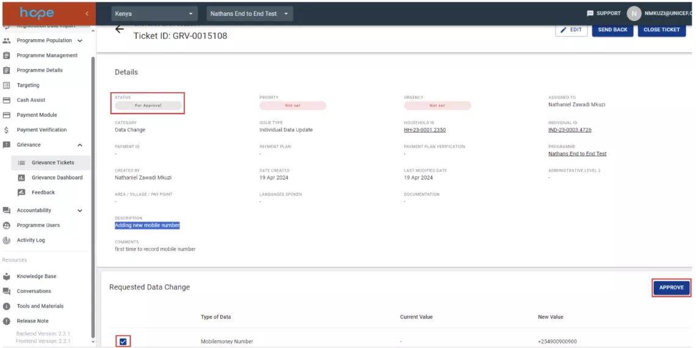

1. Once the ticket is approved the status of the ticket will change from in progress to for approval. Click on CLOSE
    Ticket to close the grievance ticket. You also have the option to send back or edit ticket if the approver is not
    satisfied with the resolution of the ticket.
    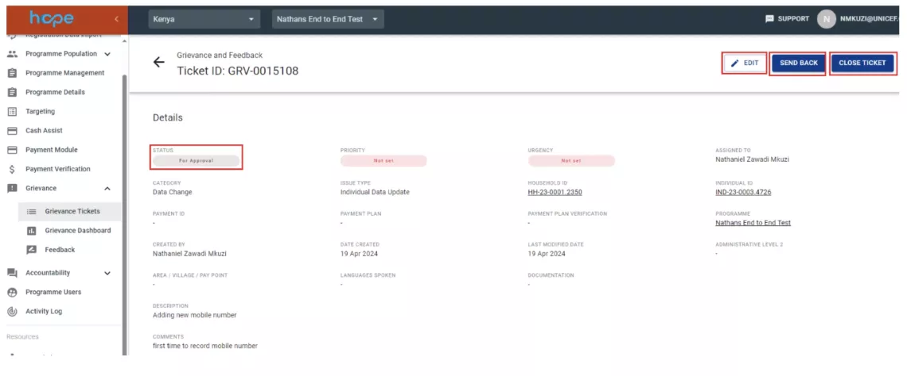

1. Once the ticket is closed the status of the ticket will change from for approval to for closed.
    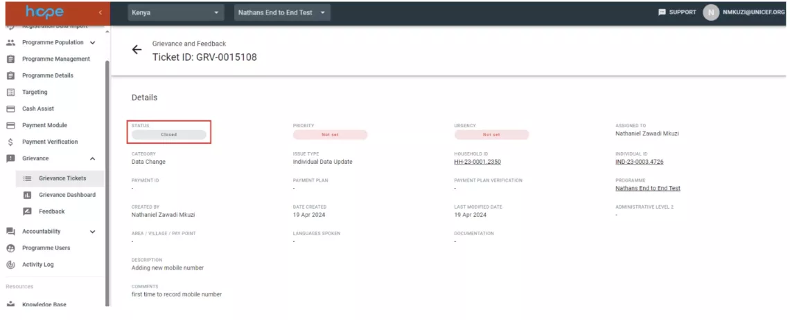

## The Grievance Dashboard

The grievance dashboard displays a summary of grievance tickets within the Programme. It includes a table with the total
number of tickets, total number of closed tickets and tickets average resolution time. The page also displays graphs on
ticket status, ticket category and tickets by category and location.

## How to view the Grievance Dashboard

1. Select the Grievance Dashboard menu under Grievance module. 
    

## How to submit feedback

1. Select the Feedback menu under Grievance module and click on SUBMIT NEW FEEDBACK. 
    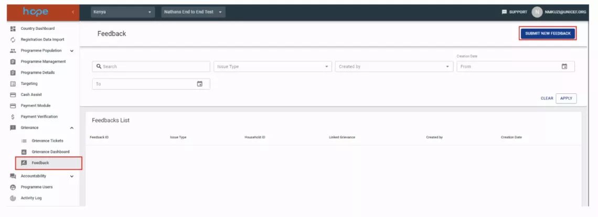

1. Select the issue type, either Negative of Positive feedback and click next. 
    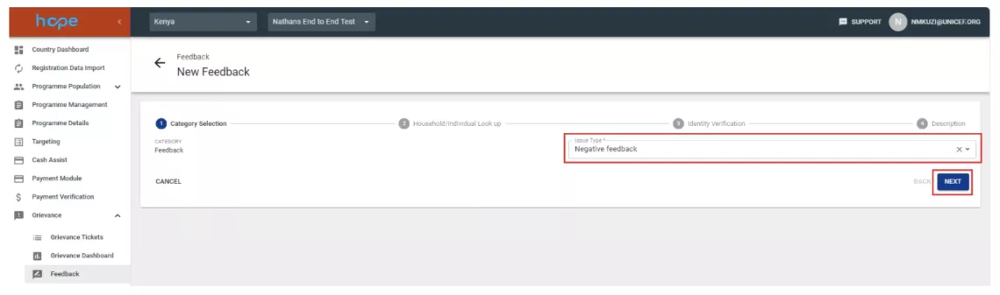

1. In the Household/Individual Look up page select the household and individual and click next. 
    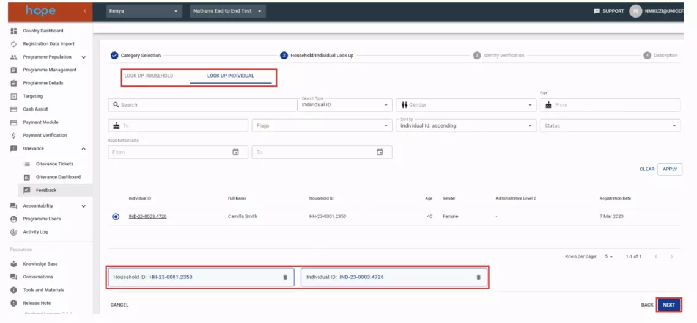

1. In the identity verification page, you have option of selecting screening questions at household level (Household Questionnaire) and individual level (Individual Questionnaire) fields. You can also have option to select if consent has been given (Received Consent). Select the received consent check box and click next. 
    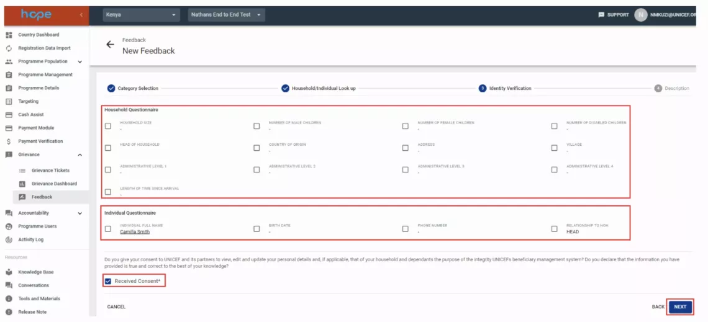

1. In the description page enter the details of the feedback collected from the beneficiary and click save. 
    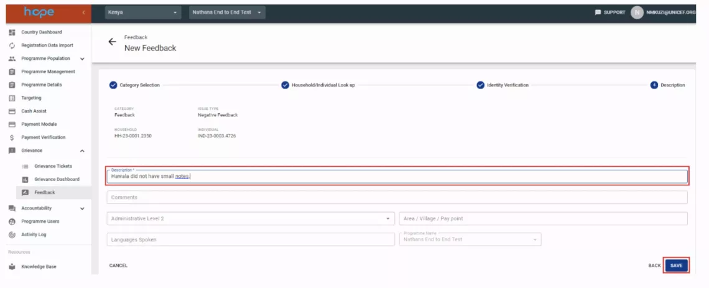

1. After you click save, a new feedback ticket will be created. You also have the option to edit the ticket or a create a linked ticket (grievance ticket). 
    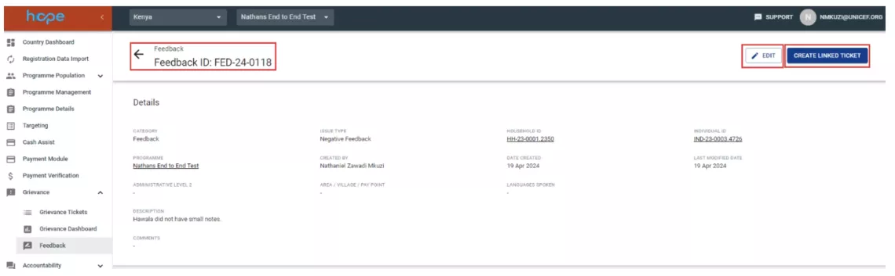
