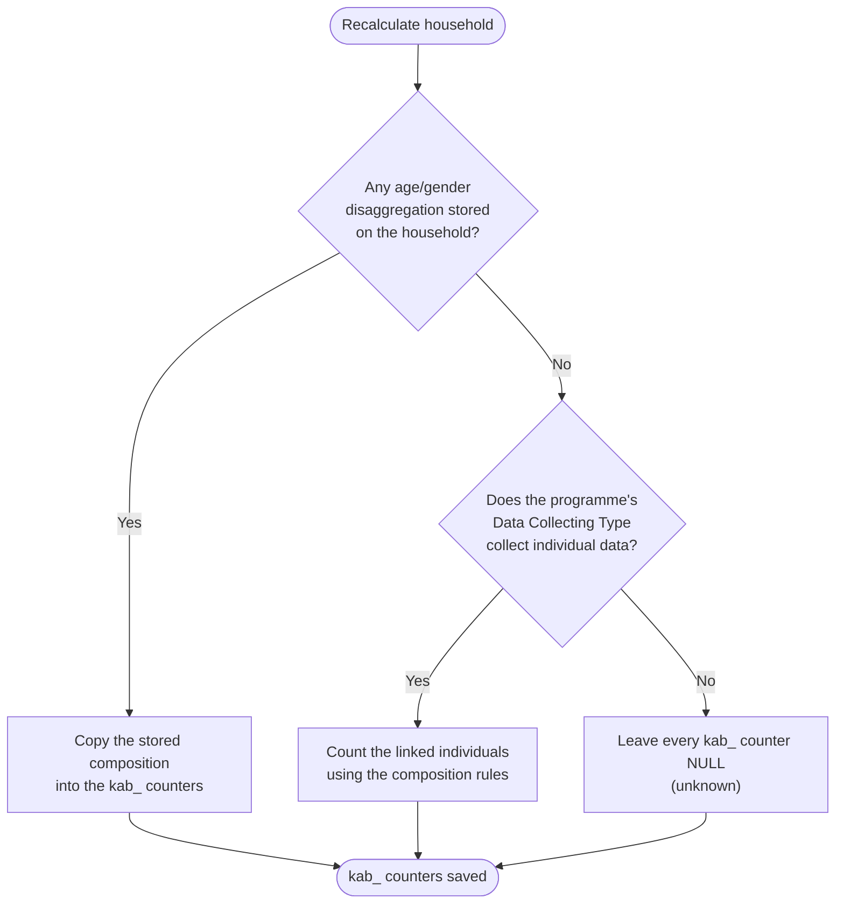
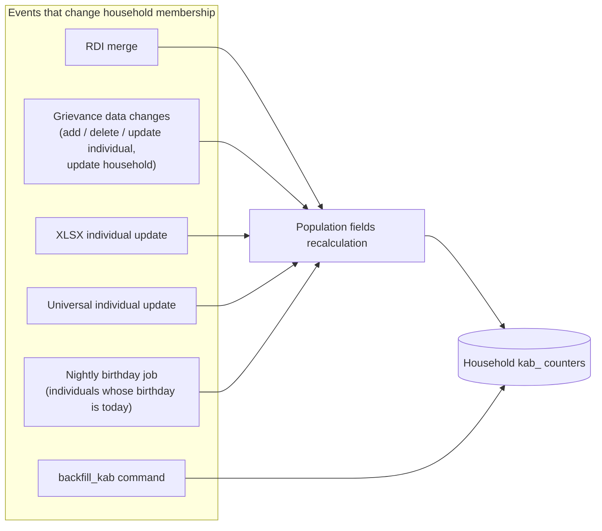

# Known Affected Beneficiaries (KAB)

## Why KAB exists

Age and gender disaggregated demographics used to be maintained only for programmes whose
data collecting type collects full membership data. Every other collection type - partial
individuals, size only, size/age/gender disaggregated - was left without any disaggregation,
so a programme that *does* register some individual members still reported nothing about them.

KAB closes that gap. It answers one question for **every** data collecting type:

> How many people do we actually **know** are affected, and what is their age and gender profile?

## KAB is not the household composition

The household already carries a set of composition counters (`female_age_group_0_5_count` and
friends). Those describe the **declared** composition of the household and are maintained only
when the data collecting type has `recalculate_composition` enabled.

KAB is a parallel set of 30 counters, each prefixed with `kab_`, describing **known** people.

| | Household composition | Known affected beneficiaries |
|---|---|---|
| Question answered | What was declared about this household? | How many people do we have knowledge of? |
| Maintained for | Data collecting types with `recalculate_composition` | Every data collecting type |
| Empty value means | Not maintained for this type | **Unknown** - never "zero people" |

!!! warning "NULL means unknown, never zero"
    An empty KAB counter must never be read as "there are no women aged 18-59 in this household".
    It means HOPE has no basis to state a number. A genuine zero is stored as `0`.
    Any consumer of these fields - report, dashboard, export - has to keep the two apart.

## How a KAB value is decided

For each household, KAB is resolved by the same routine that maintains the composition, in three
mutually exclusive cases:

Three details matter when reading that diagram:

1. **"Any disaggregation stored" looks at the age/gender bands only.** `size` is frequently entered
   by hand during registration, so a household with nothing but a size is still treated as having
   no disaggregation and falls through to the next question.
2. **The fallback is all or nothing.** Individuals are counted only when the *entire* age/gender
   disaggregation is empty. A partially filled disaggregation is mirrored as-is, gaps included,
   rather than being silently mixed with counted values.
3. **Counting uses exactly the same rules as the composition.** Both paths are built from a single
   shared definition of the counters, so a household that is mirrored and a household that is
   counted are comparable.

## Who is counted

An individual contributes to KAB only when **all** of the following hold:

- the individual is a beneficiary - anyone whose relationship to the household is
  *non-beneficiary* (for example an external collector) is excluded;
- the individual is not withdrawn;
- the individual is not marked as a duplicate.

Age bands are evaluated against the household's **last registration date**, not against today,
so a household's KAB does not silently drift as time passes:

| Band | Individual's age at last registration date |
|---|---|
| `0_5` | under 6 |
| `6_11` | 6 to 11 |
| `12_17` | 12 to 17 |
| `18_59` | 18 to 59 |
| `60` | 60 and above |
| children counters | under 18 |

!!! note "Fixed alongside KAB"
    `other_sex_group_count` and `unknown_sex_group_count` previously counted non-beneficiaries,
    withdrawn and duplicate individuals, unlike every other counter. They now apply the same
    filters as the rest, so both the composition and its KAB mirror are consistent.

## The counters

All 30 counters mirror an existing composition field one to one; the KAB field name is the
composition field name prefixed with `kab_`.

### Age and gender bands

| Female | Male |
|---|---|
| `kab_female_age_group_0_5_count` | `kab_male_age_group_0_5_count` |
| `kab_female_age_group_6_11_count` | `kab_male_age_group_6_11_count` |
| `kab_female_age_group_12_17_count` | `kab_male_age_group_12_17_count` |
| `kab_female_age_group_18_59_count` | `kab_male_age_group_18_59_count` |
| `kab_female_age_group_60_count` | `kab_male_age_group_60_count` |

### Age and gender bands, individuals with a disability

| Female | Male |
|---|---|
| `kab_female_age_group_0_5_disabled_count` | `kab_male_age_group_0_5_disabled_count` |
| `kab_female_age_group_6_11_disabled_count` | `kab_male_age_group_6_11_disabled_count` |
| `kab_female_age_group_12_17_disabled_count` | `kab_male_age_group_12_17_disabled_count` |
| `kab_female_age_group_18_59_disabled_count` | `kab_male_age_group_18_59_disabled_count` |
| `kab_female_age_group_60_disabled_count` | `kab_male_age_group_60_disabled_count` |

### Children

| Field | Counts |
|---|---|
| `kab_children_count` | all beneficiaries under 18 |
| `kab_female_children_count` | female beneficiaries under 18 |
| `kab_male_children_count` | male beneficiaries under 18 |
| `kab_children_disabled_count` | beneficiaries under 18 with a disability |
| `kab_female_children_disabled_count` | female beneficiaries under 18 with a disability |
| `kab_male_children_disabled_count` | male beneficiaries under 18 with a disability |

### Totals and other groups

| Field | Counts |
|---|---|
| `kab_size` | all counted beneficiaries in the household |
| `kab_pregnant_count` | beneficiaries flagged as pregnant |
| `kab_other_sex_group_count` | beneficiaries whose sex is recorded as *other* |
| `kab_unknown_sex_group_count` | beneficiaries whose sex was not collected |

`child_hoh` and `fchild_hoh` have no KAB counterpart - they are flags describing the head of
household, not counts of people.

## When KAB is refreshed

KAB is never computed on read. It is stored on the household and refreshed by the events below.

- **RDI merge** - every merged household is scheduled for recalculation.
- **Grievance data changes** - adding an individual, removing an individual, editing individual
  data or editing household data recalculates the affected household immediately.
- **XLSX individual update** and **universal individual update** - schedule a recalculation when the
  uploaded file touches a column that can change the counters (relationship, withdrawn, duplicate,
  sex, disability, birth date, pregnant).
- **Nightly birthday job** - runs at midnight and recalculates households containing an individual
  whose birthday falls on that day, so people crossing an age band boundary move to the next band.
- **`backfill_kab`** - the one-off command used to populate existing data, see
  [Maintenance](../guide-adm/maintenance.md#backfill-kab).

!!! warning "Changing the Data Collecting Type flag does not recalculate anything"
    Enabling `collects_individual_data` on a data collecting type in the admin does **not** trigger
    a recalculation. Households of that type keep whatever KAB they had - most likely NULL - until
    one of the events above touches them. After changing the flag by hand, re-run `backfill_kab`.

## Configuration

Whether a household can have its KAB counted from individuals is a property of the programme's
data collecting type, controlled by the **`collects_individual_data`** flag, editable in
Django Admin under **Core › Data Collecting Types** (see <glossary:Data Collection Type>).

The flag is independent of `recalculate_composition`:

| `recalculate_composition` | `collects_individual_data` | Effect |
|---|---|---|
| on | on | Composition is maintained; KAB mirrors it |
| off | on | Composition is left alone; KAB is counted from individuals when no disaggregation is stored |
| off | off | KAB stays NULL unless a disaggregation is already stored |

When the flag was introduced it was switched on for every data collecting type that already had
`recalculate_composition` enabled. **Partial collection types that do register individual members
have to be reviewed and enabled by hand** - it is a configuration decision, not something HOPE can
infer.

## Where KAB is available

The counters are returned by the household detail endpoint. Because the household detail
representation is also nested inside the payment detail response, KAB is returned there as well,
next to the composition fields it mirrors.

!!! info "Not visible in the interface yet"
    No screen in HOPE displays KAB. The household details page shows the **household composition**
    only - that table reads the original counters, not their KAB counterparts. Dashboards, exports
    and reporting are equally untouched.

    KAB is currently available to API consumers only. Presenting it in the interface is follow-up
    work, and whichever screen picks it up first has to distinguish an empty counter from a zero -
    rendering an unknown value as a blank cell next to a genuine `0` would misrepresent the data.

Known Affected Beneficiaries were introduced by
[AB#326718: Calculate Gender and Age disaggregated group ALSO for Partial Data collecting Type](https://dev.azure.com/unicef/ICTD-HCT-MIS/_workitems/edit/326718).
