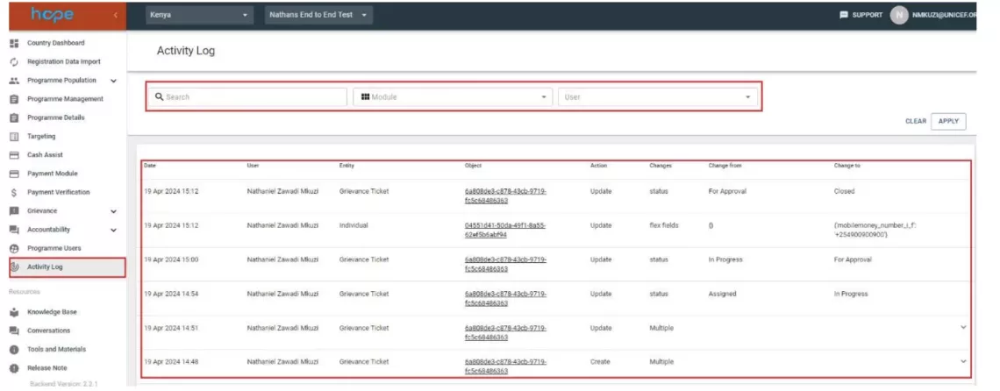

# Activity Log

**tags**:
    - User

The Activity Log shows all actions performed by all users across the system. Each activity log shows details of the time the action was completed, the user who performed the action, action taken, process affected and the before and after state of the action. The activity log facilitates audit of the system and the behaviours of users.

## How to view the activity log

1. Select Activity Log from the main menu.

    A list of the of all activities in the Programme will be displayed, including a search box with filters for the activity logs.
    
