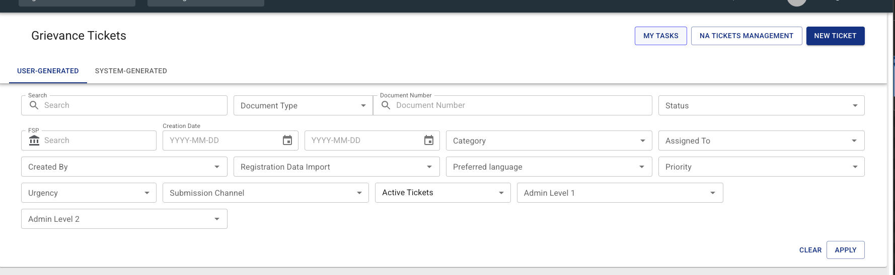
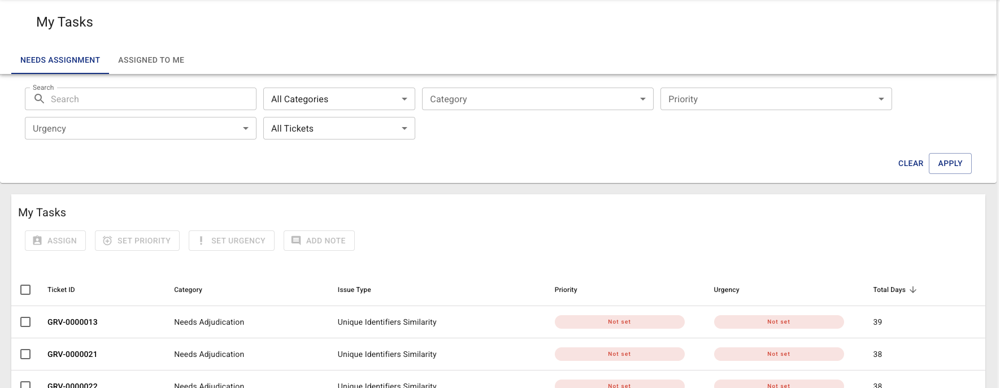
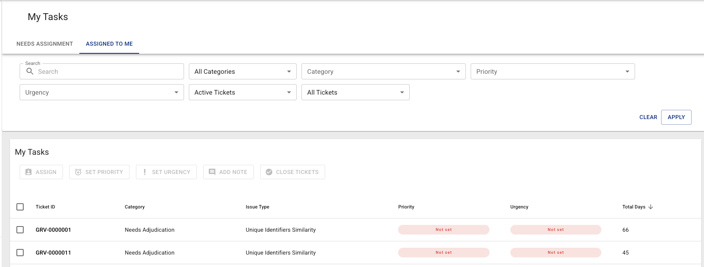
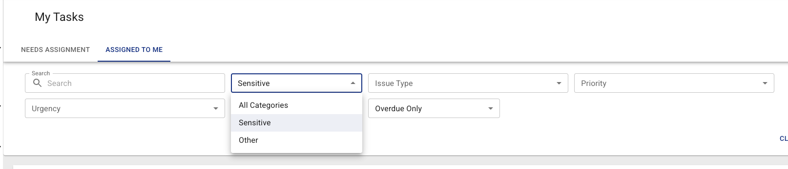
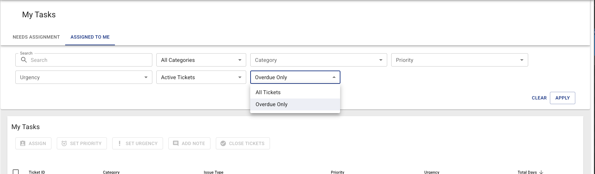

# My Tasks

**My Tasks** is a page for the tickets that wait on you: the unassigned ones waiting for somebody
with the right to assign them, and the ones already assigned to you. Each has its own tab, so
neither has to be dug out of the Grievance Tickets list.

It is also where the [daily grievance emails](grievance-daily-emails.md) land when a recipient
follows a link.

---

## Getting there

The Grievance Tickets list carries a **MY TASKS** button in its page header:

!!! info "Works in both views"
    My Tasks opens in the All Programmes scope by default, because the tickets waiting for you can
    sit in any programme you have access to. Opened inside a single programme it lists that
    programme's tickets only, and the **Programmes** column disappears.

---

## The two tabs

| Tab | What it lists |
|---|---|
| **NEEDS ASSIGNMENT** | Every active ticket with no assignee that you are allowed to assign |
| **ASSIGNED TO ME** | Tickets assigned to you |

**NEEDS ASSIGNMENT** lists active tickets only, so it carries no ticket-status filter.

**ASSIGNED TO ME** shows active tickets by default; switch its status filter to **All Tickets** to
include closed ones.

Switching tabs clears your ticket selection: a ticket ticked on one tab can never be carried into a
bulk action on the other.

---

## The sensitivity filter

Both tabs carry a sensitivity filter:

| Choice | Shows |
|---|---|
| **All Categories** (default) | Everything you are allowed to see |
| **Sensitive** | Sensitive Grievance tickets only |
| **Other** | Everything except Sensitive Grievance |

The filter reshapes the **Category** list below it:

- On **Sensitive** the category is already settled, so the Category filter disappears and the
  **Issue Type** list is the sensitive one straight away.
- On **Other** the Sensitive Grievance option is removed from the Category list.
- On **All Categories** every category you may see is offered.

!!! info "When the filter is not shown"
    Viewing sensitive and viewing non-sensitive grievances are two separate grants. A user who holds
    only one of them has nothing to choose, so the filter is hidden and the list is fixed to the half
    they may see.

---

## The overdue filter

**Overdue Only** narrows the list to tickets past their due date. "Overdue" is measured from the
ticket's creation date against a threshold that differs by category — one day for sensitive
grievances, thirty days for everything else, both configurable. See
[Overdue thresholds](grievance-daily-emails.md#overdue-thresholds).

Clearing it returns the list to all tickets rather than to "not overdue".

---

## The columns

My Tasks shows a narrower set of columns than the full ticket list: **Ticket ID**, **Category**,
**Issue Type**, **Priority**, **Urgency** and **Total Days**. The assignee is left out because each
tab already settles it. In the All Programmes scope a **Programmes** column is added.

The list is ordered by **Total Days**, longest-waiting first.

---

## Arriving from an email

The [daily grievance emails](grievance-daily-emails.md) link straight into this page with the tab
and the filters already set — for example, the sensitive half of the overdue email opens
**ASSIGNED TO ME** with **Sensitive** and **Overdue Only** applied.

Those filters are shown in the filter bar rather than applied invisibly, so a recipient who arrives
at a short list can see why it is short.

---

## Permissions

| Tab | Required |
|---|---|
| **NEEDS ASSIGNMENT** | `GRIEVANCE_ASSIGN` and any grievance list-view grant |
| **ASSIGNED TO ME** | any grievance list-view grant |

Only the tabs you hold permissions for are shown, and the first of them opens by default. A user
holding neither does not get the **MY TASKS** button, and is refused the page if they open it
directly.

On **NEEDS ASSIGNMENT** the list is scoped to the programmes you may assign in, which is what the
**Tickets Needing Assignment** email counts. A programme you may only view has nothing here for you
to act on.
