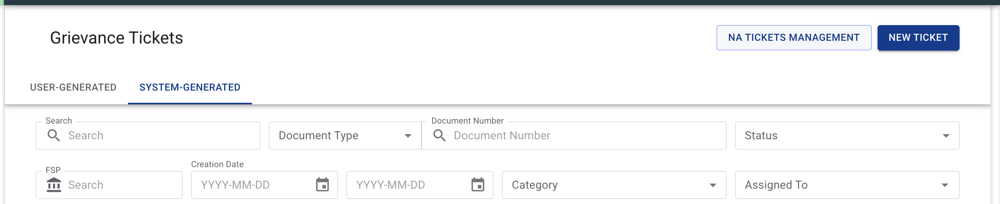
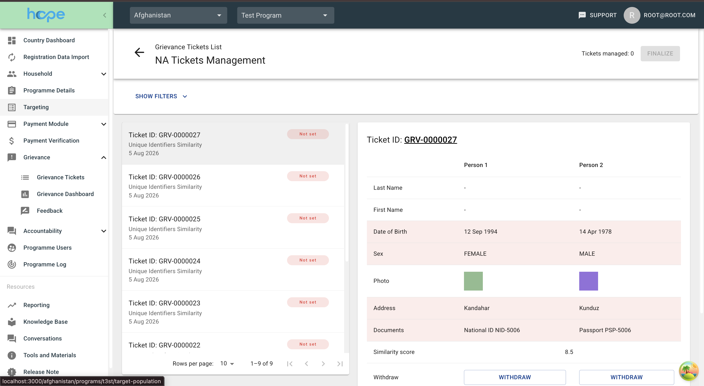
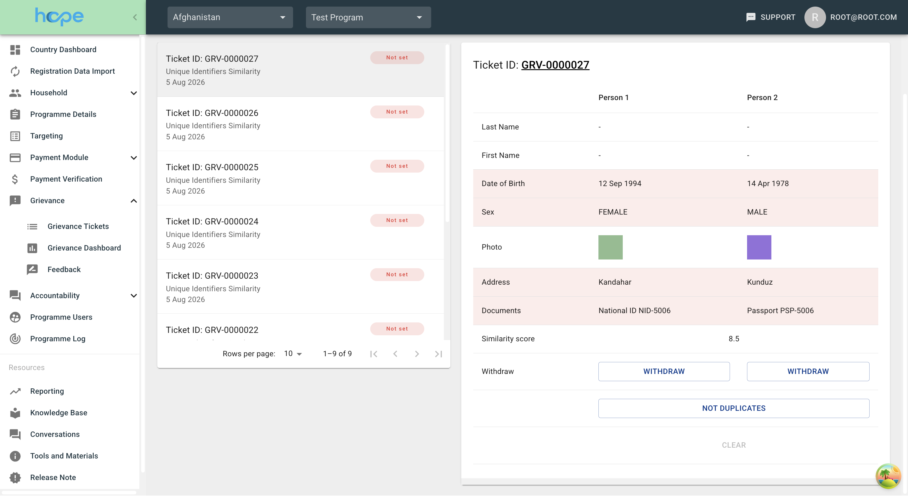
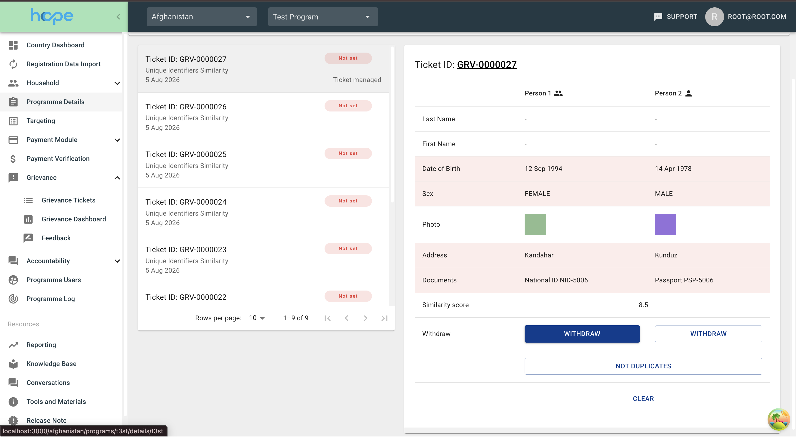
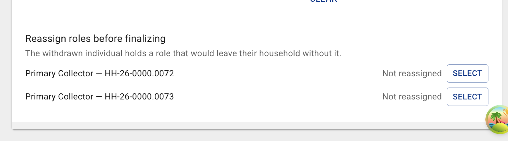
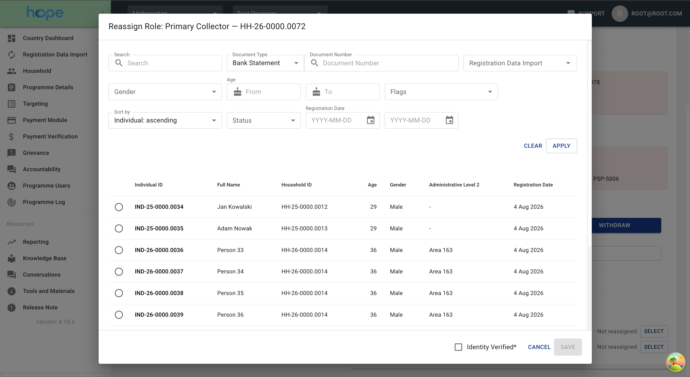
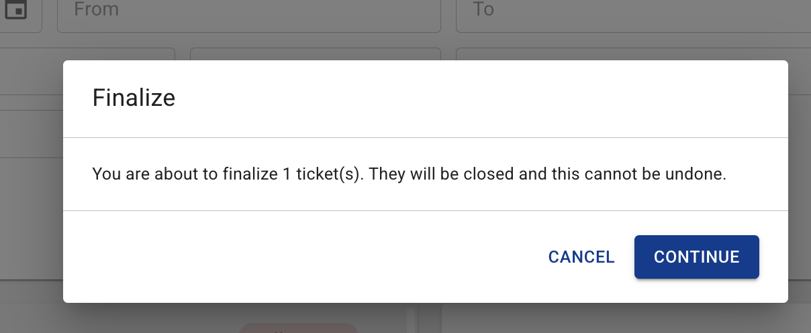

# Needs Adjudication Management

Deduplication produces **Needs Adjudication** tickets in bulk — a single Registration Data Import can raise hundreds of them. Until now each one had to be opened individually from the Grievance list, compared field by field on the ticket details page, and then pushed through approval on its own. For an operator working a backlog, most of that effort went into navigation rather than into the actual judgement of whether two records describe the same person.

**NA Tickets Management** is a dedicated workspace for that backlog. It puts a filtered queue of Needs Adjudication tickets next to a side-by-side comparison of the two individuals, lets the operator record a decision on each one without leaving the screen, and then closes all of them together in a single **Finalize** action.

---

## Getting there

The Grievance Tickets list carries an **NA Tickets Management** button in its page header, next to **NEW TICKET**. The button is only shown to users who may approve deduplication decisions — see [Permissions](#permissions) below — and it opens the workspace for the currently selected programme:



```
/{business area}/programs/{programme code}/grievance/na-tickets-management
```

The page header holds a **Grievance Tickets List** breadcrumb and a back arrow, both of which return to the ticket list.

!!! info "Works in both views"
    The workspace is available both inside a single programme and in the All Programmes scope, where it additionally offers a **Programme** filter. Nothing is degraded in All Programmes: the ticket list, the counter, the comparison panel and **Finalize** all have their own All Programmes handling, and the role-reassignment lookup resolves candidates against the programme of the individual on the ticket rather than a selected one.

---

## The workspace

The screen is laid out in three parts:

- a **filters bar** across the top, collapsed by default;
- the **ticket list** down the left-hand side, roughly 40% of the width;
- the **comparison panel** filling the rest.

The header shows a running counter, **Tickets managed: N**, and the **Finalize** button. The list is always restricted to *active* Needs Adjudication tickets — closed ones cannot be adjudicated, so they never appear — and ordered newest first.



---

## Filtering the queue

Open the filters with **SHOW FILTERS**; **HIDE FILTERS** collapses them again. **APPLY** commits the selection and returns the list to page 1, **CLEAR** resets everything. Applied filters are written into the page URL, so a narrowed queue can be bookmarked or shared with a colleague.

While decisions are outstanding, both **APPLY** and **CLEAR** raise a **Change filters** confirmation first:

> You have *N* ticket(s) managed but not finalized. Your decisions are kept even when the new filters hide those tickets, and Finalize will still close them. Continue?

A filter only changes what is on screen. It does not drop decisions, and **Finalize** still closes every ticket decided on — including the ones the new filter hides.

| Filter | Notes |
|---|---|
| **Search** | Free-text search across the tickets |
| **Document type** / **Document number** | Find the ticket by one of the individuals' identity documents |
| **Programme** | Only in the All Programmes scope; limited to *active* programmes |
| **Creation Date** | A *From* and a *To* date picker |
| **Similarity Score** | A *From* and a *To* numeric field |
| **Preferred language** | |
| **Priority** | The unset value is listed as *Not Set* |
| **Urgency** | The unset value is listed as *Not Set* |
| **Ticket Type** | The Needs Adjudication sub-categories — *Unique Identifiers*, *Biographical Data*, *Biometrics Similarity* |
| **Area Scope** | *Cross-Area Tickets* or *All Tickets*. Defaults to *All Tickets* and cannot be cleared |
| **Admin Level 1** / **Admin Level 2** | Mutually exclusive — choosing one disables the other |

---

## The ticket list

Each row identifies a ticket by **Ticket ID**, its issue type, its creation date, and a coloured urgency badge. Selecting a row loads it into the comparison panel; the first ticket on the page is selected automatically.

Once a decision has been recorded, the row also carries a status label in its bottom-right corner:

| Label | Meaning |
|---|---|
| ***Ticket managed*** | A complete decision has been recorded and this ticket is ready to be finalized |
| ***Decision incomplete*** | The ticket has more than one possible duplicate and at least one pair has not been decided yet — flagged with a warning icon |
| ***Reassignment required*** | A decision exists, but a withdrawn individual still holds a role that has to be handed over first — shown in amber with a warning icon |

*Decision incomplete* takes precedence over *Reassignment required*: while any pair is still undecided that is the label shown — see [Tickets with several possible duplicates](#tickets-with-several-possible-duplicates).

When no tickets match the filters the list reads *No Needs Adjudication tickets*.

The list is paginated at 10, 15 or 20 rows per page. Changing page — or the page size — while decisions are outstanding raises a **Change page** confirmation:

> You have *N* ticket(s) managed but not finalized. Your decisions are kept when you change page, but nothing is saved until you click Finalize. Continue?

Decisions genuinely do survive paging within the session. What they do not survive is leaving the screen — see the warning under [Recording a decision](#recording-a-decision).

---

## Comparing two individuals

The comparison panel is headed by the **Ticket ID**, which links through to the ordinary grievance ticket details page if the full record is needed.

Below it, a two-column table compares **Person 1** — the golden record — against **Person 2**, the possible duplicate. Rows where the two values differ are highlighted with a light red background, so the points of divergence are visible at a glance.

| Row | When it is shown |
|---|---|
| **Last Name** | Always |
| **First Name** | Always |
| **Date of Birth** | Always |
| **Sex** | Only when the two values differ |
| **Photo** | Always. Opens the individual's photo in a modal, and is never highlighted — two distinct people are expected to have different photos |
| **Address** | Only when different. Falls back from household address to village to Admin 2 |
| **Phone** | Only when different |
| **Documents** | Only when different. Shows document type and number |
| **Account** | Only when different |
| **Similarity score** | A single value spanning both columns, or `-` when unavailable |

The identity rows are always visible because the operator needs to see them even when they match — that they match is precisely the evidence. Everything else is suppressed when identical, to keep the table short.

An icon next to each column header reflects the current decision: a two-person icon marks the individual recorded as a duplicate, a single-person icon those recorded as unique.

### Rows that depend on permissions

Two pieces of information are gated on the server, so a user without the permission simply sees an empty value rather than an error:

- The **Account** row requires `POPULATION_VIEW_INDIVIDUAL_DELIVERY_MECHANISMS_SECTION`.
- On biometric tickets the **Similarity score** comes from the deduplication engine's own pair score, which requires `GRIEVANCES_VIEW_BIOMETRIC_RESULTS`. Without it, the score recorded on the ticket itself is shown instead.

### Tickets with several possible duplicates

A ticket may propose more than one candidate against the same golden record. A selector bar then appears above the table with **Previous** and **Next** buttons, a *Duplicate 2 of 4* position indicator, and a *1 of 4 decided* progress indicator.

Each pair is adjudicated separately, and the ticket only counts as managed once a decision exists for it. The individual decisions are then reduced into one outcome for the ticket:

- Person 1 counts as a duplicate as soon as **any** pair marks it so;
- a candidate counts as a duplicate only if **its own** pair marks it so;
- everyone else touched by a decision counts as distinct;
- where the two conflict, **duplicate wins over distinct** — the same individual can never be submitted as both.

---

## Recording a decision

The comparison table ends with a **Withdraw** row carrying one button per column, and two further actions sit beneath it:

| Action | Effect |
|---|---|
| **WITHDRAW** (in the Person 1 or the Person 2 column) | Marks that individual as the duplicate and the other as distinct |
| **NOT DUPLICATES** | Spans both columns; marks both individuals as distinct |
| **CLEAR** | Removes the decision for the pair currently displayed. Disabled until a decision exists |



The active choice is rendered as a filled button, the alternatives stay outlined. The ticket's row in the list picks up its ***Ticket managed*** label at the same moment, and the icons beside **Person 1** and **Person 2** switch to show which of the two is now recorded as the duplicate.



Clearing the last remaining decision on a ticket removes it from **Tickets managed** entirely.

!!! warning "Nothing is saved until you finalize"
    Every decision on this screen is held in the browser session. Paging through the list keeps them, but navigating away from the workspace — following the ticket link, using the breadcrumb, reloading the page — discards all of them without warning. **Finalize** is the only action that writes anything to the server.

---

## Reassigning roles before finalizing

Withdrawing an individual as a duplicate removes them from their household. If they held a role their household cannot do without, that role has to be handed over first, and the workspace will not let the ticket be finalized until it has been.

When this applies, a **Reassign roles before finalizing** section appears beneath the comparison table, explaining that *the withdrawn individual holds a role that would leave their household without it*. It lists one row per handover — **Head of Household** or **Primary Collector**, together with the household's ID — showing either *Not reassigned* or the name of the chosen replacement, and a **SELECT** button that becomes **CHANGE** once a replacement has been picked.



A withdrawn individual may hold a blocking role in more than one household, in which case each household gets its own row and each has to be handed over separately.

Only two roles block finalization:

| Role | Blocks? |
|---|---|
| Head of Household | Yes |
| Primary Collector | Yes |
| Alternate Collector | No — a household can be left without one |

Two situations are skipped even for the blocking roles: a household that is already withdrawn has nothing left to reassign, and a household whose last active member is being withdrawn is withdrawn along with them.

### The Reassign Role dialog

**Select** opens a **Reassign Role** dialog, titled with the role and the household ID. It offers the standard individual lookup, with the individual being withdrawn excluded from the results. For **Head of Household** the lookup is restricted to members of that household, since a head must be a member of it; a **Primary Collector** may be any individual.

The footer carries an **Identity Verified\*** checkbox and **CANCEL** / **SAVE** buttons. **SAVE** stays disabled until both an individual has been selected and the checkbox has been ticked.



!!! info "The dialog does not save to the server"
    Unlike the reassignment dialog on the single-ticket flow, this one only records the choice in the session alongside the rest of the decision. The handover is performed as part of **Finalize**.

---

## Finalizing

**Finalize** is disabled while there is nothing to finalize, while more than 50 tickets are managed, while any managed ticket still has an undecided pair, while any managed ticket still needs a reassignment, and while a finalize is already in flight. In the blocked cases, hovering over the button explains why:

| Why it is blocked | Tooltip |
|---|---|
| More than 50 tickets managed | *You can finalize at most 50 tickets at a time, and you have N managed. Undo some decisions, finalize, then carry on with the rest.* |
| A multi-duplicate ticket has undecided pairs | *N ticket(s) need every duplicate decided before finalizing* |
| A withdrawn individual still holds a blocking role | *N ticket(s) need a role reassignment before finalizing* |

The cap of 50 is enforced by the server as well, so working the backlog in batches of at most 50 is part of the normal rhythm of the screen.

Clicking it raises a confirmation:

> You are about to finalize *N* ticket(s). They will be closed and this cannot be undone.



**CONTINUE** commits the batch, **CANCEL** returns to the workspace with every decision intact. On success a snackbar confirms *N ticket(s) finalized*, the session decisions are cleared, and the counter returns to zero.

!!! info "Tickets someone else closed first are skipped"
    If a ticket in the batch was closed by another user between the decision and **Finalize**, it is skipped and the rest of the batch still goes through. The confirmation message names the skipped tickets — *N ticket(s) finalized. Closed by someone else in the meantime and skipped: …*

!!! warning "Errors stop the whole batch"
    Apart from that, the batch goes through as one — all of it or none of it. If any ticket cannot be closed — an individual on it has been withdrawn somewhere else in the meantime, or the same individual is withdrawn on one ticket in the batch and kept as distinct on another — **nothing at all is written**, and every decision stays on screen so it can be corrected and resubmitted.

!!! warning "Finalized tickets close immediately"
    Tickets finalized from this screen go straight to **Closed**. They do **not** pass through the **For Approval** step that the single-ticket flow uses, so there is no second pair of eyes between the decision and the data change. This is the one behavioural difference to understand before using the workspace.

---

## Permissions

Two permissions are required to reach the workspace, and **both** are needed — either one on its own is not enough to see the **NA Tickets Management** button or open the screen:

| Permission | Grants |
|---|---|
| `GRIEVANCES_APPROVE_FLAG_AND_DEDUPE` | Recording the adjudication decision |
| `GRIEVANCES_CLOSE_TICKET_EXCLUDING_FEEDBACK` | Closing the ticket, which is what **Finalize** does |

The pair is re-checked on the server for every ticket in the batch, not only when the screen opens.

Two further permissions only widen what the comparison table shows; without them the operator sees an empty value rather than an error:

| Permission | Grants |
|---|---|
| `GRIEVANCES_VIEW_BIOMETRIC_RESULTS` | The deduplication engine's similarity score on biometric tickets |
| `POPULATION_VIEW_INDIVIDUAL_DELIVERY_MECHANISMS_SECTION` | The **Account** row in the comparison table |

There are no creator- or owner-scoped variants in play here: Needs Adjudication tickets are system-generated, so nobody is their creator, and the workspace skips the assignment step, so nobody is their owner.

---

Needs Adjudication Management was introduced by [AB#305854: Needs Adjudication management](https://dev.azure.com/unicef/ICTD-HCT-MIS/_workitems/edit/305854).

---
