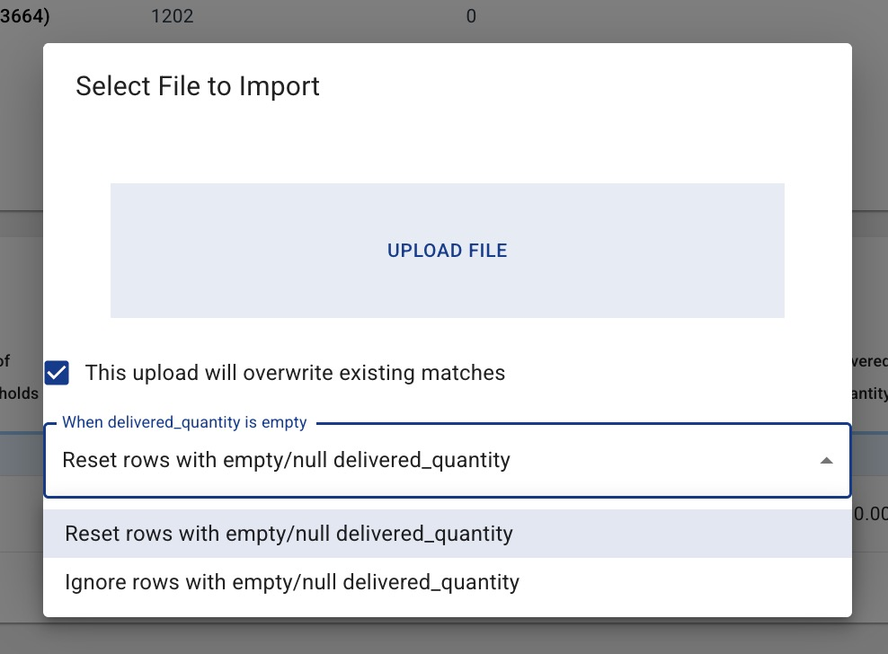
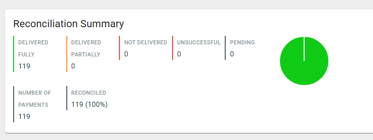
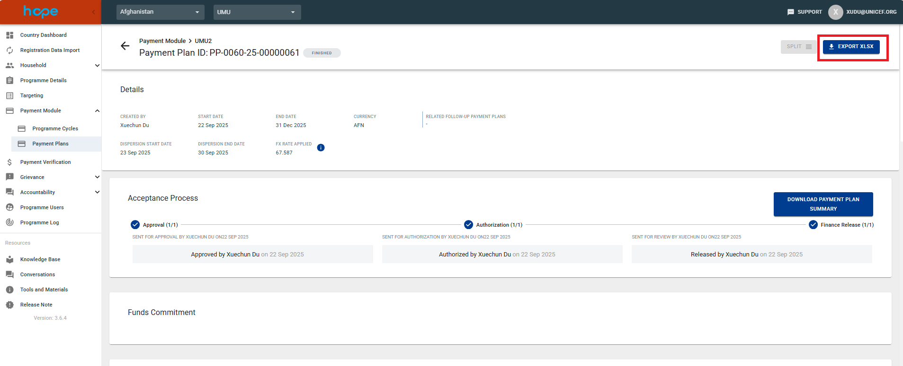

# Payment Reconciliation

Payment reconciliation records how much was delivered for each Payment. This guide covers manual XLSX reconciliation
from a **Payment Plan Group**. It does not cover Payment Gateway automatic API reconciliation.

## Prepare the file

1. Open the Payment Plan Group.
2. Export the delivery XLSX. A Payment included in the export is marked as sent to the Financial Service Provider
   (FSP) and becomes ready for reconciliation.
3. Enter a value in `delivered_quantity` for each Payment you want to reconcile.
4. Do not change `payment_id` or add the same Payment more than once.

The file may contain some or all Payments from the group. Payments not included in the file are not changed.

### Delivered quantity values

| XLSX value | Result |
| --- | --- |
| Full entitlement | Distribution successful |
| More than `0`, but less than the entitlement | Distribution partially successful |
| `0` | Not distributed |
| `-1` | Distribution error; the delivered quantity is stored as empty |
| Empty | Depends on the selected upload mode |

Text, dates, values above the entitlement, and negative numbers other than `-1` are rejected.

## Normal reconciliation

Use normal mode for the first reconciliation:

1. Open the Payment Plan Group and select **Upload Reconciliation**.

   

2. Select the completed XLSX without enabling overwrite.
3. Submit the file.

HOPE processes each row as follows:

- An empty delivered quantity is ignored.
- A new valid delivered quantity is imported.
- A quantity that already matches HOPE is ignored, even if other reconciliation values differ.
- A quantity that differs from an existing delivered quantity is a conflict. HOPE rejects the entire file and does
  not change any Payments.
- A Payment that was not included in a successful delivery export is not eligible and is ignored.

Normal mode does not update FINISHED Payment Plans. Use override mode when a finished plan needs correction.

## Correct reconciliation data with override

Override is intended for correcting material errors. It is available only to users with the reconciliation override
permission.

1. Open **Upload Reconciliation**.
2. Enable **This upload will overwrite existing matches**.
3. Choose what HOPE should do when `delivered_quantity` is empty.
4. Select the XLSX and submit it.

For a non-empty delivered quantity, HOPE overwrites the reconciliation data and recalculates the distribution result.
This also applies when the quantity is unchanged, allowing other reconciliation values to be corrected.

### Empty delivered quantity options

**Reset rows with empty/null delivered_quantity** is the default. It clears the Payment's distribution result and
reconciliation data and returns the Payment to the sent-to-FSP state.

**Ignore rows with empty/null delivered_quantity** leaves the Payment unchanged.

If a reset makes a FINISHED Payment Plan incomplete, HOPE moves the plan back to ACCEPTED. Its totals are recalculated.

!!! warning
    When override changes a delivered quantity or resets a Payment, HOPE deletes Payment Verification records based on
    the old quantity, including their related grievance tickets. An override that keeps the quantity unchanged does
    not delete verification data.

FSP-provided extra fields are preserved during a reset.

## Additional reconciliation columns

The XLSX can contain additional reconciliation columns, such as an identity or transaction reference. When HOPE
imports a row:

- a non-empty custom value is saved against the Payment Record;
- an empty cell removes the existing value when that column is present in the file;
- a column that is not present in the file leaves its existing value unchanged;
- FSP-owned extra fields are always preserved.

Open the Payment Record after the import to review custom values under **Reconciliation Information: Extra Info**. For
example, an FSP identity reference can be compared with the individual's registration-time
[Identification Key](population.md#identification-key).

## CLOSED Payment Plans

A CLOSED Payment Plan is never changed.

- An empty row or a row that matches the stored result is ignored.
- A row that attempts to add or change reconciliation data for a CLOSED plan rejects the entire file.

This is important when reusing an older group XLSX. For example, Plan A may have been reconciled and closed while Plan
B still needs reconciliation. The old file may still contain rows for both plans. Leave Plan A's rows empty or
unchanged; any attempted change to Plan A stops the import.

## File-level validation

The entire file is rejected without changing Payments when it contains:

- different non-empty delivered quantities for an already reconciled Payment;
- duplicate `payment_id` rows;
- invalid delivered quantities;
- an attempt to change a CLOSED Payment Plan;
- another invalid row.

Fix every reported error and upload the file again.

## Review the result

After the import finishes, review the reconciliation summary.

You can also select **Export XLSX** to export the updated information.

## Notifications

- If the initial upload finds quantity conflicts, HOPE shows the row errors and emails the uploader.
- After an accepted file finishes processing, HOPE emails the uploader with the result.
- If background processing finds a new error, HOPE emails the uploader with the available error details.
- If an administrator restarts an import, notifications still go to the original uploader.
