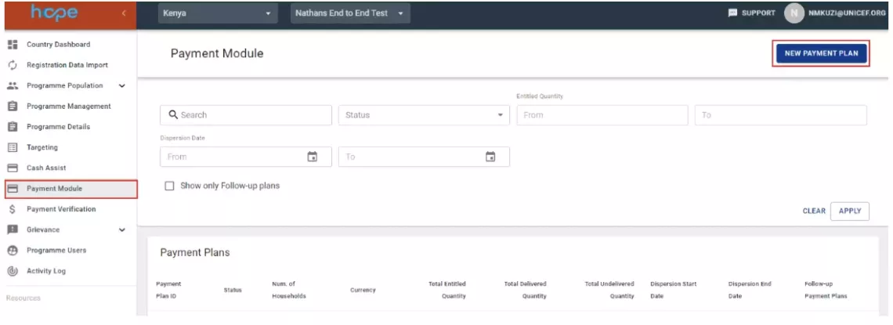
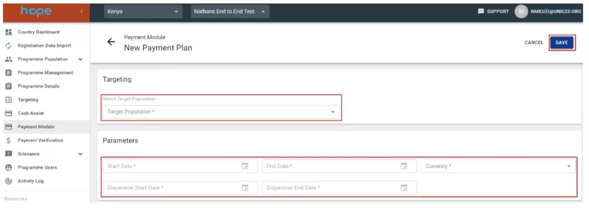
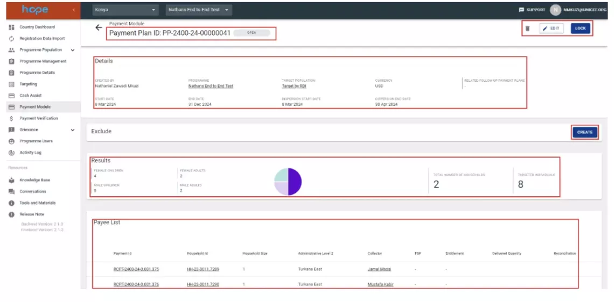
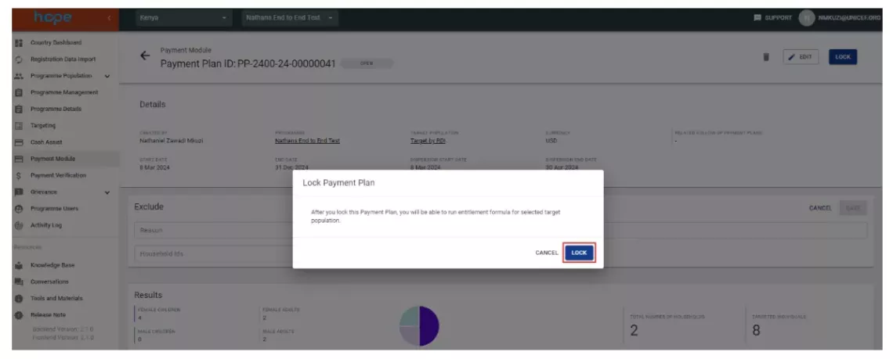
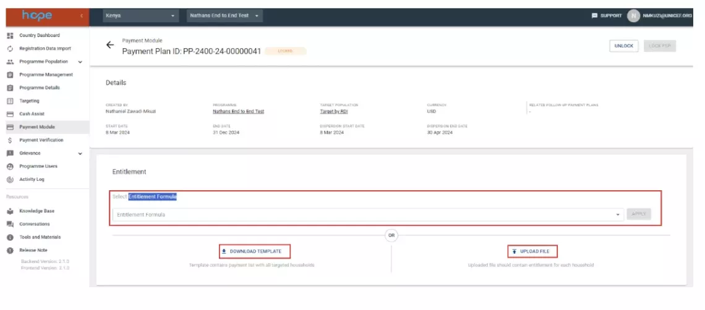
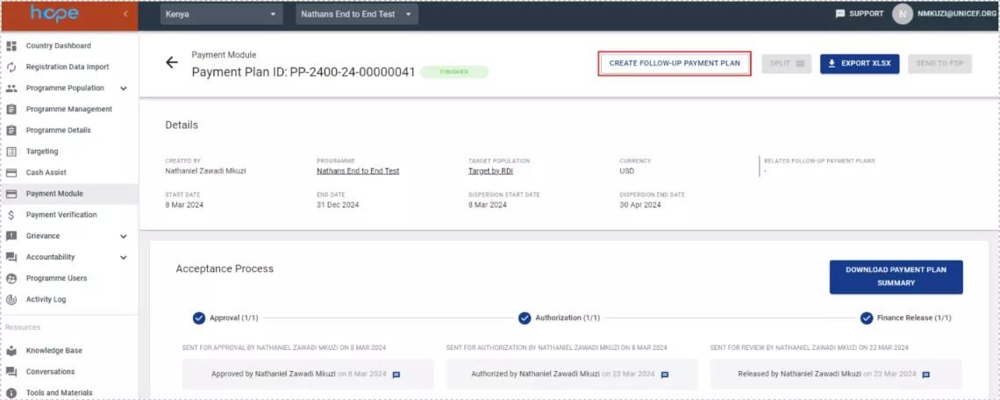
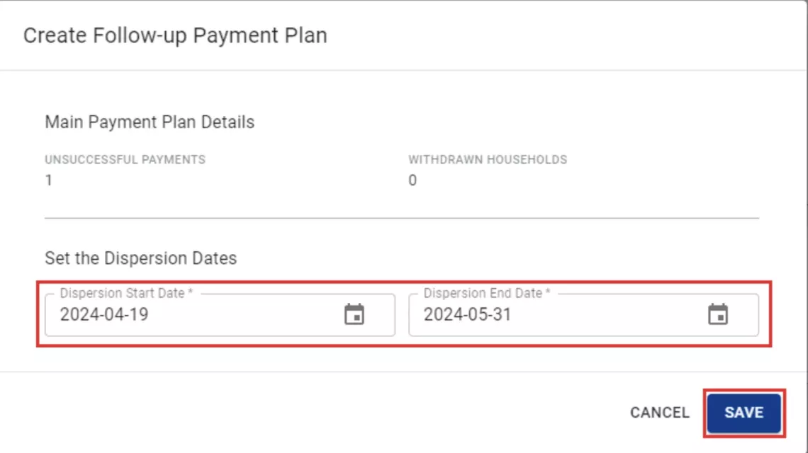
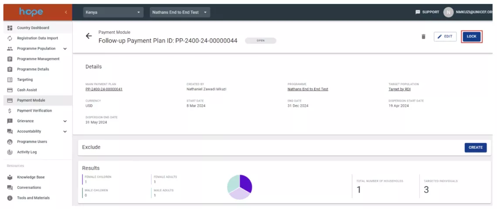
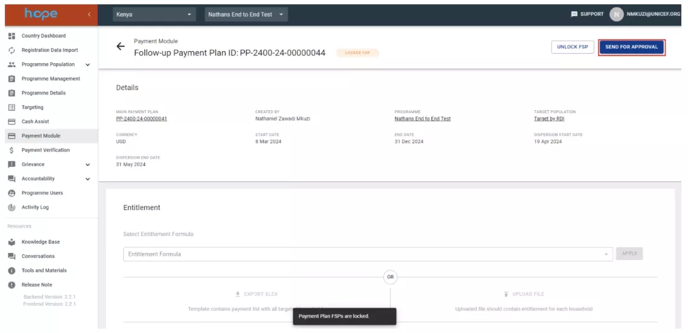

# Payment Module

The Payment module is the payment management tool within HOPE that facilitates the creation of payment lists using information from targeted households. This module is used to create payment plans with payees and entitlements, track approvals and authorizations, create and export payment lists for payment providers (FSPs or IPs) and perform reconciliation with reports from payment providers.

## HOPE and VISION Integration

When payments are provided through an Implementing Partner and are included in the Direct Cash transfer to the Implementing Partner, HOPE Payment Module currently does not fetch data from Vision. It is the responsibility of UNICEF programme manager to ensure that the cash to be transferred to beneficiary by the IP in the Cash Plan does not exceed the agreed DCT amount. Cash plans using a UNICEF FSP need to receive up-to-date financial data (approved with sufficient fund commitments) from Vision to be approved and released. Vision either provides, 

1. Regular operation FC for payment when UNICEF has its own account with the FSP. 
1. ezHACT functionality to be used when UNICEF pays through a FSP where UNICEF has no account. 

## How to create a payment plan 

1. Select the Payment Module tab and click on ‘NEW PAYMENT PLAN’ to create a new payment plan. 
    

1. Select the corresponding target plan and fill in the parameters for the payment plan (start date, end date, currency, dispersion start date and dispersion end date).
    

1. Once you click save, a summary of the payment plan will be displayed for review before creation. This includes the payment plan ID, a summary of the payment plan parameters and payees list. You also have an option to exclude households from the payment plan by pasting a list of household IDs in the Exclude field (click CREATE to view the input box).  
    

1. Two actions are available at this stage

    1. EDIT: to change the payment plan details.
    1. LOCK: locks the configuration of the payment plan and allows creation of an entitlement formula. Once you lock the the payment plan, the status will change from OPEN to LOCKED 

    

## Entitlement Formula

The entitle formula is used to define the amount that a household or individual should receive based on programmatic criteria. In the Payment Module there two options for setting up entitlement formulas:

1. Manual setup: this involves downloading the payment list (DOWNLOAD TEMPLATE), filling in the corresponding payment values and uploading the payment list (UPLOAD FILE) back to HOPE. 

1. Custom setup: this involves submitting entitlement formula requirements to the HOPE support team for backend configuration in the HOPE. Once configured in HOPE, the entitlement formula will be available for selection on the ‘Select Entitlement Formula’ dropdown box.

    
    
    

1. Click on CREATE FOLLOW-UP PAYMENT PLAN

1. Select the dispersion dates and click save
    

1. Click on LOCK payment plan
    

1. Select the FSP, send the payment plan for approval and follow steps 3 – 9 for creating payment plans. 
    
