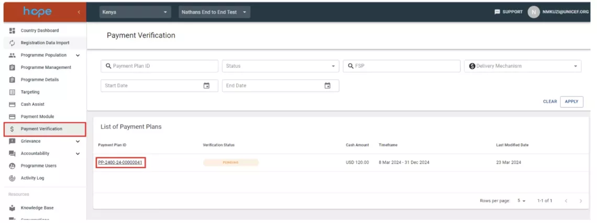
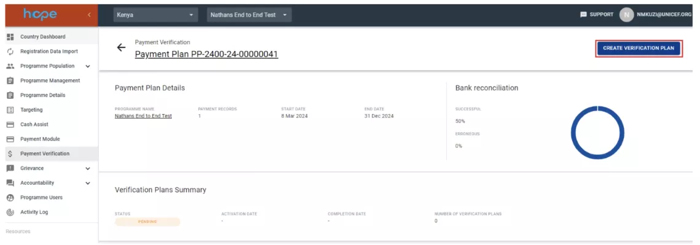
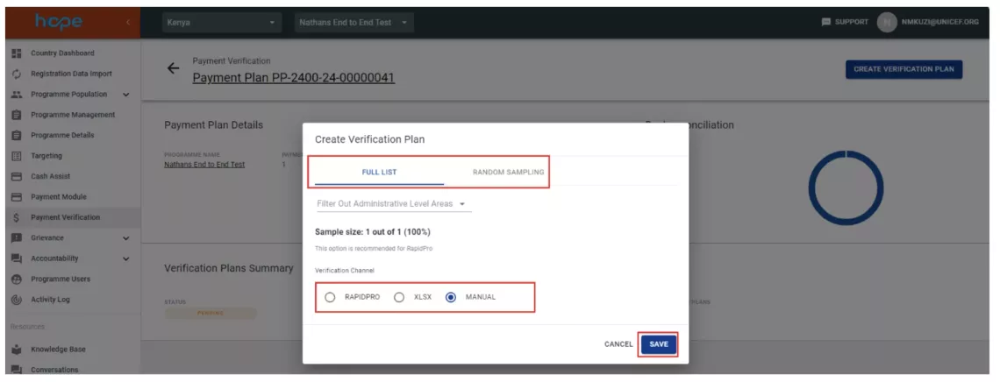
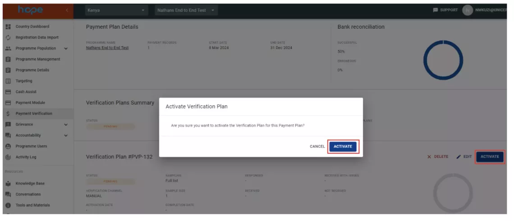
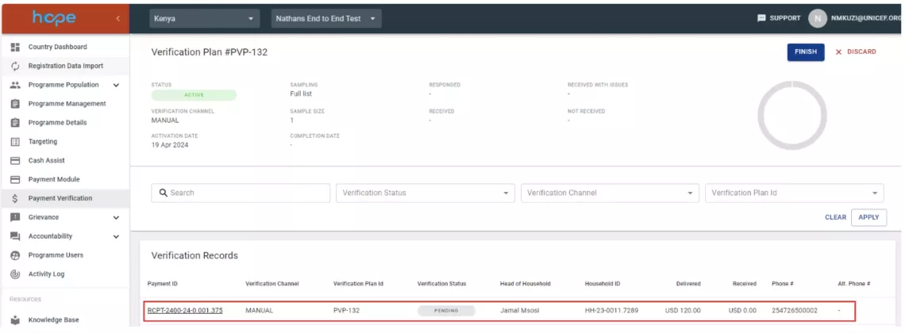
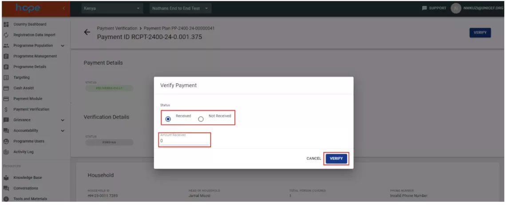
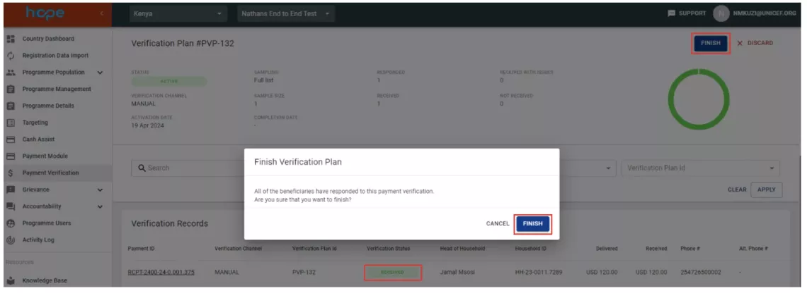

The Payment Verification module allows UNICEF to check that beneficiaries have received the correct amounts in the correct timeframe by providing tools for sampling and matching data from financial reconciliation for beneficiaries for each payment cycle and verifying received amounts directly with beneficiary households.

## How to create a payment verification plan

1. Click on Payment Verification tab on the main menu and then select the payment plan that you want to perform payment verification on. 
    
2. Click on CREATE VERIFICATION PLAN 
    
3. Select either FULL LIST or RANDOM SAMPLING and the verification channel. 
    
4. Select ACTIVATE to activate the verification plan 
    
5. Click on the payment record to open the verification page 
    
6. Select the status of the payment and enter amount received then click VERIFY 
    
7. The status of the verification record will change from PENDING to RECEIVED. 
    
8. The status of the payment verification will change from ACTIVE to FINISHED. 
