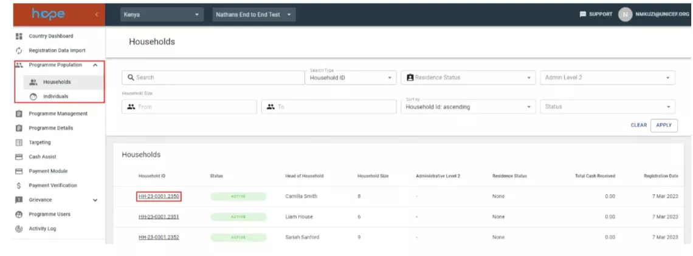
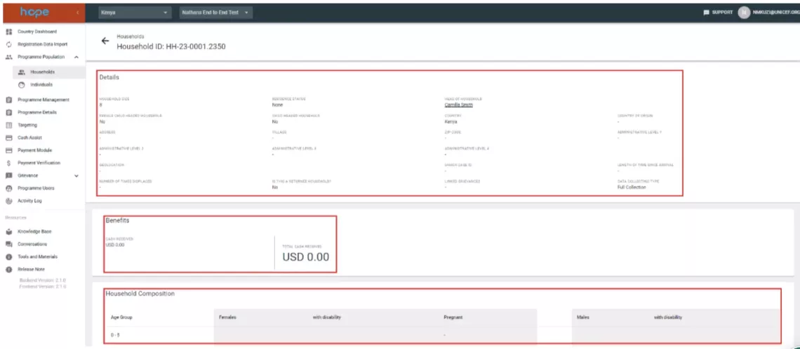
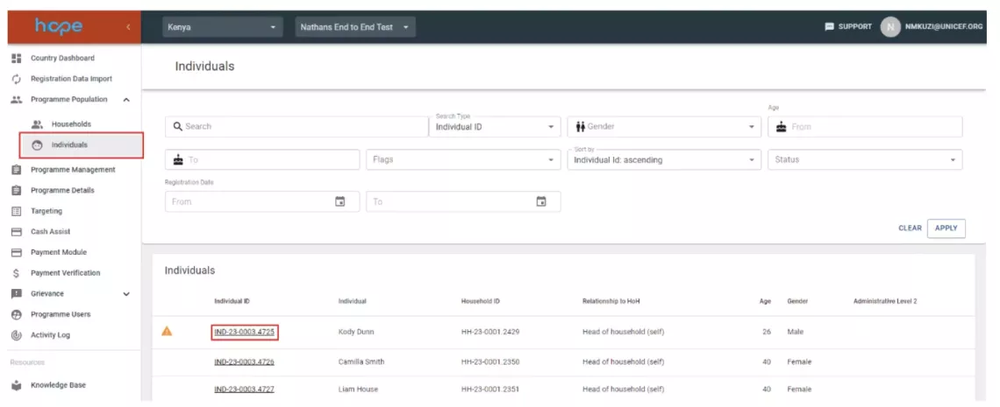
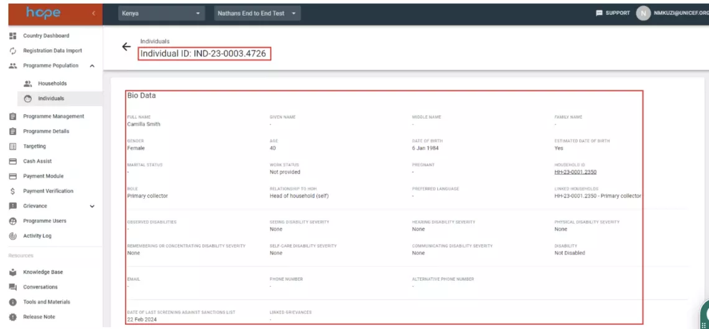

# Population Management

The Population module provides an overview of households and individuals which have been imported into the system. On each screen in the Population module users can search by Household and Individuals. Additionally, one can search by different categories of data on the Household or individual. 

## What Can I Do in The Population Module?

When imported households and individuals are merged with the overall population of beneficiaries in HOPE, they are moved to the Population module. The individual and households in this module form the basis of those who can be included in target populations to be marked for receipt of payments for UNICEF programmes. Once the imports are merged to population, each household and individual will receive system generated unique IDs. Additionally, this module provides a sanctions flag if a record was identified as a potential match against the UN sanctions list. Household details such as amount received, programmes enrolled, payment records and any grievances and feedback recorded are also provided in this module.

## Presumption of Innocence

Possible matches will continue to receive cash transfers until a decision has been made on whether the beneficiary is unique or duplicated through the Grievance and Feedback Module. The population screen for Households provides searchable data both by different categories and by the Household ID.

## How to navigate the population module 

1. The household view page displays a search bar with several filters and a list of households.
   

1. To view household details, click on the Household ID link, benefits received, household composition, list of individuals in the household, payment records, vulnerabilities, registration details and activity log are also displayed.
    

2. The individuals view page displays a search bar with several filters and list of individuals.
    

1. To view individual details, click on the Individual ID link, bio data, vulnerabilities and an activity log are also displayed.
    
