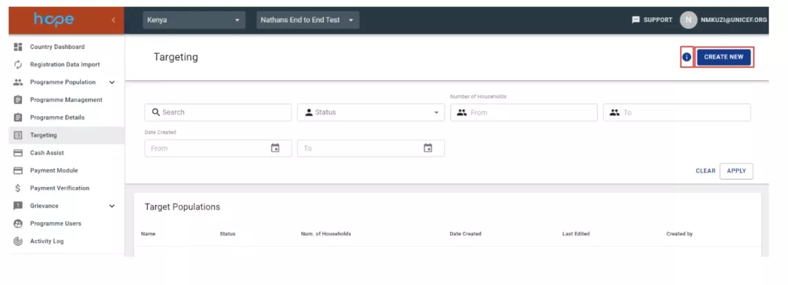
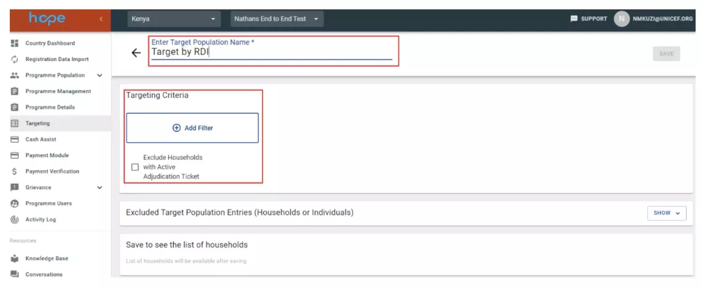
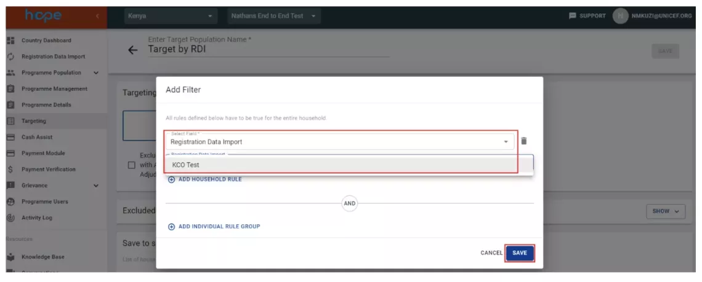
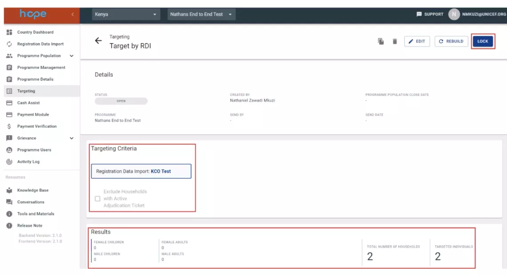
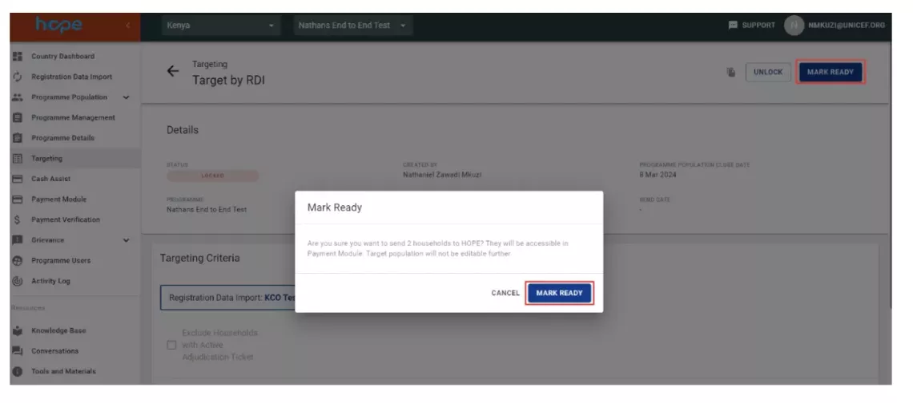

The Targeting module allows querying households based on programme criteria and defining entitled households to be included as recipients for a transfer. In this regard, HOPE can perform complex computation analysis resulting in composite vulnerability scores.  

## Why is Targeting Important?
The Target Population Module both defines the beneficiary list and provides insight as to whether programme objectives are met. The Targeting module is used to create lists of eligible households matching the programme's criteria. The module can undertake complex queries on household and individual household members' information to define the lists of households to be included in each cash programme. 

Once the list of households has been defined, it will be added to the selected programme and will be used to send cash transfers to the households. When conducting a registration of beneficiaries, the project team can choose to either collect detailed data only about the head of the household and one alternate collector, or to collect detailed data from all the members of the household. The decision to collect either detailed information on one member or all the members of the household will determine the type of targeting that can be done in the targeting module. Depending on the targeting methodology of the programme, either one of the options can be selected. 

For more information on the Targeting module and the key functionalities of this module, click here.  

## What Do I Need to Know When Creating a Target Population?

- To create a Target Population, first define the Programme for which the Target Population is created through the Programme Module
- Many Target Populations can be associated with a given Programme
- If the user selects a Programme which was configured to use Head of household (HoH) data only, the first filter is set as relationship to HoH and cannot be changed or removed
- For more in depth targeting (such as using a score calculated upon multiple vulnerabilities) custom formulas can created using “Steficon rules”, this can be requested through your HOPE CO focal point or a ticket via Service gateway.

## How to setup a target population

1. Select the targeting tab on the left menu and click on the ‘CREATE NEW’ button to create a new target population.
    

    !!! note
    
        Note: The information icon next to the ‘Create New’ button displays the fields that are available for targeting. 

1. Enter the Target Population.
    

4. Click "Add Filter" to apply the relevant targeting criteria that will filter the households or individuals needed for your Programme. For example, if your Programme targeting is based on RDI, search for 'Registration Data Import' field and select the respective RDI then click save.
    

4. Once you save the target population a summary of the selected households will be displayed. If the targeted population meets your Programme criteria, you can proceed to lock the target population in preparation to create the payment plan. If the Programme criteria is not met you can edit the target population and select the relevant criteria.
    

    !!! note
    
        You have the option to exclude households with active adjudication tickets. Below the targeting criteria you can also exclude households or individuals using a list of households IDs or Individual IDs. 

5. Once your done with targeting click on ‘MARK READY’ so that target population can be used to create a payment plan.
    

## Custom target populations

In HOPE complex targetting requirements can be handled by the Steficon tool that allows for more in-depth targeting, such as using a score calculated upon multiple vulnerabilities. Country Offices can develop their own scoring (for example through a proxy means testing model) and engage with HQ support to develop the appropriate formula on HOPE. This score can be used as a second-tier criterion for inclusion or exclusion. 
