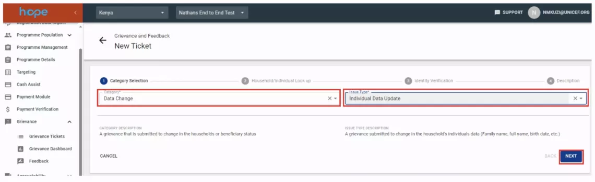

# User Management

The Program Users module shows the HOPE users in the Programme and which roles are assigned to them.

## How to view Programme Users

1. Select Programme users from the main menu. A list of the of all users in the Programme will be displayed include a search box with filters for the users. 
    

1. Click on the username to view details of roles assigned to a user. 
    

## User Roles
The below user roles are presented for information purposes and group permission that are typically used in HOPE
### 1. Population Management Roles

#### 1.1 Reader
"Users with this role can view lists and details of registration data imports, households & individuals, target population, payment verification, user management, country office dashboard and activity log) of households only but cannot modify them neither import them. This role can be assigned to: HCT Programme staff."

#### 1.2 Advanced Registration Reader
"Users with this role can view lists and details of registration data imports, households & individuals (population details) inclusive of payment records.This role can be assigned to: HCT Programme staff."

#### 1.3 Population Viewer
"Users with this role can view lists and details of households and individuals and related details (i.e payment details). This role can be assigned to: Call Centre agents."

#### 1.4 Planner
"Users with this role can view and import populations and run deduplication (without merging it to the golden database), create, edit and activate Programmes, target populations and payment verification plans. This role can be assigned to: HCT Programme staff."

#### 1.5 Approver
"Users with this role can merge an imported population into HOPE, create, edit, and activate programmes and a target populations. Can activate and discard a cash plan and payment verification plan. This role can be assigned to: HCT Programme staff."

### 2. Payment Module Roles					

#### 2.1 Payment Planner
"Users with this role can create a Payment Plan (choose target population, dates the payment is expected to cover and dispersion dates), run the entitlement formula, choose the FSP and send a Payment Plan to approval. This role can be assigned to: HCT Programme Staff"

#### 2.2 Payment Approver
"Users with this role can approve or reject the payment plan and comment on its approval or rejection. This role can be assigned to: HCT Programme Staff"

#### 2.3 Payment Authorizer
"Users with this role can authorize or reject the payment plan and comment on its approval or rejection. This role can be assigned to: HCT Programme Staff"

#### 2.4 Payment Releaser
"Users with this role can release (final authorization to conduct the transaction) or reject the payment plan, send the payment plan to the FSP (in case of SFTP or API connection) and/or trigger the excel generation for download. This role can be assigned to: Finance Officer."

#### 2.5 Payment Reconcilier
"Users with this role can upload the reconciliation file and finish a Payment Plan. This role can be assigned to: Finance Officer/Assistant."

#### 2.6 Payment Data Officer
"Users with this role can export and import the payment data in order to generate the file needed by the FSP. This role can be assigned to: Finance Officer/Assistant."

### 3. Grievance Roles					

#### 3.1 Grievance Collector
"Users with this role can view, create, and add notes to grievance tickets (except for sensitive grievances). This role can be assigned to: Call Centre Agent (Partners)"

#### 3.2 Grievance Manager
"Users with this role can view, assign, update, approve and add notes to grievance tickets including sensitive grievances that were created by the grievance reviewer. Additionally, this role can set tickets in progress, put tickets on hold, bulk assign grievances and upload documents. This role can be assigned to: HCT Programme Staff (Accountability)"

#### 3.3 Grievance Reviewer
"Users with this role can view, update, and add notes to grievance tickets including sensitive grievances that were assigned to them by the grievance manager. Additionally, this role can set tickets in progress, put tickets on hold, send for approval, upload documents, and create new related tickets if needed. This role can be assigned to: HCT Programme Staff (Accountability)."

#### 3.4 Sensitive Grievance Reviewer
"Users with this role can view, update, add notes, set in progress, put on hold, send for approval sensitive grievances. Additionally, this role can upload documents only for sensitive grievances. This role can be assigned to: HCT Programme Staff (Accountability)."

#### 3.5 Grievance Approver
"Users with this role can view, create, and add notes to grievance tickets (including sensitive grievances). Additionally, this role can approve data change and adjudication tickets. This role can be assigned to: HCT Programme Staff (Accountability)"

#### 3.6 Senior Management (for notification purposes)
"Users with this role receive notification on grievances collected (including sensitive) and can add a note on them. Users checked under this box would be given a grievance approver function with an update level of update as owner. This role can be assigned to: Senior HCT Programme Staff (Accountability)."

### 4. Accountability Roles

#### 4.1 Accountability Viewer
"Can view list of created surveys and communication messages. Can review details of created surveys and communication messages.This role can be assigned to: HCT Programme Staff (Accountability)."

#### 4.2 Accountability Manager
"Has full access on both surveys and communication. Can create new surveys and communication messages, view list of created surveys and communication messages, review details of created surveys and communication messages. This role can be assigned to: Senior HCT Programme Staff (Accountability)."

