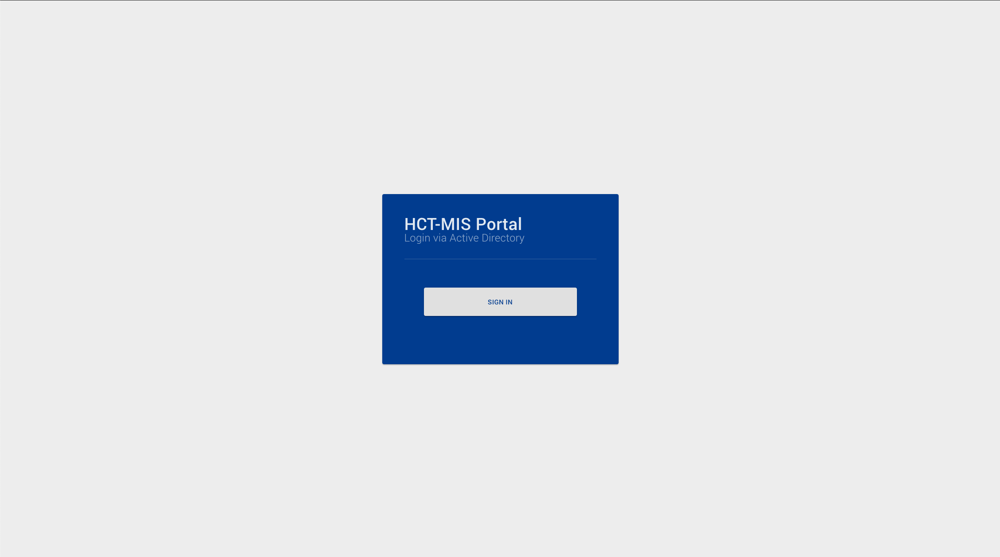

# Login

## Overview:

The login section of this application allows UN Agency users to use their Azure AD account login credentials to access the application.

## Active Directory

The user will be taken to the Unicef Active Directory login screen after clicking on the Sign In button from the portal.

From this screen they will be taken to the Microsoft Active directory environment to provide their login credentials:

## Access

The HCT-MIS application only allows those who have been formally invited by another, activated, HCT-MIS Admin User. 

