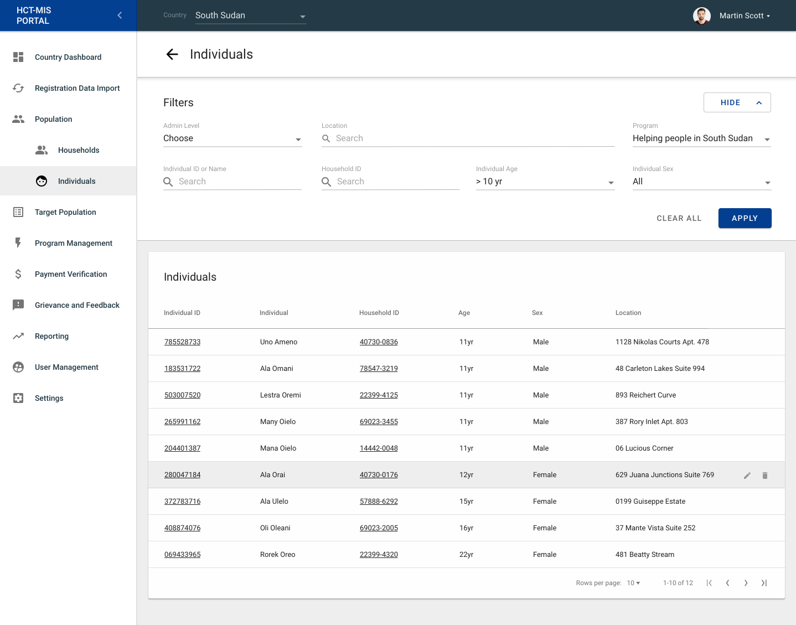
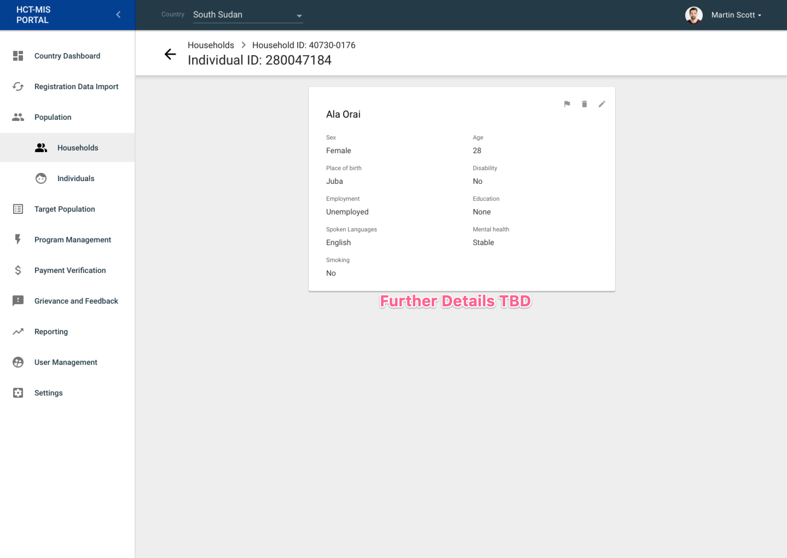

# Population

## Overview

This interface/functionality is a way to search and view all the households and individuals in HCT MIS.

## Households

### Household Search

### Household Details

## Individuals

### Individual Search

### Individual Details

