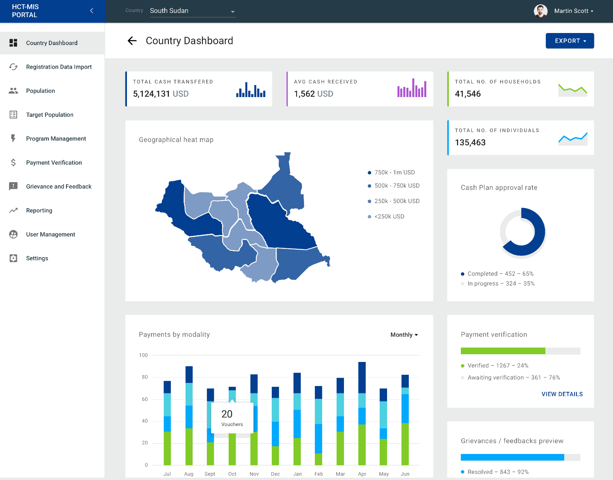
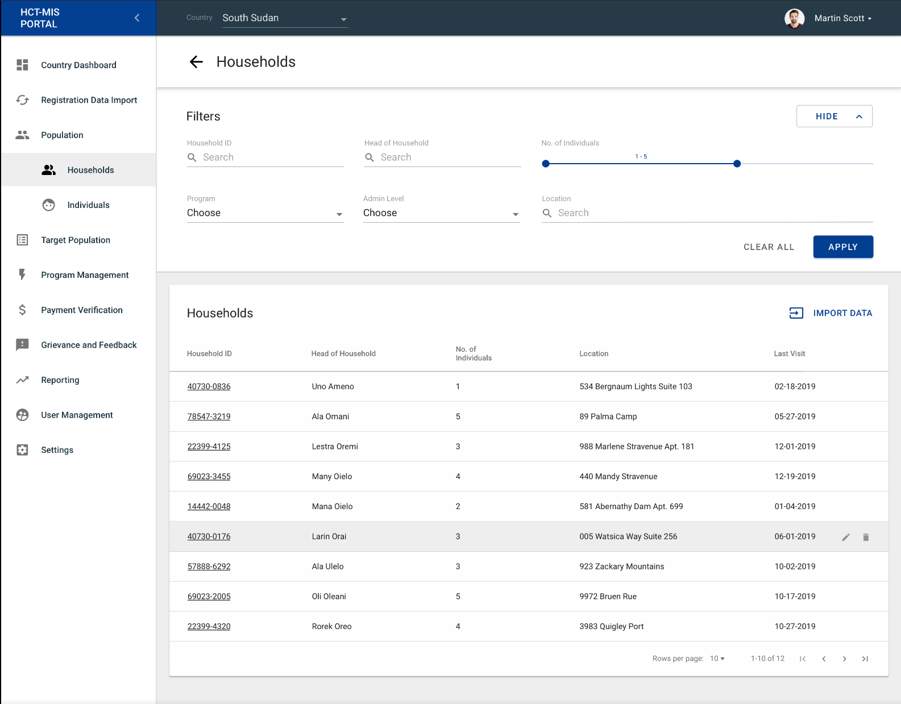
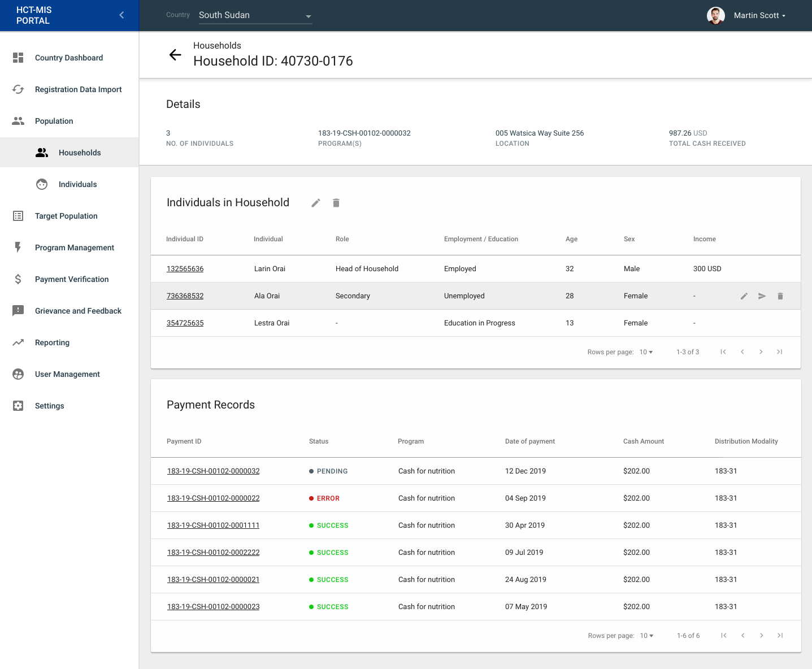
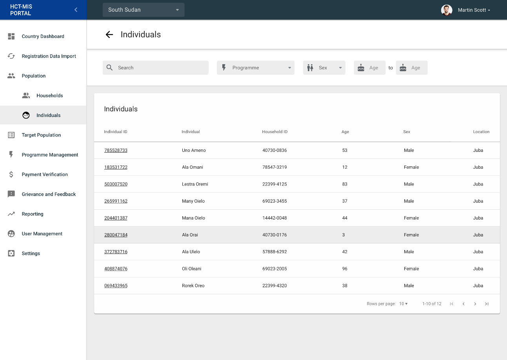
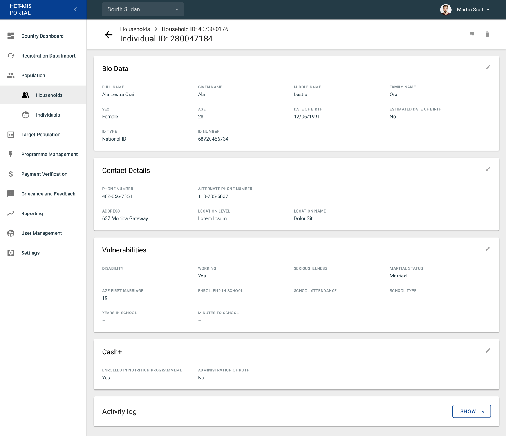

# Population

## Description

The Population tab is an essential are within the HCT-MIS system, which allows users to search, filter, and view valuable information regarding Beneficiaries. Users can come to this section not only to learn more about specific household vulnerabilities information, but find out how each beneficiary is associated to Programmes, Cash Plans, and Payment Records as well. 

## Feature Specification

In this section we will review the many features of the Population Tab in detail.

### Households

\*\*\*\*[**See Glossary**](../../introduction/glossary-terminology/)\*\*\*\*

Households are comprised of individual beneficiaries or groups of beneficiaries under a single location / address. In this section of the HCT-MIS, users can sort/filter and view detailed information regarding the households registered in the system.

#### Household Search

> **Features:** [https://unicef.visualstudio.com/ICTD-HCT-MIS/\_boards/board/t/Software%20Engineering/Features/?workitem=49434](https://unicef.visualstudio.com/ICTD-HCT-MIS/_boards/board/t/Software%20Engineering/Features/?workitem=49434)

This interface/functionality is a way to search and view all the households and individuals in HCT MIS.

Users will be able to filter their search query by using the following options:

* Number of Individuals \(belonging to a household\).
* Programs
* Admin Level \(Location\)
  * Location Search in respect to Admin Level selected.

#### Household Details

> **Features:** [https://unicef.visualstudio.com/ICTD-HCT-MIS/\_boards/board/t/Software%20Engineering/Features/?workitem=49435](https://unicef.visualstudio.com/ICTD-HCT-MIS/_boards/board/t/Software%20Engineering/Features/?workitem=49435)

This interface / functionality is a way to view all household details that are kept in the HCT-MIS system. 

Users on this screen will be able to navigate through lists of data, separated into the following categories:

* Individuals in Household
* Entitlement Card
* Payment Records
* Vulnerabilities
* Registration Details

### Individuals

#### Individual Search

> **Features:** [https://unicef.visualstudio.com/ICTD-HCT-MIS/\_boards/board/t/Software%20Engineering/Features/?workitem=49437](https://unicef.visualstudio.com/ICTD-HCT-MIS/_boards/board/t/Software%20Engineering/Features/?workitem=49437)

#### Individual Details

> **Features:** [https://unicef.visualstudio.com/ICTD-HCT-MIS/\_boards/board/t/Software%20Engineering/Features/?workitem=49436](https://unicef.visualstudio.com/ICTD-HCT-MIS/_boards/board/t/Software%20Engineering/Features/?workitem=49436)

## Acceptance Criteria

The navigation should include the following:

The global navigation for this product must include the following:

* [ ] Number of Individuals Filter for Household Search feature should set a limit between 1 and 20.
* [ ] 
## User Permissions

\*\*\*\*[**Roles & Permissions**](user-management/user-roles-and-permissions.md)\*\*\*\*

The following users should be able to interact with the following Populations features and functionalities.

* &lt;User type 1&gt;
* &lt;User type 2&gt;

#### &lt;User Type 1&gt;

This user has the ability to view only Household / Individual Information

#### &lt;User Type 2&gt;

This user has the ability to address Grievances & Feedback specific to a particular Beneficiary.

## Technical Notes

* Searches handled by searching throughout the JSON fields so that Elastic search is not necessary to build for this feature. 

## Future Features to Consider

* TBD

