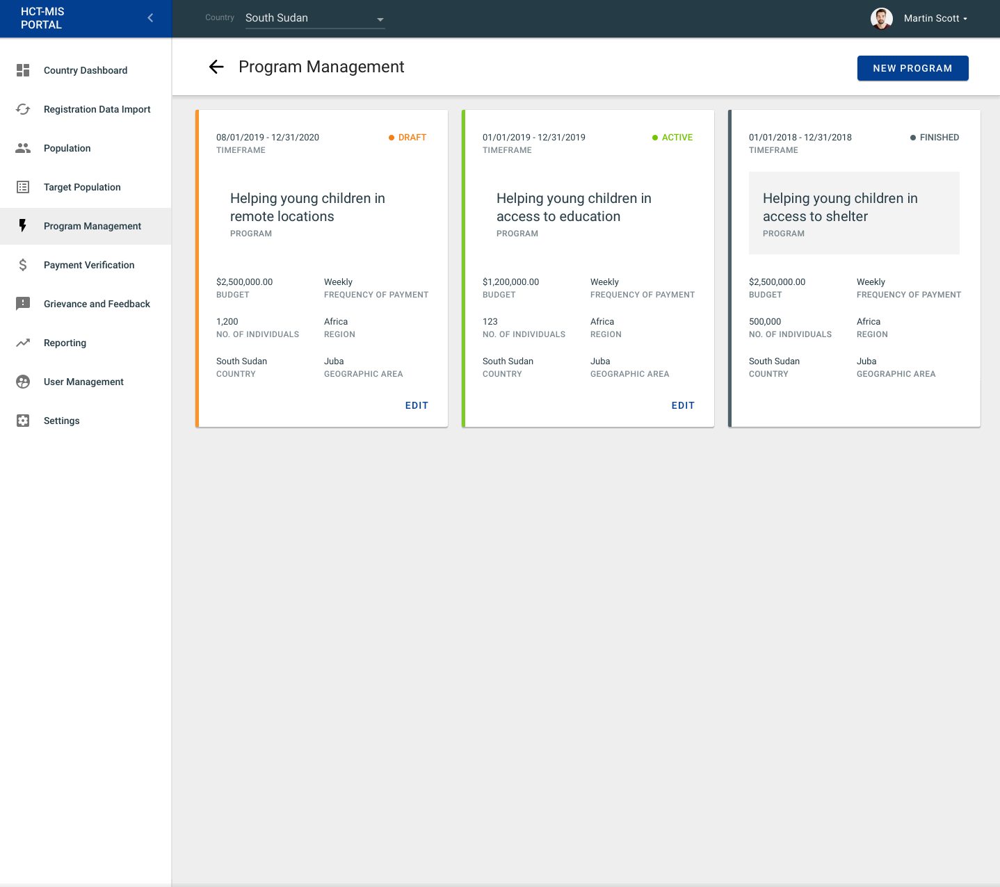

# Program Management

## Overview

xzy

## Program Overview Page

### Cards

#### Card States

Located on the top right hand corner of each Program card, displays a status. Each program has the following state:

* Draft
* _Pending_
* Active
* Finished

### Create New Program

To create a New Program, click on the "New Program" button on the top right hand corner of the page.

### Activate Program

To Activate Program, click on the "Activate" button on the top right-hand corner of the page.

### Edit Program

To Edit Program, click on the "Edit" button in the down right-hand corner of a Program Tile or on the top right-hand corner of the preview page.

### Finish Program

To Finish Program open an Active Program, click on the "Open in CashAssist" button in the top right-hand corner, and proceed further within CashAssist.

### Cash Plan

To preview a list of Cash Plans, click on the Program tile.

To preview the Cash Plan details or **Payment Records list**, click on the Cash Plan ID on the list.

### Payment Records

To preview the Payment Record details, go to Program Details, click on the particular Cash Plan ID on the list, and click on the chosen Payment Record from the list.

