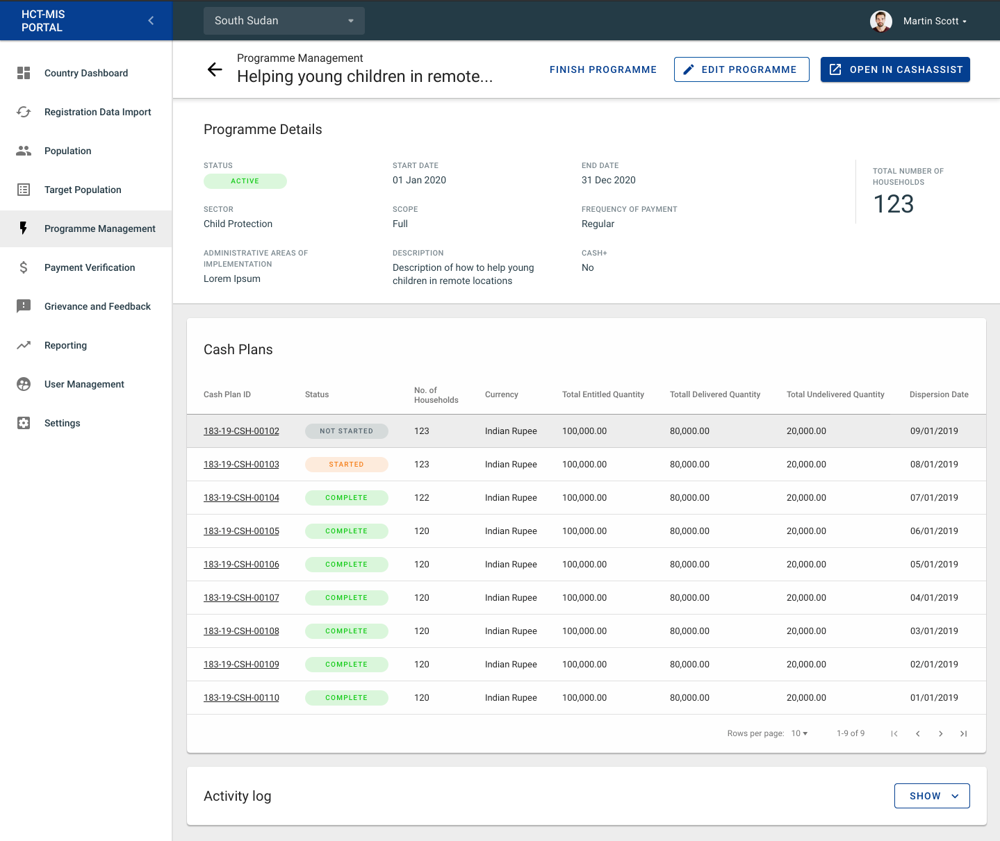
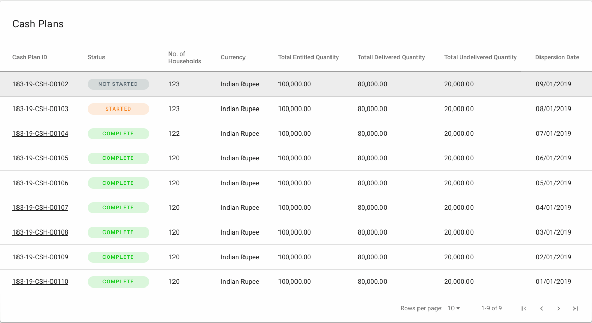
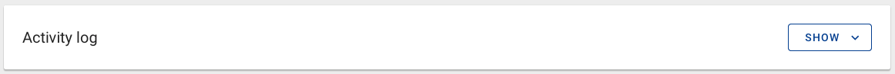
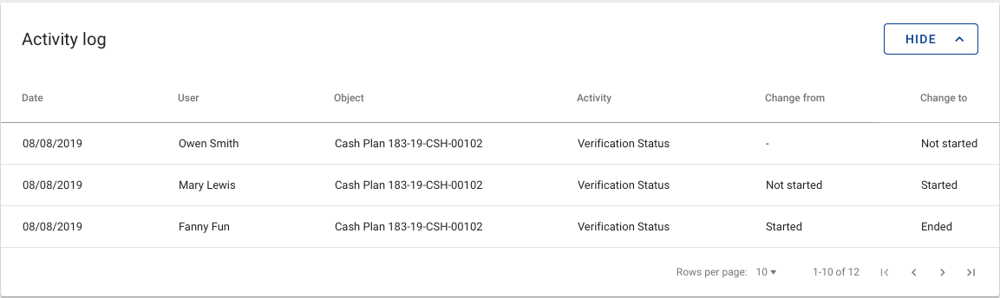

# Programme: Detail Page

## Overview

## Header

Placed in the Programme Details Page header, the user will find common features found throughout the site's sub pages such as:

* Page Title
* Breadcrumbs

There are also a few unique buttons that are available when a programme is in a certain Status.

### Status Features

#### STATUS: Draft

When a Programme is in the **DRAFT** Status, the user will see the following options:

Here the user has an option to:

* **Remove** or delete the draft
* **Edit** the Programme details
* **Activate** the draft programme. 

#### 

#### STATUS: Active

When a Programme is in the **ACTIVE** Status, the user will see the following options:

Here the user has an option to:

* **Finish** the Programme
* **Edit** the Programme
* **Open** an external link to view the Programme in CashAssist

#### STATUS: Finished

When a Programme is in the **FINISHED** Status, the user will see the following displayed:

Here the user does not have many options other than being able to open an external link to view the Programme in CashAssist

## Programme Details

In the Programme Details section the user will see the following high-level data displayed:

* Programme Status
* Start Date
* End Date
* Sector
* Scope
* Frequency of Payment
* Administrative Areas of Implementation
* Description
* Cash+
* Total Number of Households
* Population Goal.

## Cash Plans

#### **List Details**

Cash Plan details consists of:

* Cash Plan ID
* Status
* No. of Households
* Currency
* Total Entitled Quantity
* Total Delivered Quantity
* Total Undelivered Quantity
* Dispersion Date

A user has the option to click and view the detailed page for any Cash Plan in the Table.

## Activity Log

The **Activity Log** section is a collapsible area that allows to the user to review all the recorded activities associated to the project in the form of an audit list.

When collapsed, the section will look like this \(default\):

When expanded, the section will look like this:

