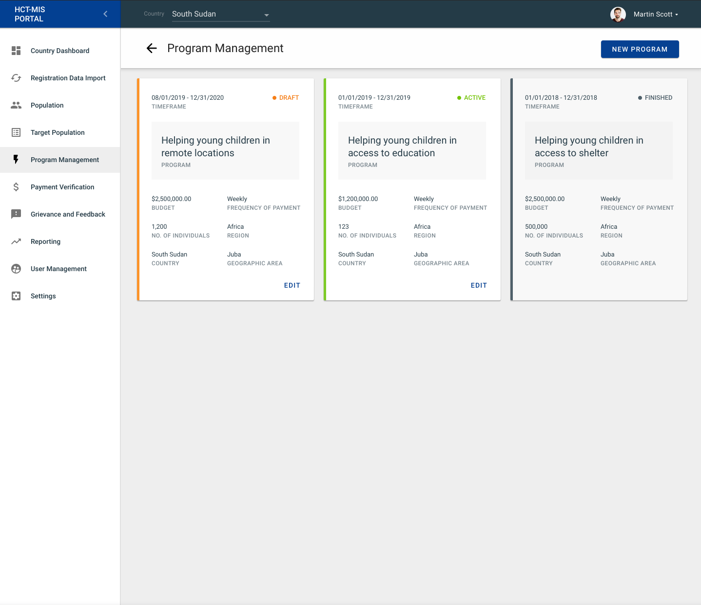
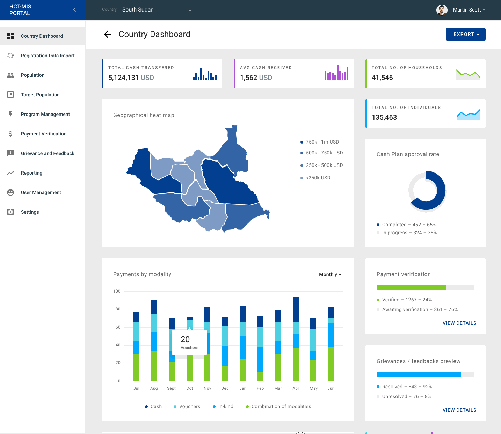
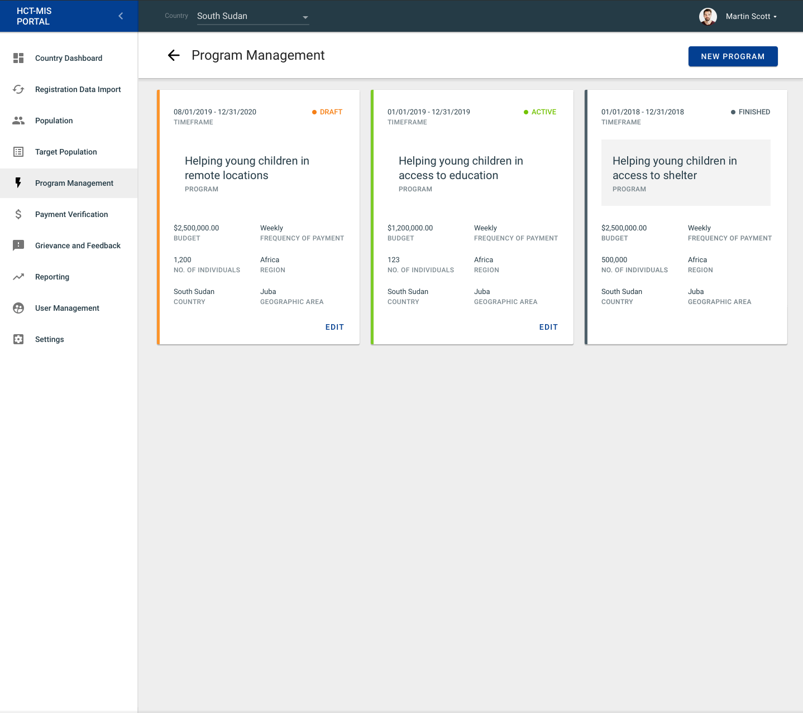
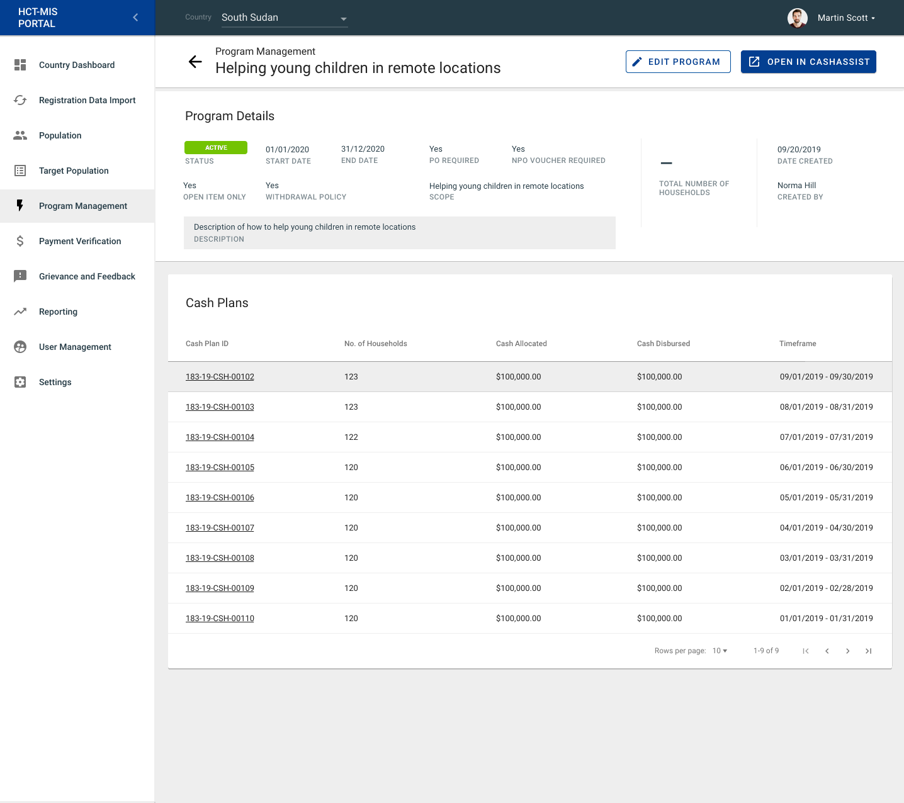
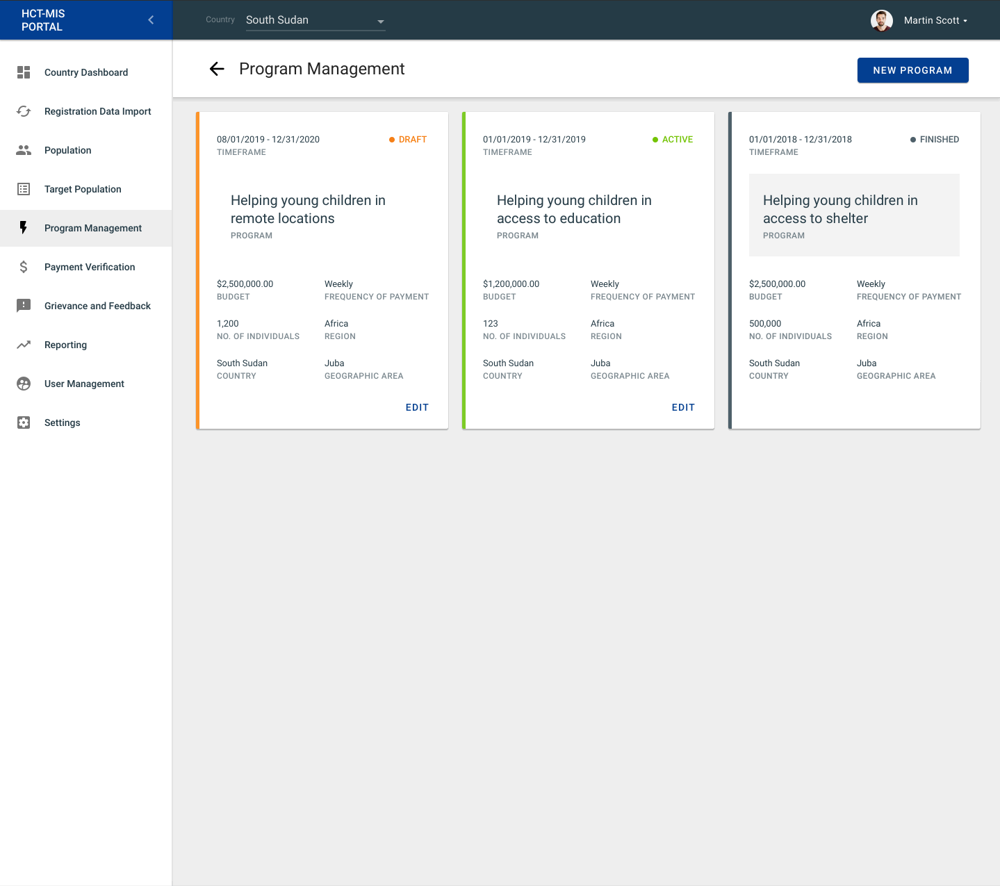
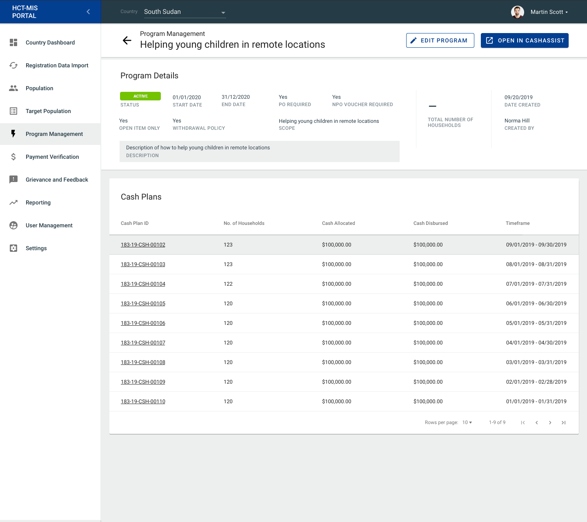

# Programme: Overview Page

## Overview

### Cards

#### Card Order

The cards displayed on the Programme Overview screen are ordered first by **Programme State** \(as correctly listed above\), then secondly by **Last Modified Date.**

#### 

#### Card States

Located on the top right hand corner of each Programme card, displays a status. Each programme has the following state:

* Draft
* Active
* Finished

Once the programme is finished we can set it active again.

#### Draft Programme

Draft Programmes are newly created Programmes that have not yet been activated. This feature allows users to have the flexibility get started on a programme, even if they are not yet ready to activate it.

A unique feature to Draft Programmes is the **ability to delete the draft programme.**

A useful feature for Draft Programmes is the ability to see the last modified date.

**Active Programme**

Active programmes are programmes that have been activated by a user and sent to Cash Assist for further monitoring.

Active programmes cannot be deleted once started. 

#### 

#### Finished Programme

A finished Programme is one that has either lived past "end by date" or has been manually finished by user. 

A finished programme has the ability to be reactivated by a user if needed, by comleting the following steps:

1. Opening the Programme with `finished` status and click the "re-activate" button. 
2. Next, the user will be prompted to update the "end by date" before proceeding, if the Programme has expired.
3. Lastly, they will click the "re-open" button to proceed with the action, or "cancel" button to exit without saving changes.

   \*\*\*\*

\*\*\*\*

#### **Card items**

Card items also consists of:

* planned timeframe - on the top left hand corner
* name of the programme - in the middle of a card

In the down half of a card is information about:

* budget
* frequency of payment
* number of individuals
* region
* country
* geographic area

### Create New Program

**See Data Dictionary for detailed requirements:**

{% embed url="https://unicef.sharepoint.com/:x:/r/teams/EMOPS-HCT-MIS/DocumentLibrary2/Overarching%20Documentation/Requirements/Data%20Dictionary.xlsx?d=w41de76b5566c42c9b96533d8ed4fbc4f&csf=1&e=hSLqdj" %}

To create a New Program, click on the "New Programme" button on the top right hand corner of the page.

#### Creating New Programme

To create a New Programme, you have to provide information. 

Required information is:

* Name of the Programme
* CashAssist Scope
* Start and End date

Optional information is:

* Description
* Budget
* Geographic area
* Number of Countries
* Population Goal
* Sector

#### Programme created

When Programme is created, the following information is presented on the screen:

* status
* start and end date
* is PO required
* is NPO voucher required
* is it Open item only
* withdrawal policy
* scope
* description
* total number of households

### Activate Program

To Activate Program, click on the "Activate" button on the top right-hand corner of the page.

#### Activated Program

When Programme is activated, additionally to information presented to the drafted Program, a list of assigned Cash Plans is displayed on the screen. The Cash Plans list consists of the following columns:

* Cash Plan ID
* number of households
* cash allocated
* cash allocated
* cash disbursed
* timeframe

### Edit Program

To Edit Program, click on the "Edit" button in the down right-hand corner of a Programme Tile or on the top right-hand corner of the preview page.

### Finish Program

To Finish Programme open an Active Program, click on the "Open in CashAssist" button in the top right-hand corner, and proceed further within CashAssist.

### Cash Plan

To preview a list of Cash Plans, click on the Programme tile, and to preview Cash Plan details click on one of the Cash Plans from the list.

#### **Cash Plan Details**

Cash Plan details consists of:

* Cash Plan name
* plan start and end date
* dispersion date
* coverage \(duration\)
* coverage \(units\)
* target population
* total number of households
* date created
* created by

### Payment Records

To preview the Payment Record details, go to Programme Details, click on the particular Cash Plan ID on the list, and click on the chosen Payment Record from the list.

#### Payment Records details

Payment Record details consist of:

* registration group
* target population
* distribution modality
* business unit
* comments
* date created
* created by

Household information under Payment Record consist of:

* household ID
* head of household
* total person covered

Entitlement Details under Payment Record consist of:

* entitlement quantity
* currency
* delivery type
* delivered quantity
* delivery date 
* entitlement card status
* entitlement card issue date
* payment through

x

