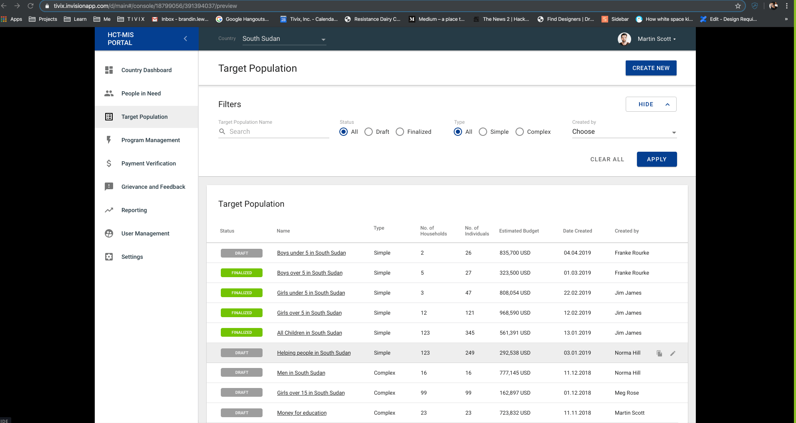

# Target Population \(Targeting\)

## Organization

### RACI

#### **Responsible:**

**Accountable:**

**Consult:**

**Informed:**

## Functional Spec:

### Overview:

In the Targeting Module you can do xyz

### How to Target:

* Name Target Set
* Set Location
* Add Rules
* Save
* Send to Cash Assist

### Name A Target:

## Business Rules

### 3.2.3 Targeting Module

#### Entrees

* Synonymous with Households. 
* Registration Group Level 
* Assistant Package - Linked to a Cash Plan
* Entitlement Card - Could be anything...Bank Title, etc.

#### Program Model:

* Programme \(Master\) \["Intervention"\]
  * Program - Scope
    * Cash Plan \(every Cycle\)
      * Assistance Package
        * Target Pop
        * Distribution
          * FSP
          * Mobile mo


Process needs refinement from a user experience perspective 


### Risk:

* Rule Engine Criteria for read privileges - Columns vs JSON configuration
  * Corticon Rules Engine - Commercial Product to investigate further. 
  * 

