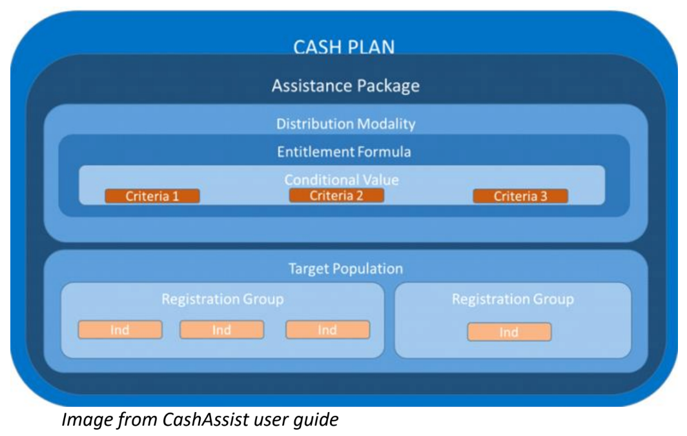
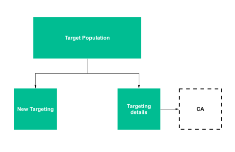
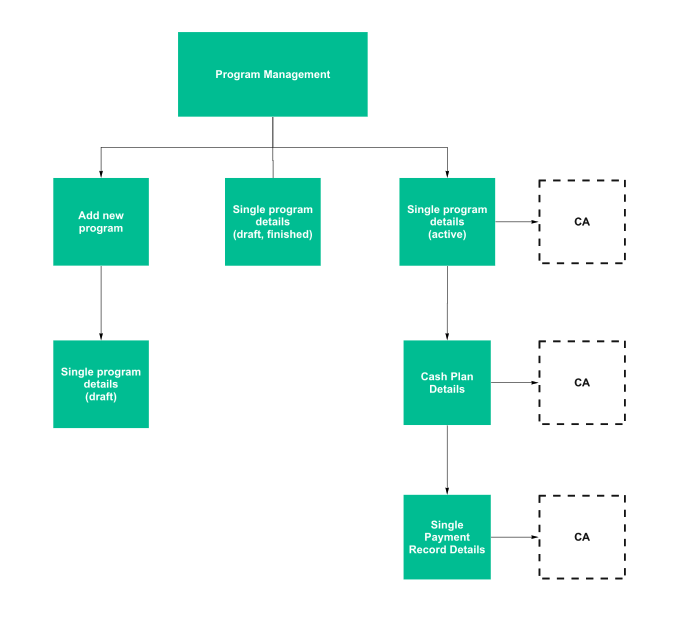
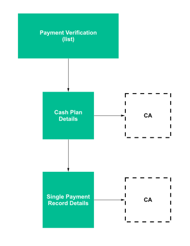

# CashAssist

See [CA glossary](../../introduction/glossary-terminology/cashassist.md) for some overview/quick information.

## Overview

Its an app on top of Dynamics.

### Implementation for UNICEF

HCT MIS will be a root node just like UNHCR is. Hence there is no overlap on business units at all.

The implementation for UNICEF in CashAssist will be a separate "App".

### FSP integration

### Cash Plan

## HCT-MIS Sitemap Integration

### Target Population

### Programe Management

### Payment Verification

## HCT-MIS Data Model Integration

