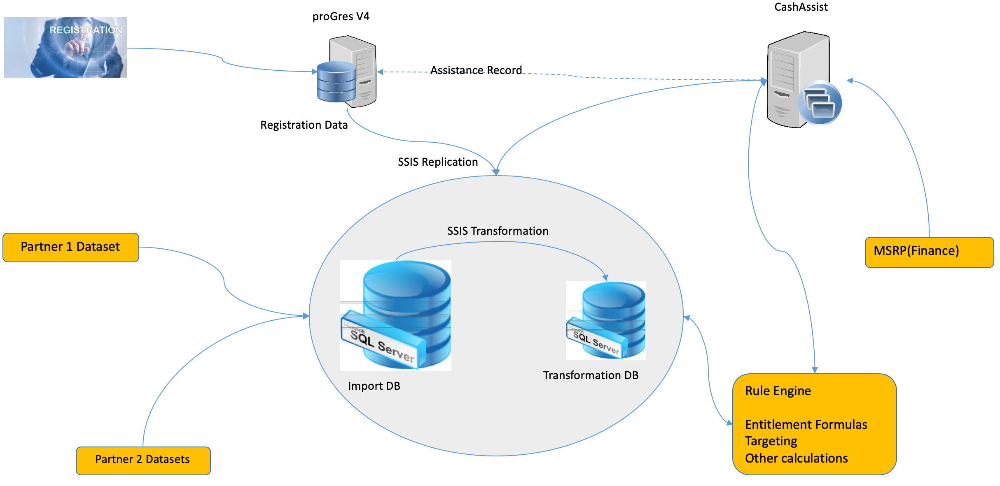

# Cash Assist

## Background:

Cash Assist started several years ago, as a prototype, based on the MS Dynamics Platform.  
It was decided to build upon the current existing system and a program would be launched - Jan 2018.  
Built for UNHCR Cash Distribution.

**Typical Data Size per Business Unit?**

* **Greece - ~80K individual**
* **Cash Plans every week \(10+\)**
* **Every week - 50K Payments**

### Misc Notes:

* 5 countries in cash assist.
  * Few million cash plans at a time?
* Mid-Next year will have 1-2 extra countries.
* Big countries coming this month - not clear on which ones, need to ask a colleague.
* Hosted by MS.
* On the cloud as SaaS.

### CashAssist Data Flow

## **UNHCR Project Timeline**

Early March - Country Operation - collect info - built plan - business process - discover - requirements - etc. 550 Requirements deemed classified.

July-Aug was moved to Cloud via Azure.

July 2018 - development commenced to build CA w/ an Agile Approach - Sprints\(4-6weeks\)

Last dev sprint starts October 14th, 2019  after which Development will cease. \(4 week sprint - reports and few installation\)  

Following this last sprint the project will be considered complete by UNHCR.

#### Future Work: 1-2 releases per year.

## **Integrations:**

Integration with older systems including:

* ProGres
* PeopleSoft
* Biometrics \(Software name tbd\)

## **MS Dynamics**

Cash Assist is built in Dynamics

### **Reason for Dynamics**

* Azure ProGres is levered by MS Dynamics - which is not using the typical out of box functionality.
* OOB functions are pay to play
* Use Dynamics as a platform to build upon w/o using their suggested functionality to save on costs.
* Using mainly to build main objects and to leverage security features...etc.
  * Dedicated bandwidth - security levels
* Using the UI from MS.

### **APIs:**

* Can call any Dynamics function through API
  * Mostly \(if not all\) Get Requests.
* Not leveraging the REST APIs… mostly completely native.
* \*\*\*\*[**ProApps**](https://powerapps.microsoft.com/en-us/)\*\*\*\*
* Collects through **Postman**.
* Approaches that don’t work:
  * Use old API
  * Recreating CashAssist functionality through API usage

### Data Model:

* **Request Yves to provide a data model or schema for Tivix.**
  * **Need an NDA… legal constraints to grant access.**
  * **OAuth tokens and such for Postman**
* **Dynamics Background Server = Integration Server.**

## **Main Focus for HCTMIS**

* **How to get primary/household data into CA.**
* **Targeting on HCT-MIS side raised red flag.**
  * **Could be confusion on goals.**
    * **Mainly used for filtering**
    * **Not full blown targeting.**
    * **Practical use for Draft Cash Plans.**
  * **“We don’t want to filter in many places, many times… prevent losing source of truth.” - Evrim**
    * **Ideal: Choose HCT or CA - one or the other…**
* **Making details on HCT-MIS mostly read-only and generated in RealTime from API Calls from CA.**
  * **Cant be read only - need write permissions for CA.**

## **Data Lake:**

* Does one currently exist?
  * Unicef came w/ DL concept.
  * Unicef would offer DL for CA to connect w/.
  * Unicef DL would be the Source of Truth.
  * Designed and drawn on the High-Level Market Solution Architecture
* Is there any technical documentation on Data Lake?:
  * Data Lake is just a concept at this point. - Yves
  * Not sure atm… - Evrim.
* **Data Lake is the backend of HCT-MIS** - Kahlid
  * If storing data in Postgres - CA would connect to and pull data.
* **Potential for Performance Issue:**
  * Need extra layer between the database -  due to the amount of data.
  * Read Replicas…
  * Direct DB access concerns.
* **To Decide:** 
  * **Large JSON storage**
  * **Azure**
    * **Comes w/ Hosting issues?**

## CA vs HCT-MIS Concepts

* HCT-MIS' new concept of Household in CA is for mainly for Internally Displaced People \(IDP\).
  * Way to store and build on top of db / cash plan of those people \(IDPs + Registration Group\)
  * IDPs - managing limited amount of information.
  * EX: Operation or country provides excel to Unicef Sharepoint, data is cleaned and loaded into system &gt; Then filtering for cash plan.
    * Registration Group = Families
      * Father - Focal Point
      * Mother + Children - Individuals
      * Together they form a family, A.K.A. Registration Group.
    * Household vs registration group…??

## Notes on CA Admin Settings Demo

* [**Tutorial to CA Dev Resources**](https://cl.ly/2b0c0f704754)
* Business Unit \(location\) can essentially be dropdown selector from the UI. The account doesn’t need to be switched to access data between Business Units - so long that the permissions allow it.
  * Registration Group data is managed via Dynamic’s security functionality.
* Potential use for security roles / permissions.
  * \# of roles depends on business unit in CA.
    * Ex: Advanced Reader, Approver, Planner, Reviewer, Releaser, Reconciler
      * Some user assigned certain roles cannot have more than 1 roles.
    * 1 user can have many roles - per Business Unit
    * System can allow multiple roles but organization enforces separation of duties per role.
  * CA &gt; Settings &gt; Security:
  * User + Security Role + Teams = Security Access
* Does CA have data from different BUs living in the same table?
  * I.e. Greece data rows next to Syria’s\(or w/e\) data
  * Possible - emphasis on logical separation at app level

### **Flex Fields**

* Managing flex fields:
  * Cash Assist does not have concept of Flex Fields by nature.
* Option for CA to implement/add a Flex Field attribute mechanism to accommodate for HCT-MIS.
  * At the Business Unit level.

## **Rule Engine:**

* What is the use for RE:
  * Can be used in different manors:
    * HCL
    * Targeting
    * Calculations and Batch Mechanism
    * Azure connection w/ Dynamics
* Desktop App or Web?
  * Desktop
    * Create Rules
      * Deployed on the Rule Server \(Live\)
* How many ppl use it?
  * 1-2 Operations - to create the rules
    * Ways to avoid the cost of dev.
* Corticon is the software editor of Rule Engine
* Rule Engine Training was mentioned as something that can be provided.

Case in Fields in Rule Engine:

* Rule engine can work with Postgres \(not yet tested\) and can create rules on top of JSON fields
  * Need to create keys to pass as values…
  * Need to have columns on a table to run rules against
    * Does not seem as though Rule Engine can parse abstract data into columns
    * Possible FormForce style fields
* On Prem & Cloud - will go w/ Cloud option.
* Cost depends on server put in place.

## Payment Process

Payment details created by CA

How are payments submitted to FSPs?

Payment Instructions are sent to FSP for disbursement

* Done by means of ISP\(?\)
* Depending on country, could be direct.

## **User Ticketing System:**

* **Access Portal that will automate \(workflow discussed earlier?\).**
* **Unicef to have own user management then push to CA.**
* **Sebastian has an assumption typed out and currently testing.**
  * **Included in email.**

## **Glossary of Terms:**

* **Possibly something available, Yves will search and share.**

### 

