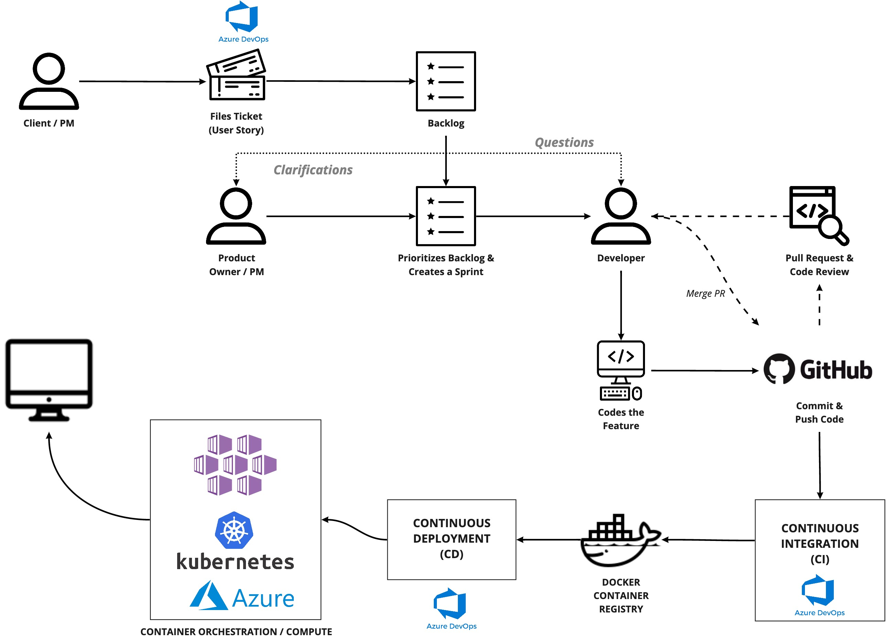
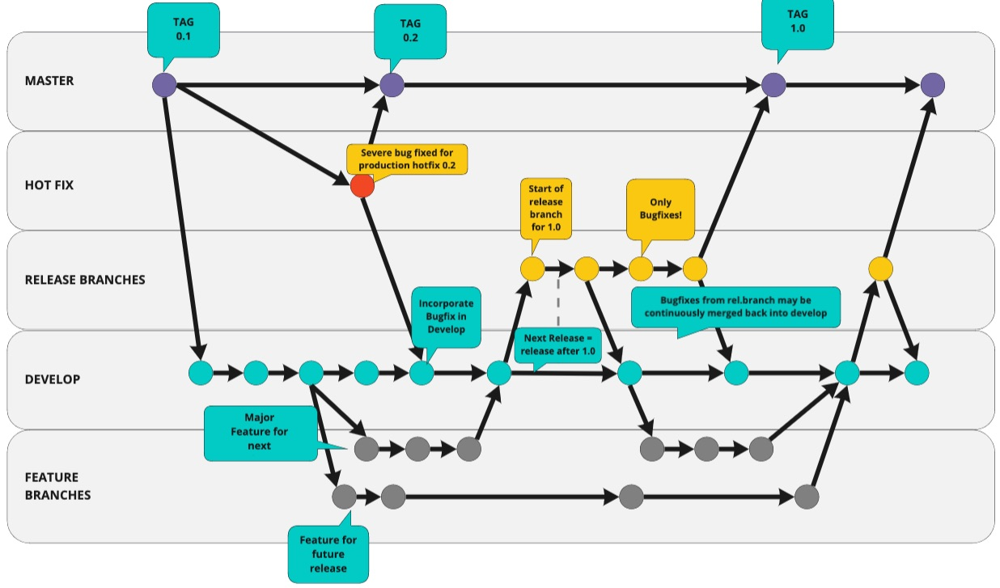

# Development Setup / Process

## Local Setup

1. Install [Docker](https://docs.docker.com/engine/installation/) for your OS.
2. Receive .env file from your team member. There are AD secrets there.
3. Run


Frontend running on Local Machine (use node 16)

```bash
cd frontend
yarn
yarn start
# in another terminal
cd ..
docker-compose build
docker-compose up
# once everything is up, in yet another terminal
docker exec -it <prefix>_backend_1 ./manage.py initdemo
```
***
Frontend app is run inside Docker (a lot slower)

```bash
docker-compose -f docker-compose.yml -f docker-compose.frontend.yml build
docker-compose -f docker-compose.yml -f docker-compose.frontend.yml up
docker-compose -f docker-compose.yml -f docker-compose.frontend.yml run --rm backend bash

# in docker container
./manage.py initdemo
```

Access the frontend in your browser at [`localhost:8082/login`](http://localhost:8082/login)

Backend can be accessed at `/api/` i.e. [`localhost:8082/api/unicorn/`](http://localhost:8082/api/unicorn/)

When running locally, you don't neet to provide AD credentials - you can go straight to [`localhost:8082/api/unicorn/`](http://localhost:8082/api/unicorn/) and log in with `root:root1234`. When you have the necessary cookies in your browser, you can also access the FE dashboard.

# Cypress Testing Service
Go to cypress_testing_service catalog
Create cypress.env.json file based on cypress.env.json.example file
Run yarn install
Run yarn cy:open


### **Commands**

**generatefixtures** - command for generating project fake data, requires business areas, which can be loaded before by using:

```bash
./manage.py loadbusinessareas
```

or **generatefixtures** will ask if you want to load business areas.

accepts the arguments:

* **--program** - Create provided amount of programs, default is 10
* **--cash-plan** - Create provided amount of cash plans for one program, default is 10
* **--payment-record** - Create provided amount of payment records assigned to household and cash plan, default is 10
* **--noinput** - Suppresses all user prompts

**loadbusinessareas** - load businessareas defined in XML file backend/data/GetBusinessAreaList\_XML.xml

**migratealldb** - our custom command to migrate all databases specified in settings

**generateroles** - creates all default roles with correct permission sets

**init** - resets all databases, run migrations on all databases, load business areas and fake data with default values, creates a set of default roles

**initdemo** - initialize project with a simple demo data

### Writing and running tests:

#### **Backend:**

for backend we are using _Django's TestCase_ and snapshottest.

For snapshottest we are using our custom class **APITestCase**, use it if your test should use snapshots. Check existing tests to see how we are using it.

We are keeping tests in &lt;app\_name&gt;/tests/ and creating separate files for each test case.

to run all tests use:

```bash
./manage.py test
```

to overwrite existing snapshots:

```bash
./manage.py test --snapshot-update
```

You can run single test in TestCase or overwrite snapshot for only one TestCase by providing a path.

Example for running single test method in TestCase.

```bash
./manage.py test core.tests.test_flexibles.TestFlexibles.test_load_invalid_file
```

More information can be found here:



[https://github.com/syrusakbary/snapshottest](https://github.com/syrusakbary/snapshottest)

## Development / Build / Deployment Process



## Git Branching / Cloud environments

Below represents approximately strategy we hope to follow. We may or may not use tags in the master branch \(tbd\). Additionally instead of release branches \(since HCT is under development\) we may use a staging branch approach \(more stable than develop\).



The following are the code branches and their CI / CD usage.

| Branch | Auto-deployed? | Cloud environment | Airflow UI |
| :--- | :--- | :--- | :--- |
| develop | yes | [https://dev-hct.unitst.org/](https://dev-hct.unitst.org/afghanistan/) | [https://dev-af.unitst.org](https://github.com/unicef/hct-mis/tree/ae764be9c9518105b72bdfe481f0a65f79dd538a/README.md) |
| staging | yes | [https://staging-hct.unitst.org/](https://staging-hct.unitst.org/) | [https://stg-af.unitst.org](https://stg-af.unitst.org) |
| master | no | ? |  |
| feature/\* or bug/\* | no | n/a |  |

In the future hotfix branches might be made as well which merge directly to master potentially. A UAT environment that mirrors the stability of production \(master branch\) might be necessary as well. If strictly following an agile methodology, it may or may not be necessary, but a UAT env mirroring production might be helpful for production focused hot fix testing.
