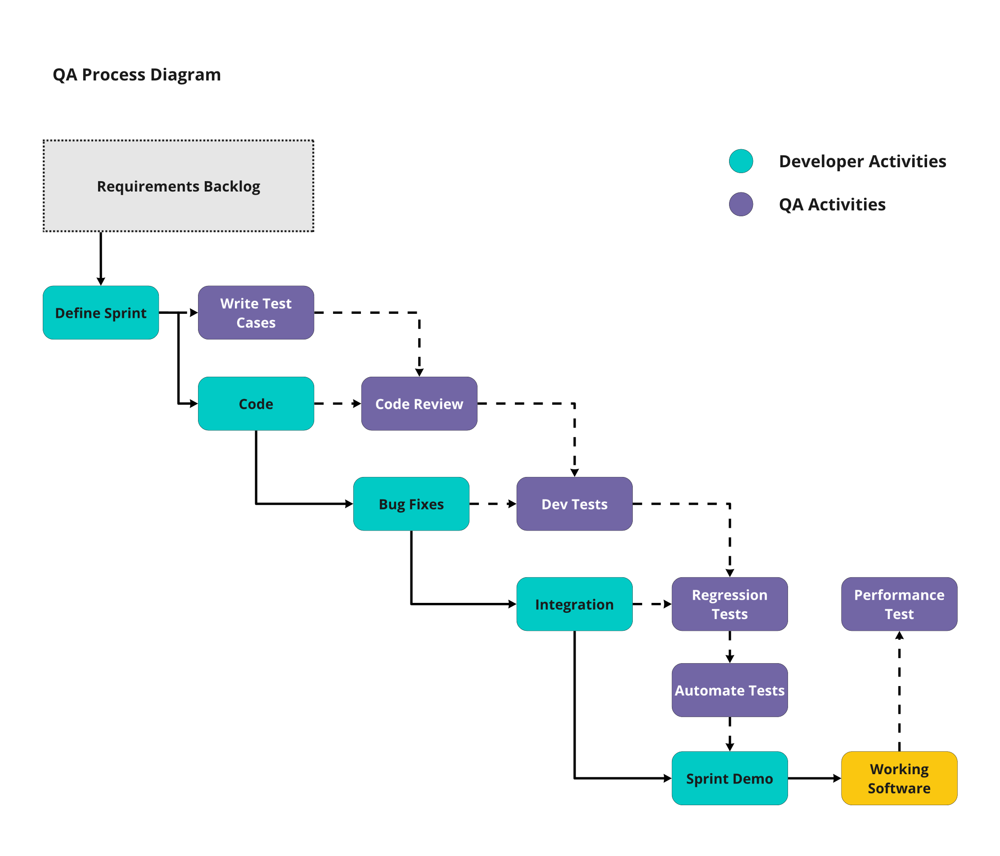
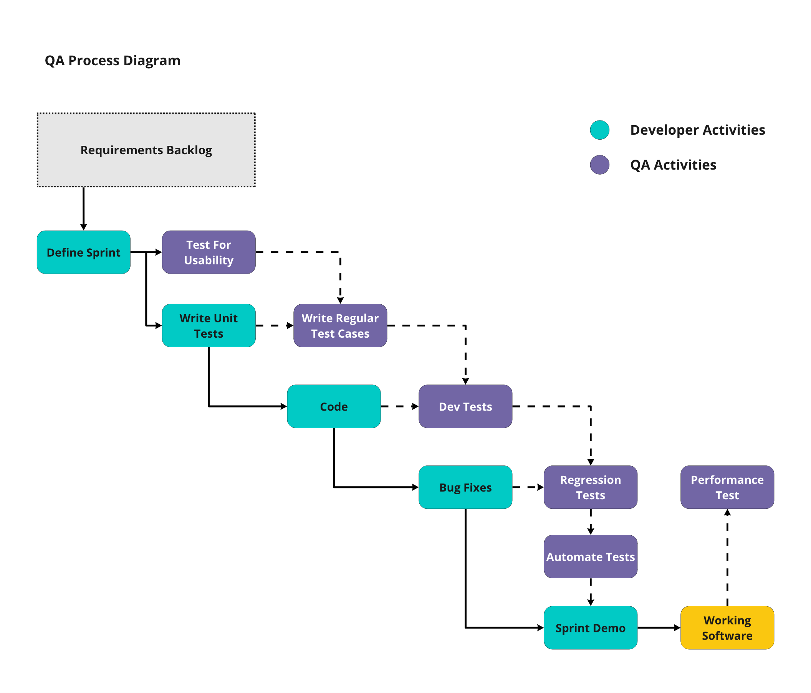

# HCT-MIS: Testing Strategy

## **Quality Assurance / E2E /** Unit Testing

Tivix insures quality assurance throughout the SDLC by maintaining clear documentation through the project requirements, down to the code level.

## Quality Assurance

Tivix proposes an approach to QA & Unit Testing similar to what has been done in the PRP & UNPP projects. _**See diagram below:**_

#### Test Cases:

With each feature of the HCT-MIS that will be developed, Unicef will provide specific test cases to ensure that each feature is delivered to meet quality expectations.

#### Code:

All code written for the program will follow standard best practices for both format, syntax, efficiency, and appropriate documentation for readability. 

#### Code Reviews:

When a particular feature / user story is developed, it will go through it's first round of Quality Assurance testing, which will be the **Code Review**.

This will be visible to the project team in Clubhouse via the Sprint Board. All tickets/tasks that are undergoing code review will be located under the column labeled **In Review.**

**Dev Tests:**

Once a User Story / Feature passes it's code review, it will then be merged into **Develop**. Features / User Stories in the Develop column in Clubhouse have already been merged to Develop and are awaiting functional testing in this environment before moving forward.

#### Regression Tests:

Similar to the **Dev Test,** the same is true for items in the **Integration** column / environment, only this time  the QA Tester is looking for any regressions with the current Integration environment.

#### Automated Tests:

At this stage, automated testing will take place with the help of Cypress\(?\).

#### Performance Tests:

Once the working software has been updated with the latest release it will continue to be monitored and tested by performance tests also hooked up by Cypress\(?\) and possibly manual tests as necessary. 

## Unit Testing

Unit Testing may be viable when considering the different components HCT-MIS will be comprised of \(Registration, Targeting, Cash Plans, Reporting, etc.\)

Depending on the need, Manual & Automated Unit Testing can be considered to take place at the time of development \(manual\) as well as towards the merge to Integration environments \(automatic\).

## E2E Testing

Cypress E2E testing?

