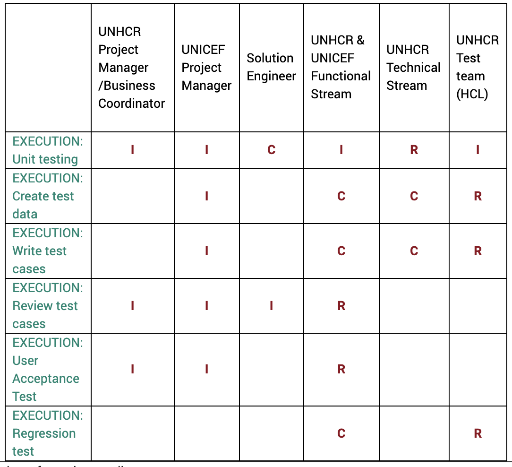

# UNHCR QA/Testing

## 1.1.1     Testing

**Shared UNHCR & UNICEF responsibilities**  

* Iterative testing by SMEs and functional stream \(BA\) in each phase 
* Testing of hot fix deployment
* Reviewing test cases

Accountability for UNHCR test manger:

* Creation of test plan
* Coordination of creation of test data, test cases and test steps

Responsibilities for UNHCR HCL testing team

* Creation of test scenarios for sprint user stories
* Creation of test data
* Updating regression tests
* Executing of regression tests

In each test phase the following tests should be covered

* Unit test \(executed by technical stream\)
* Integration test – **this test phase is currently covered by the UNHCR functional stream, but not the HCL testing team.**
* User acceptance test – **currently done by the functional stream**
* Regression test

## 1.2  Key Roles & Responsibilities

1.2.1     Overview summary of roles & responsibilities

### With what testing methodologies:

* All tests are currently performed manually

### Periodicity:

* Unit testing; UAT for each sprint; Regression before each release.

