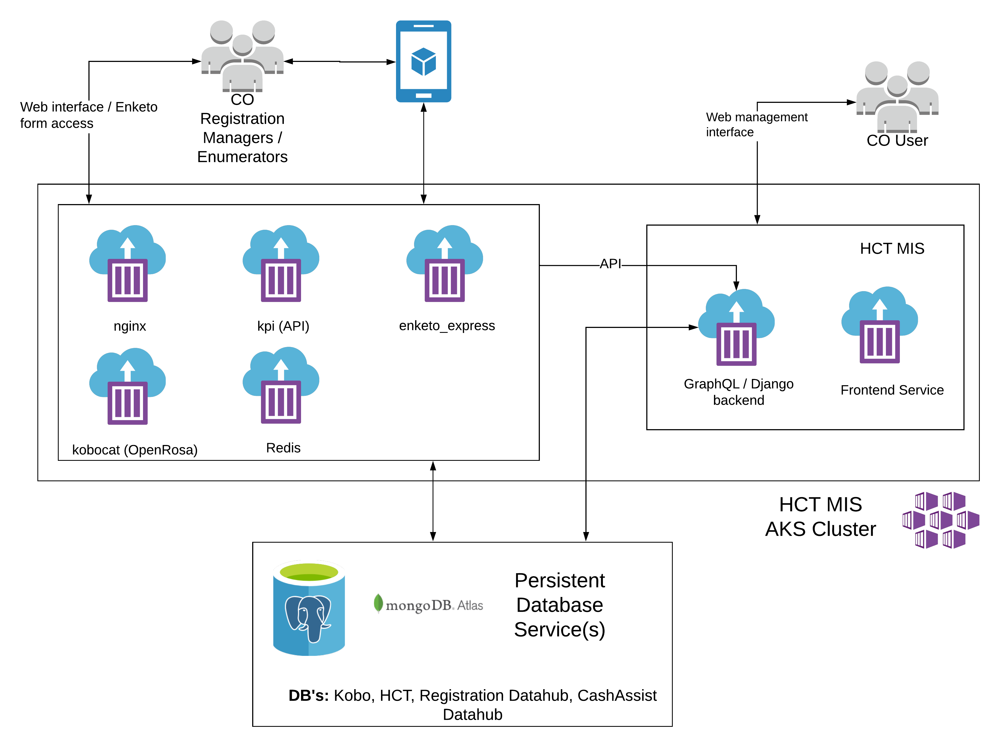

# Kobo hosting

We would like to deploy Kobo on the existing AKS cluster. The best way to do so would be via a [helm chart](https://helm.sh/). This would enable a very easy, versioned method of installing kobo on any kubernetes cluster \(cloud or on-premise or local development\)

Currently the best way to generate a docker install of Kobo is via [https://github.com/kobotoolbox/kobo-install](https://github.com/kobotoolbox/kobo-install) - which generates all the configurations needed to run Kobo and its dependencies locally.

### Proposed setup

### Example URL's

Just like HCT, Kobo would be hosted on the staging, UAT and production environments. Example URL: **https://kobo.dev-hct.unitst.org/** would be the one that country office users involved with user registration and even enumerators would use.

The mobile application or the PWA application that will be used will connect to such a URL \(production one\).

