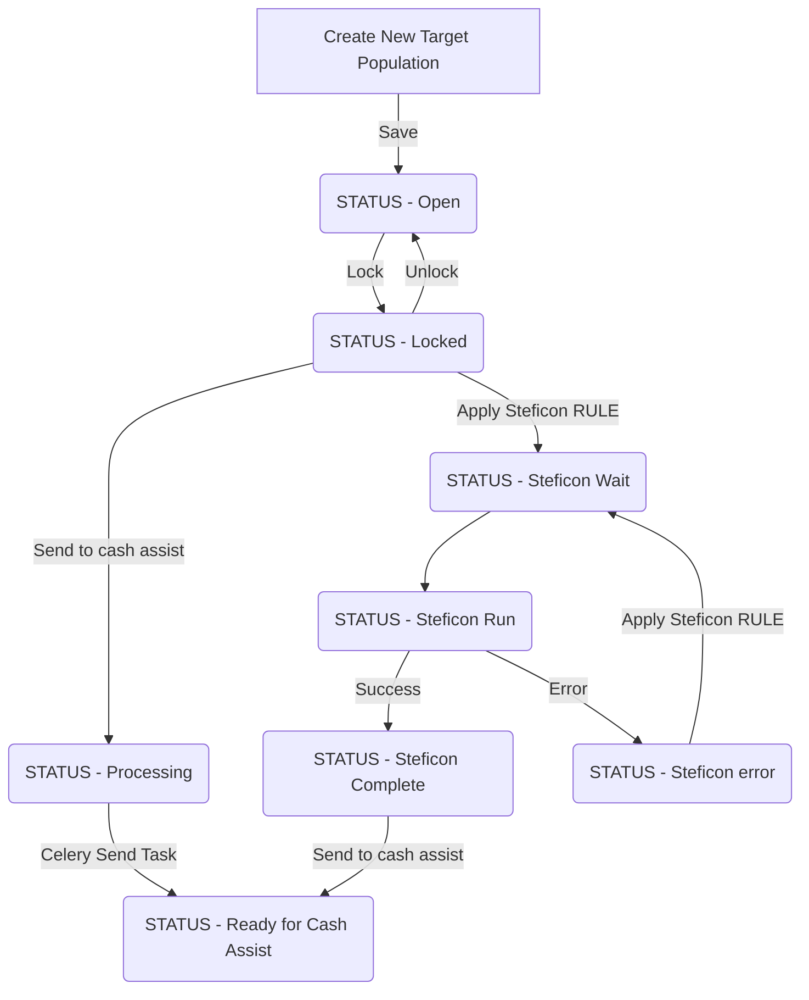

# Target population status flow chart

Open it in https://mermaid.ink/

```mermaid
graph TD
    CREATE_PAGE[Create New Target Population] -->|Save| OPEN
    OPEN(STATUS - Open)
    LOCKED(STATUS - Locked)
    PROCESSING(STATUS - Processing)
    READY_FOR_CASH_ASSIST(STATUS - Ready for Cash Assist)
    STEFICON_WAIT(STATUS -  Steficon Wait)
    STEFICON_RUN(STATUS -  Steficon Run)
    SETFICON_COMPLETE(STATUS - Steficon Complete)
    STEFICON_ERROR(STATUS - Steficon error)

    OPEN --> |Lock| LOCKED
    LOCKED --> |Unlock| OPEN
    LOCKED --> |Send to cash assist| PROCESSING
    PROCESSING --> |Celery Send Task| READY_FOR_CASH_ASSIST
    LOCKED --> |Apply Steficon RULE| STEFICON_WAIT
    STEFICON_WAIT --> STEFICON_RUN
    STEFICON_RUN --> |Error| STEFICON_ERROR
    STEFICON_ERROR --> |Apply Steficon RULE| STEFICON_WAIT
    STEFICON_RUN --> |Success| SETFICON_COMPLETE
    SETFICON_COMPLETE -->|Send to cash assist| READY_FOR_CASH_ASSIST
```
