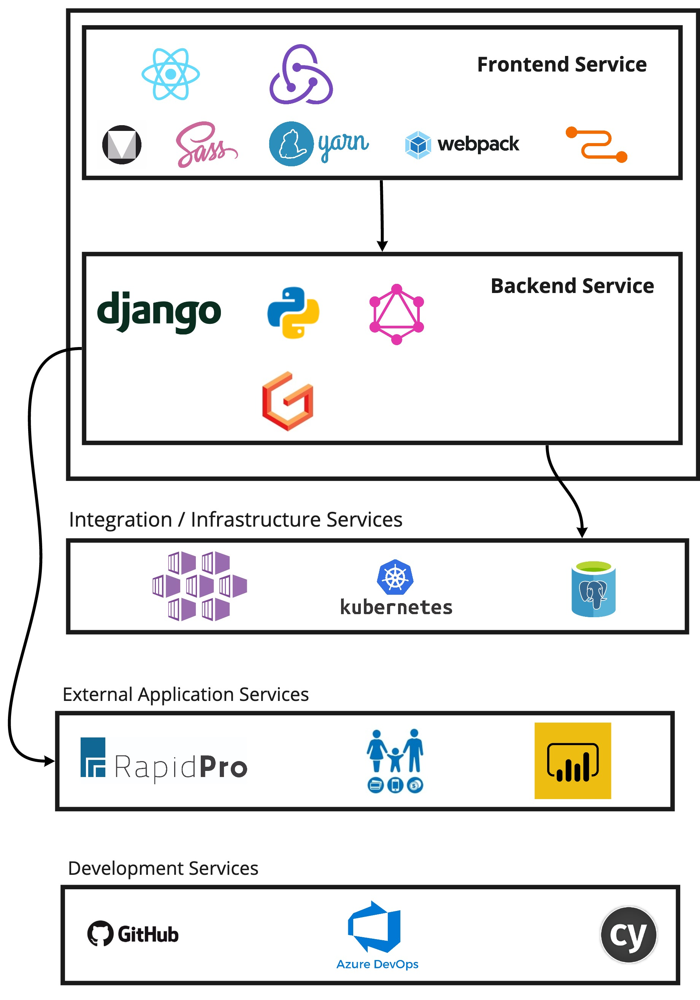

# Technical Architecture

### Centrally Managed Cloud Hosted

HCT MIS in production will be run as in Microsoft Azure. The same production setup will support all the business areas that adopt the platform. Data isolation and security requirements may drive the [DB architecture](db-architecture.md), even though all business areas will share the same application level code-base and business logic.

That said the way it is being architected, in circumstances that do require a country for any reason to . The only downside of this approach will be the inability to then have this data easily sync back for [HQ Dashboard](../../product-specification/hq/dashboard.md) based reporting needs.

### Breakup into various Services

The goal is to have separation of the user interfaces \(be it mobile / PWA or web application interface\) and backend logic.

The frontend will be a React based application leveraging UNICEF design philosophy that is built on top of Material Design.

The backend will be a Django and Python application, exposing a [GraphQL](https://graphql.org/) API that leverages [Graphene](https://graphene-python.org).

### Application components / sub-components

These may or may not map 1:1 to the modules being speced.

